<p align="center">
  
</p>

<div align="center">

Universidad Peruana de Ciencias Aplicadas

Carrera de Ingeniería de Software

**1ASI0728**

**Arquitecturas De Software Emergentes**

NRC

**9077**


**Informe del Trabajo Final**


Docente: 

**Jara Palacios, Marino Humberto**

Equipo:

**NaturaTech**

Proyecto: 

**PlantSync**

<br>

Integrantes

<table style="border-collapse: collapse; border: none; margin-left: auto; margin-right: auto;">
  <thead>
    <tr>
      <th style="border: none; padding: 6px; text-align: center;">Código</th>
      <th style="border: none; padding: 6px; text-align: center;">Apellidos y Nombres</th>
    </tr>
  </thead>
  <tbody>
    <tr>
      <td style="border: none; padding: 4px; font-weight: bold;">U202219481</td>
      <td style="border: none; padding: 4px;">Alaya Cabrera, Rodrigo</td>
    </tr>
    <tr>
      <td style="border: none; padding: 4px; font-weight: bold;">U202313172</td>
      <td style="border: none; padding: 4px;">Coca Lavado, Carlos Andrés</td>
    </tr>
    <tr>
      <td style="border: none; padding: 4px; font-weight: bold;">U20221G068</td>
      <td style="border: none; padding: 4px;">Almerco Rojas, Jocelyn Damaly</td>
    </tr>
    <tr>
      <td style="border: none; padding: 4px; font-weight: bold;">U202113432</td>
      <td style="border: none; padding: 4px;">La Madrid Lozano, Ivan Jeanpierre</td>
    </tr>
    <tr>
      <td style="border: none; padding: 4px; font-weight: bold;">U202310636</td>
      <td style="border: none; padding: 4px;">Zuñiga Murillo, Diego Sebastian</td>
    </tr>
  </tbody>
</table>

<br>
  
**Fecha de publicación:** septiembre de 2026

**Período 202620**

</div>
<div style="break-after: page;"></div>


# **Registro de Versiones**

| **Versión** | **Fecha** | **Autor(es)** | **Descripción de modificación** |
|-------------|------------|----------------|---------------------------------|
| 0.1 | 12/09/2026 | Rodrigo Alaya Cabrera | Definición inicial del Solution Profile |
| 0.1 | 12/09/2026 | Carlos Coca Lavado | Analisis de Competidores y Diseño de las entrevistas |
| 0.2 | 13/09/2026 | - | Desarrollo del Solution Profile y planteamiento del problema |
| 0.3 | 14/09/2026 | - | Desarrollo de needfinding, user personas y user task matrix |
| 0.4 | 15/09/2026 |Rodrigo Alaya Cabrera| Desarrollo de entrevistas y análisis del problema |
| 0.5 | 16/09/2026 | - | Desarrollo de Impact Mapping y análisis de competidores |
| 0.6 | 16/09/2026 | - | Desarrollo de Profile and Preferences Management Context y definición de épicas iniciales |
| 0.7 | 16/09/2026 | - | Desarrollo del Event Storming colaborativo y definición de bounded contexts |
| 0.8 | 16/09/2026 | - | Definición de segmentos objetivos y Startup Profile |
| 0.9 | 16/09/2026 | - | Desarrollo de diagramas C4 y avance en diseño de base de datos |
| 0.10 | 16/09/2026 | - | Desarrollo de Lean UX Hypothesis y Technical Stories |
| 0.11 | 16/09/2026 | - | Redacción y mejora de épicas y User Stories |
| 0.12 | 17/09/2026 | Rodrigo Alaya Cabrera | Desarrollo de antecedentes, problemática y entrevistas a empresas mineras |
| 0.13 | 26/04/2026 |- | Integración final del informe, ajustes de historias de usuario y validación de entregables |
| 0.14 | 02/05/2026 | - | Desarrollo de Style Guidelines, Information Architecture y sistemas de navegación y búsqueda |
| 0.15 | 03/05/2026 | Rodrigo Alaya Cabrera | Diseño de wireframes, mockups y user flows para Landing Page, Web App, Mobile App e IoT |
| 0.16 | 04/05/2026 | - | Desarrollo de prototipos de aplicaciones e integración del diseño UI/UX de la solución |
<div style="break-after: page;"></div>

## Project Report Collaboration Insights

Link del repositorio: https://github.com/1ASI0728-2620-9077-NaturaTech/NaturaTech-report.git

+ TP1:

  Este insight muestra la distribución de los commits realizados por cada integrante del equipo durante el sprint. La evidencia permite visualizar el nivel de participación de los colaboradores y demuestra el uso de control de versiones, así como el trabajo colaborativo y continuo en el desarrollo del proyecto.

<p align="center">
  
</p>

<p align="center">
  
</p>

<div style="break-after: page;"></div>

# Tabla de Contenidos

- [Capítulo I: Introducción](#capítulo-i-introducción)
  - [1.1. Startup Profile](#11-startup-profile)
    - [1.1.1. Descripción de la Startup](#111-descripción-de-la-startup)
    - [1.1.2. Perfiles de integrantes del equipo](#112-perfiles-de-integrantes-del-equipo)
  - [1.2. Solution Profile](#12-solution-profile)
    - [1.2.1. Antecedentes y problemática](#121-antecedentes-y-problemática)
    - [1.2.2. Lean UX Process](#122-lean-ux-process)
      - [1.2.2.1. Lean UX Problem Statements](#1221-lean-ux-problem-statements)
      - [1.2.2.2. Lean UX Assumptions](#1222-lean-ux-assumptions)
      - [1.2.2.3. Lean UX Hypothesis Statements](#1223-lean-ux-hypothesis-statements)
      - [1.2.2.4. Lean UX Canvas](#1224-lean-ux-canvas)
  - [1.3. Segmentos objetivo](#13-segmentos-objetivo)

- [Capítulo II: Requirements Elicitation & Analysis](#capítulo-ii-requirements-elicitation--analysis)
  - [2.1. Competidores](#21-competidores)
    - [2.1.1. Análisis competitivo](#211-análisis-competitivo)
    - [2.1.2. Estrategias y tácticas frente a competidores](#212-estrategias-y-tácticas-frente-a-competidores)
  - [2.2. Entrevistas](#22-entrevistas)
    - [2.2.1. Diseño de entrevistas](#221-diseño-de-entrevistas)
    - [2.2.2. Registro de entrevistas](#222-registro-de-entrevistas)
    - [2.2.3. Análisis de entrevistas](#223-análisis-de-entrevistas)
  - [2.3. Needfinding](#23-needfinding)
    - [2.3.1. User Personas](#231-user-personas)
    - [2.3.2. User Task Matrix](#232-user-task-matrix)
    - [2.3.3. Empathy Mapping](#233-empathy-mapping)
    - [2.3.4. As-is Scenario Mapping](#234-as-is-scenario-mapping)
  - [2.4. Ubiquitous Language](#24-ubiquitous-language)

- [Capítulo III: Requirements Specification](#capítulo-iii-requirements-specification)
  - [3.1. To-Be Scenario Mapping](#31-to-be-scenario-mapping)
  - [3.2. User Stories](#32-user-stories)
  - [3.3. Impact Mapping](#33-impact-mapping)
  - [3.4. Product Backlog](#34-product-backlog)

- [Capítulo IV: Strategic-Level Software Design](#capítulo-iv-strategic-level-software-design)
  - [4.1. Strategic-Level Attribute-Driven Design](#41-strategic-level-attribute-driven-design)
    - [4.1.1. Design Purpose](#411-design-purpose)
    - [4.1.2. Attribute-Driven Design Inputs](#412-attribute-driven-design-inputs)
      - [4.1.2.1. Primary Functionality (Primary User Stories)](#4121-primary-functionality-primary-user-stories)
      - [4.1.2.2. Quality Attribute Scenarios](#4122-quality-attribute-scenarios)
      - [4.1.2.3. Constraints](#4123-constraints)
    - [4.1.3. Architectural Drivers Backlog](#413-architectural-drivers-backlog)
    - [4.1.4. Architectural Design Decisions](#414-architectural-design-decisions)
    - [4.1.5. Quality Attribute Scenario Refinements](#415-quality-attribute-scenario-refinements)
  - [4.2. Strategic-Level Domain-Driven Design](#42-strategic-level-domain-driven-design)
    - [4.2.1. EventStorming](#421-eventstorming)
    - [4.2.2. Candidate Context Discovery](#422-candidate-context-discovery)
    - [4.2.3. Domain Message Flows Modeling](#423-domain-message-flows-modeling)
    - [4.2.4. Bounded Context Canvases](#424-bounded-context-canvases)
    - [4.2.5. Context Mapping](#425-context-mapping)
  - [4.3. Software Architecture](#43-software-architecture)
    - [4.3.1. Software Architecture System Landscape Diagram](#431-software-architecture-system-landscape-diagram)
    - [4.3.2. Software Architecture Context Level Diagrams](#432-software-architecture-context-level-diagrams)
    - [4.3.3. Software Architecture Container Level Diagrams](#433-software-architecture-container-level-diagrams)
    - [4.3.4. Software Architecture Deployment Diagrams](#434-software-architecture-deployment-diagrams)

- [Capítulo V: Tactical-Level Domain-Driven Design](#capítulo-v-tactical-level-domain-driven-design)
  - [5.1. Bounded Context: <IAM>](#51-bounded-context-iam)
    - [5.1.1. Domain Layer](#511-domain-layer)
    - [5.1.2. Interface Layer](#512-interface-layer)
    - [5.1.3. Application Layer](#513-application-layer)
    - [5.1.4. Infrastructure Layer](#514-infrastructure-layer)
    - [5.1.5. Bounded Context Software Architecture Component Level Diagrams](#515-bounded-context-software-architecture-component-level-diagrams)
    - [5.1.6. Bounded Context Software Architecture Code Level Diagrams](#516-bounded-context-software-architecture-code-level-diagrams)
      - [5.1.6.1. Bounded Context Domain Layer Class Diagrams](#5161-bounded-context-domain-layer-class-diagrams)
      - [5.1.6.2. Bounded Context Database Design Diagram](#5162-bounded-context-database-design-diagram)
  - [5.2. Bounded Context: Profiles](#52-bounded-context-profiles)
    - [5.2.1. Domain Layer](#521-domain-layer)
    - [5.2.2. Interface Layer](#522-interface-layer)
    - [5.2.3. Application Layer](#523-application-layer)
    - [5.2.4. Infrastructure Layer](#524-infrastructure-layer)
    - [5.2.5. Bounded Context Software Architecture Component Level Diagrams](#525-bounded-context-software-architecture-component-level-diagrams)
    - [5.2.6. Bounded Context Software Architecture Code Level Diagrams](#526-bounded-context-software-architecture-code-level-diagrams)
      - [5.2.6.1. Bounded Context Domain Layer Class Diagrams](#5261-bounded-context-domain-layer-class-diagrams)
      - [5.2.6.2. Bounded Context Database Design Diagram](#5262-bounded-context-database-design-diagram)
  - [5.3. Bounded Context: PlantProfiles](#53-bounded-context-plantprofiles)
    - [5.3.1. Domain Layer](#531-domain-layer)
    - [5.3.2. Interface Layer](#532-interface-layer)
    - [5.3.3. Application Layer](#533-application-layer)
    - [5.3.4. Infrastructure Layer](#534-infrastructure-layer)
    - [5.3.5. Bounded Context Software Architecture Component Level Diagrams](#535-bounded-context-software-architecture-component-level-diagrams)
    - [5.3.6. Bounded Context Software Architecture Code Level Diagrams](#536-bounded-context-software-architecture-code-level-diagrams)
      - [5.3.6.1. Bounded Context Domain Layer Class Diagrams](#5361-bounded-context-domain-layer-class-diagrams)
      - [5.3.6.2. Bounded Context Database Design Diagram](#5362-bounded-context-database-design-diagram)
  - [5.4. Bounded Context: IoT Management](#54-bounded-context-iot-management)
    - [5.4.1. Domain Layer](#541-domain-layer)
    - [5.4.2. Interface Layer](#542-interface-layer)
    - [5.4.3. Application Layer](#543-application-layer)
    - [5.4.4. Infrastructure Layer](#544-infrastructure-layer)
    - [5.4.5. Bounded Context Software Architecture Component Level Diagrams](#545-bounded-context-software-architecture-component-level-diagrams)
    - [5.4.6. Bounded Context Software Architecture Code Level Diagrams](#546-bounded-context-software-architecture-code-level-diagrams)
      - [5.4.6.1. Bounded Context Domain Layer Class Diagrams](#5461-bounded-context-domain-layer-class-diagrams)
      - [5.4.6.2. Bounded Context Database Design Diagram](#5462-bounded-context-database-design-diagram)
  - [5.5. Bounded Context: CareScheduling](#55-bounded-context-carescheduling)
    - [5.5.1. Domain Layer](#551-domain-layer)
    - [5.5.2. Interface Layer](#552-interface-layer)
    - [5.5.3. Application Layer](#553-application-layer)
    - [5.5.4. Infrastructure Layer](#554-infrastructure-layer)
    - [5.5.5. Bounded Context Software Architecture Component Level Diagrams](#555-bounded-context-software-architecture-component-level-diagrams)
    - [5.5.6. Bounded Context Software Architecture Code Level Diagrams](#556-bounded-context-software-architecture-code-level-diagrams)
      - [5.5.6.1. Bounded Context Domain Layer Class Diagrams](#5561-bounded-context-domain-layer-class-diagrams)
      - [5.5.6.2. Bounded Context Database Design Diagram](#5562-bounded-context-database-design-diagram)
  - [5.6. Bounded Context: Inteligencia Botánica y Análisis Externo](#56-bounded-context-inteligencia-botánica-y-análisis-externo)
    - [5.6.1. Domain Layer](#561-domain-layer)
    - [5.6.2. Interface Layer](#4462-interface-layer)
    - [5.6.3. Application Layer](#563-application-layer)
    - [5.6.4. Infrastructure Layer](#564-infrastructure-layer)
    - [5.6.5. Bounded Context Software Architecture Component Level Diagrams](#565-bounded-context-software-architecture-component-level-diagrams)
    - [5.6.6. Bounded Context Software Architecture Code Level Diagrams](#566-bounded-context-software-architecture-code-level-diagrams)
      - [5.6.6.1. Bounded Context Domain Layer Class Diagrams](#5661-bounded-context-domain-layer-class-diagrams)
      - [5.6.6.2. Bounded Context Database Design Diagram](#5662-bounded-context-database-design-diagram)
  - [5.7. Bounded Context: <PlantGuidance>](#57-bounded-context-plantguidance)
    - [5.7.1. Domain Layer](#571-domain-layer)
    - [5.7.2. Interface Layer](#572-interface-layer)
    - [5.7.3. Application Layer](#573-application-layer)
    - [5.7.4. Infrastructure Layer](#574-infrastructure-layer)
    - [5.7.5. Bounded Context Software Architecture Component Level Diagrams](#575-bounded-context-software-architecture-component-level-diagrams)
    - [5.7.6. Bounded Context Software Architecture Code Level Diagrams](#576-bounded-context-software-architecture-code-level-diagrams)
      - [5.7.6.1. Bounded Context Domain Layer Class Diagrams](#5761-bounded-context-domain-layer-class-diagrams)
      - [5.7.6.2. Bounded Context Database Design Diagram](#5762-bounded-context-database-design-diagram)

- [Capítulo VI: Solution UI/UX Design](#capítulo-vi-solution-uiux-design)
  - [6.1. Style Guidelines](#61-style-guidelines)
    - [6.1.1. General Style Guidelines](#611-general-style-guidelines)
    - [6.1.2. Web, Mobile and IoT Style Guidelines](#612-web-mobile-and-iot-style-guidelines)
  - [6.2. Information Architecture](#62-information-architecture)
    - [6.2.1. Organization Systems](#621-organization-systems)
    - [6.2.2. Labeling Systems](#622-labeling-systems)
    - [6.2.3. SEO Tags and Meta Tags](#623-seo-tags-and-meta-tags)
    - [6.2.4. Searching Systems](#624-searching-systems)
    - [6.2.5. Navigation Systems](#625-navigation-systems)
  - [6.3. Landing Page UI Design](#63-landing-page-ui-design)
    - [6.3.1. Landing Page Wireframe](#631-landing-page-wireframe)
    - [6.3.2. Landing Page Mock-up](#532-landing-page-mock-up)
  - [6.4. Applications UX/UI Design](#64-applications-uxui-design)
    - [6.4.1. Web Applications Wireframes](#641-web-applications-wireframes)
    - [6.4.2. Mobile Applications Wireframes](#642-mobile-applications-wireframes)
    - [6.4.3. Web Applications Wireflow Diagrams](#web-applications-wireflow-diagrams)
    - [6.4.4. Mobile Applications Wireflow Diagrams](#mobile-applications-wireflow-diagrams)
    - [6.4.5. Applications Mock-ups](#542-applications-mock-ups)
    - [6.4.6. Applications User Flow Diagrams](#643-applications-user-flow-diagrams)
  - [6.5. Applications Prototyping](#65-applications-prototyping)
  - [6.6. IoT Device Design](#66-iot-device-design)
    - [6.6.1. Criterios de Diseño Físico e Introducción](#661-criterios-de-diseño-físico-e-introducción)
    - [6.6.2. Relación con la Arquitectura de Información y Guía de Estilos](#662-relación-con-la-arquitectura-de-información-y-guía-de-estilos)
    - [6.6.3. Diseño de Circuito (Hardware Architecture)](#663-diseño-de-circuito-hardware-architecture)
    - [6.6.4. Flujos de Interacción del Prototipo](#664-flujos-de-interacción-del-prototipo)

- [Conclusiones](#conclusiones)
- [Video About-the-Team](#video-about-the-team)
- [Bibliografía](#bibliografía)
- [Anexos](#anexos)
<div style="break-after: page;"></div>


## Student Outcome

El curso contribuye al cumplimiento del Student Outcome ABET:

**ABET – EAC - Student Outcome 5**

Criterio: : Capacidad de comunicarse efectivamente con un rango de audiencias.
En el siguiente cuadro se describe las acciones realizadas y enunciados de conclusiones por parte del grupo, que permiten sustentar el haber alcanzado el logro del ABET – EAC - Student Outcome 5.


<div align="center">

<table>
    <thead>
        <tr>
            <th>Criterio específico</th>
            <th>Acciones realizadas</th>
            <th>Conclusiones</th>
        </tr>
    </thead>
    <tbody>
        <tr>
            <td>Comunica oralmente sus ideas y/o resultados con objetividad a público de diferentes especialidades y niveles jerarquicos, en el marco del desarrollo de un proyecto en ingeniería.</td>
            <td>
                <b>AV1:</b><br><br>
                <b>Rodrigo Alaya Cabrera:</b> Conduje entrevistas con usuarios potenciales durante la fase de Needfinding, adaptando mi lenguaje para evitar tecnicismos y lograr extraer información objetiva sobre sus necesidades reales en el cuidado de plantas. Además, expuse mis ideas en las reuniones de equipo para definir el Startup Profile y el Lean UX.<br><br>
                <b>TB1:</b><br><br>
                <b>Rodrigo Alaya Cabrera:</b> Sustenté oralmente las decisiones de diseño a nivel estratégico (Domain-Driven Design) y la arquitectura de software del sistema IoT. Expliqué la interacción entre los sensores, la IA y la aplicación de manera clara, adaptando el nivel de profundidad técnica para asegurar la comprensión tanto de desarrolladores como de evaluadores.<br><br>
                <b>AV2:</b><br><br>
                <b>- :</b><br><br>
                <b>TB2:</b><br><br>
                <b>- :</b><br><br>
            </td>
            <td>
                <b>AV1:</b> La comunicación oral adaptativa durante las entrevistas tempranas fue fundamental para identificar con precisión los "pain points" de los usuarios, lo que permitió validar nuestras hipótesis iniciales de negocio sin sesgar las respuestas.<br><br>
                <b>TB1:</b> Exponer de manera estructurada los diagramas arquitectónicos y modelos de dominio garantizó que los lineamientos técnicos del proyecto PlantSync fueran comprendidos por todas las partes interesadas, demostrando dominio del tema y claridad expositiva.<br><br>
                <b>AV2:</b><br><br>
                <b>TB2:</b><br><br>
            </td>
        </tr>
        <tr>
            <td>Comunica en forma escrita ideas y/o resultados con objetividad a público de diferentes especialidades y niveles jerarquicos, en el marco del desarrollo de un proyecto en ingeniería de Software </td>
            <td>
                <b>AV1:</b><br><br>
                <b>Rodrigo Alaya Cabrera:</b> Redacté de forma estructurada los artefactos del Lean UX Process, perfiles de usuario (User Personas) y el registro analítico de entrevistas, asegurando que la información plasmada sea objetiva y fácilmente digerible para cualquier stakeholder del negocio o miembro del equipo.<br><br>
                <b>TB1:</b><br><br>
                <b>Rodrigo Alaya Cabrera:</b> Elaboré y documenté la especificación de diseño táctico (Bounded Contexts), así como los diagramas a nivel de código y base de datos en el reporte oficial. Utilicé un lenguaje técnico estandarizado, formatos de tablas y notación UML/C4 para asegurar una lectura fluida y profesional.<br><br>
                <b>AV2:</b><br><br>
                <b>- :</b><br><br>
                <b>TB2:</b><br><br>
                <b>- :</b><br><br>
            </td>
            <td>
                <b>AV1:</b> Plasmar por escrito los hallazgos del análisis de requerimientos de manera ordenada facilitó la alineación de todo el equipo respecto a los objetivos del producto y características de los segmentos objetivo.<br><br>
                <b>TB1:</b> La correcta y exhaustiva documentación de la arquitectura de software proporcionó una guía técnica sólida y sin ambigüedades, lo cual es esencial para que desarrolladores y diseñadores puedan implementar el sistema de manera coordinada.<br><br>
                <b>AV2:</b><br><br>
                <b>TB2:</b><br><br>
            </td>
        </tr>
    </tbody>
</table>

</div>
<div style="break-after: page;"></div>


# Capítulo 1: Introducción
## 1.1. Startup Profile
### 1.1.1. Descripción de la startup
Nuestra startup, NatureTech, se establece con la misión de ofrecer soluciones tecnológicas para el mantenimiento de plantas en hogares, aprovechando al máximo las tecnologías IoT para promover un cambio positivo en el medio ambiente.

Nuestro producto, PlantSync, es un servicio digital accesible desde aplicaciones web y móvil que facilita a los usuarios el seguimiento y cuidado de sus plantas. Proporciona información en tiempo real sobre las condiciones ambientales, recomendaciones personalizadas de riego y fertilización, alertas automáticas, guías de cuidado e identificación de plantas mediante fotografías. Nuestro compromiso es fomentar la responsabilidad ambiental mientras contribuimos a la sostenibilidad.

**Misión**:  
Nuestra misión es facilitar el cuidado de plantas en el hogar mediante soluciones tecnológicas accesibles e inteligentes. Nos comprometemos a proporcionar herramientas personalizadas que permitan a nuestros usuarios mantener sus plantas saludables mientras fortalecen su conexión con el medio ambiente.

**Visión**:  
En un período de cinco años, NatureTech alcanzará la posición de vanguardia en el mercado de soluciones tecnológicas para el cuidado de plantas en el hogar. PlantSync se consolidará como la aplicación de referencia para entusiastas de la jardinería hogareña en América Latina, quienes buscan mantener sus plantas saludables y vibrantes. Nos destacaremos por la excelencia, la asequibilidad y la originalidad de nuestras soluciones.

**Valores**:  
Promovemos la ecología como prioridad, la innovación tecnológica como motor de cambio y la eficiencia operativa como resultado. Nos comprometemos con la confiabilidad de nuestros sistemas, la prevención de contaminacion y la protección de la vida en cualquier entorno y medio.

### 1.1.2. Perfiles de integrantes del equipo

|  Nombres y Apellidos |    Codigo   | Descripción | Foto | 
|----------------------|-------------|-------------|------|
| Jocelyn Damaly  Almerco Rojas | u20221G068  | Soy estudiante de Ingeniería de Software, con conocimientos en lenguajes como C++, SQL, HTML, CSS y JavaScript. Durante mi formación académica he fortalecido mis habilidades en análisis lógico, documentación técnica y diseño estructurado de software, además de adquirir conocimientos básicos en frameworks como Angular y Vue.js para el desarrollo frontend. Me interesa seguir desarrollando mis competencias en programación y participar en proyectos que me permitan aplicar buenas prácticas de desarrollo y mejorar la calidad de las soluciones tecnológicas. Me considero una persona responsable y comprometida con el aprendizaje continuo. |    |
| - |  -  | - | |
| Rodrigo Alaya Cabrera |  U202219481  | Soy una persona responsable, comprometida con mis objetivos y con gran disposición para aprender continuamente. Me adapto con facilidad al trabajo en equipo, aportando ideas y soluciones. Valoro mucho la eficiencia, la ética profesional y la mejora constante. Me esfuerzo por entregar siempre resultados de calidad, gestionando mis tareas con orden y enfoque. |    |
| Carlos Andrés Coca Lavado  | U202313172  | Mi Nombre es Carlos Andrés Coca, tengo 20 años, actualmente me encuentro cursando el octavo ciclo de la carrera de Ingeniería de Software. Cuento con conocimientos en C++, Python y HTML. y desde muy joven me ha interesado el desarrollo Web. Teniendo en cuenta el gran impacto que presentan a día de hoy las novedosas soluciones presentadas. |   |
| - | -  | - |   |
|-|-|-|   |
| - | - | - |   |
<div style="break-after: page;"></div>

## 1.2. Solution Profile

### 1.2.1. Antecedentes y problemática

La relación entre los seres humanos y las plantas ha evolucionado de una mera dependencia de subsistencia a una conexión profunda de bienestar psicológico y salud social. En la actualidad, tener plantas en el hogar no es solo una decisión estética; responde a una necesidad de reducir el cortisol y el estrés urbano, actuando como un mecanismo de autorregulación emocional. Diversas fuentes psicológicas destacan que el "fanatismo" por las plantas surge del instinto de cuidado y la gratificación de ver un ser vivo prosperar bajo nuestra responsabilidad. No obstante, existe una contradicción fundamental: mientras que el 80% de la biomasa terrestre es vegetal, la mayoría de los ciudadanos urbanos carecen de la alfabetización biológica para mantener este plexo vivo en sus hogares.

La horticultura terapéutica demuestra que el acto de cultivar mejora la salud física y mental, reduciendo la depresión y la ansiedad. Sin embargo, la entrada de estos "cuidados verdes" en el hogar se ve amenazada por la falta de tiempo, la incapacidad de diagnosticar enfermedades a simple vista y la pérdida de motivación a largo plazo. Para cuidar a los humanos, las plantas primero deben ser cuidadas, y es aquí donde surge la problemática: el usuario moderno se enfrenta a una fragmentación de cuidados y a una sobrecarga cognitiva al intentar buscar soluciones genéricas en internet cuando su planta enferma.

Esta desconexión genera una brecha de éxito. Existe una necesidad imperativa de herramientas disruptivas que funcionen como mediadoras de cuidados, permitiendo que la tecnología IoT, combinada con la Inteligencia Artificial (Computer Vision y Agentes Autónomos) y la gamificación descentralizada (Web3), actúe como un puente para que el usuario pueda entender, delegar y ser recompensado por el cuidado de su micro-ecosistema doméstico de forma remota y precisa.

<h4>WHO (Quién)</h4>

+ **Afectados directos:** Entusiastas del cuidado de plantas, divididos en novatos (quienes sufren mayor frustración emocional por no saber identificar visualmente las enfermedades de sus plantas) y experimentados (quienes buscan automatización precisa y delegación de tareas); ambos dependen de su intuición o de cronogramas manuales que a menudo fallan por falta de datos objetivos y tiempo.

+ **Beneficiarios indirectos:** El ecosistema doméstico y la salud mental del usuario, dado que las plantas actúan como mediadoras de bienestar y agentes de "salutogénesis".

<h4>WHAT (Qué)</h4>

+ **El problema:** Una alta tasa de mortalidad botánica debido a la incapacidad humana para interpretar las señales bióticas en tiempo real, sumado a la falta de constancia en el mantenimiento a largo plazo.

+ **El objeto técnico:** Un ecosistema integrado por nodos IoT, algoritmos de Inteligencia Artificial (Visión Computacional para diagnóstico visual y un LLM para la toma de decisiones autónoma) y Smart Contracts desplegados en redes Blockchain de prueba.

+ **El servicio:** Una plataforma multiplataforma que ofrece monitoreo de telemetría, diagnóstico de enfermedades por fotografía (Computer Vision), un Agente Virtual que ejecuta acciones físicas a distancia (Action-oriented AI), y un sistema de gamificación que premia la constancia con medallas digitales (Eco-Tokens en Web3).

<h4>WHERE (Dónde)</h4>

+ **Espacio físico:** Hogares urbanos, departamentos con iluminación natural inconsistente y oficinas donde el microclima no siempre es apto para la vida vegetal.

+ **Entorno digital:** La interacción ocurre en la capa física, en la nube (procesamiento de datos y APIs de Inteligencia Artificial), en redes descentralizadas (Testnets Web3) y en las interfaces de usuario (Mobile y Web).

<h4>WHEN (Cuándo)</h4>

+ **Temporalidad del problema:** El riesgo de daño es continuo, intensificándose durante jornadas laborales extensas. La confusión visual surge en el momento en que la planta empieza a cambiar de coloración o a marchitarse.

+ **Ciclo de vida:** Desde la adquisición de la planta hasta su mantenimiento a largo plazo (fase de delegación al Agente Autónomo y recolección de recompensas Web3).

+ **Momento de la alerta:** Inmediato al detectar anomalías en la telemetría IoT o tras el análisis fotográfico realizado por el usuario.

<h4>WHY (Por qué)</h4>

+ **Justificación:** Existe una "separación de sociedad y naturaleza" que ha dejado a los humanos sin la capacidad de entender las necesidades de las plantas visual o ambientalmente.

+ **Causa raíz:** La falta de herramientas accesibles que transformen datos y fotos en diagnósticos exactos, la incapacidad de ejecutar acciones automáticas a distancia de forma conversacional, y la falta de un incentivo tangible (gamificación) que fomente el hábito del cuidado constante.

+ **Motivación psicológica:** El fracaso botánico genera percepción de incapacidad. Inversamente, recibir un Eco-Token digital tras salvar una planta genera un refuerzo positivo de dopamina que consolida el hábito.

<h4>HOW (Cómo)</h4>

+ **Diferencia entre estado óptimo y problema:** En el estado de problema, existe una "asimetría de información": el usuario percibe la planta como "sana" visualmente o no sabe cómo interpretar una mancha, buscando respuestas erróneas en la web. En el estado óptimo, la brecha se cierra: el usuario simplemente toma una foto, la Visión Computacional diagnostica la enfermedad con precisión, y el Agente Autónomo de IA toma el control de los actuadores IoT (riego, luz UV) para corregir el entorno, todo mientras el usuario acumula Smart Contracts (Eco-Tokens) por sus buenos resultados.

+ **Patrón de aparición:** El problema no es aleatorio; sigue patrones cíclicos. Estos se dividen en:
  + **Patrones circadianos:** Déficits de luz en horarios específicos del día debido a la rotación solar y sombras urbanas (edificios).
  + **Patrones estacionales:** Variaciones en la intensidad lumínica según la época del año.
  + **Patrones de actividad humana:** La falta de cuidado coincide con las jornadas laborales de 8 a 10 horas o periodos de viaje, momentos en los que el usuario se desconecta físicamente de la planta.

<h4>HOW MUCH (Cuánto)</h4>

+ **Frecuencia y Gravedad de los Problemas:**
  + **Mortalidad:** Aproximadamente el 35% de las plantas mueren en hogares por cuidados inadecuados.
  + **Impacto diario:** Se detectan de 3 a 5 fluctuaciones críticas de luz al día que requieren intervención automática o manual.
+ **Implicación económica:**
  + Tomando como referencia a esta tienda online [https://www.teslaelectronic.com.pe/tarjetas-arduino/](https://www.teslaelectronic.com.pe/tarjetas-arduino/), el desglose de costos de IoT es el siguiente, tomando como costo máximo **S/.237**: 
  
  | Componente | Costo unitario | Descripción |
  |---|---|---|
  |Arduino UNO R4 WiFi|S/.129|Placa arduino|
  |Sensor de Humedad de Suelo Capacitivo v2.0|S/.15|Mide la humedad en la tierra que detecta el sensor|
  |Módulo detector de radiación UVB con ML8511|S/.68|Mide la luz ultravioleta que llega al sensor|
  |Módulo sensor de luz BH1750|S/.15|Mide la luz que llega al sensor|
  |Sensor DHT11 Temperatura y Humedad KY-015|S/.10|Mide la temperatura y humedad del ambiente|
  
  +  Tomando como referencia a esta plataforma de reclutamiento [https://jobicy.com/salaries/pe/software-developer#salary-section](https://jobicy.com/salaries/pe/software-developer#salary-section), y tomando en cuenta el equipo de 7 desarrolladores junior, el desglose de desarrollo sería el siguiente, tomando como costo máximo :
  
  |Herramienta|Costo unitario mensual|Descripción|
  |-|-|-|
  |Capital humano | 8750$ | 15000$ (salario anual junior estimado) ÷ 12 meses * 7 integrantes
  | AWS App Runner (Backend) | 15$| Despliegue del RESTful API (Spring Boot/ASP.NET Core).
  | Vercel Pro (Frontend) | 20$ | Hosting de alta disponibilidad para la Web Application (Angular/Vue).|
  | Figma Profesional | 20$ | Licencias para el diseño de Wireframes, Mock-ups y Prototipos.
  | UXPressia Pro | 36$ | Elaboración de User Personas, Journey Maps e Impact Maps.
  | Lucid Suite Individual| 18$ | Diagramas C4 Model, UML y Database Design. | 
  | Jira Standard | 7.91$ | Gestión de Product Backlog y Sprints.|
  

### 1.2.2. Lean UX Process

#### 1.2.2.1. Lean UX Problem Statements

Nuestra plataforma integral de cuidado botánico fue diseñada para lograr que los usuarios mantengan la salud de sus plantas de forma óptima, eliminando la carga cognitiva del cuidado mediante tecnologías disruptivas. Hemos observado que los servicios actuales del mercado no interpretan efectivamente las señales bióticas, carecen de diagnósticos visuales precisos y no fomentan la constancia a largo plazo, causando una tasa de mortalidad del 35% y alta frustración. ¿Cómo podríamos mejorar nuestra plataforma para que nuestros clientes tengan más éxito basándonos en la reducción del 50% de la pérdida de plantas domésticas y el aumento significativo de la interacción diaria de los usuarios?

**Aspectos Específicos:**
+ **Domain:** Smart Gardening integrando IoT, Inteligencia Artificial Activa y Tecnologías Descentralizadas (Web3).
+ **Customer Segments:** Entusiastas novatos y cuidadores experimentados de plantas domésticas.
+ **Pain Points:** Incertidumbre al diagnosticar visualmente enfermedades botánicas, falta de tiempo para actuar físicamente sobre la planta y desmotivación con el paso de las semanas.
+ **Gap:** Inexistencia de soluciones que unifiquen sensores/actuadores (IoT) con diagnósticos fotográficos (Computer Vision), delegación autónoma de tareas (AI Agents) y sistemas de retención gamificados (Web3).
+ **Visión/Strategy:** Ecosistema multicomponente que democratice el cuidado botánico de precisión trasladando la carga de decisiones de la mente humana a un agente de inteligencia artificial con capacidades de actuación física.
+ **Initial Segment:** Entusiastas novatos con el hobby del cuidado de plantas y agendas apretadas.

#### 1.2.2.2. Lean UX Assumptions

<h5>Business Assumptions</h5>

1. **Creemos que nuestros clientes tienen la necesidad de:** Mantener sus plantas saludables sin requerir conocimientos botánicos avanzados ni invertir tiempo excesivo en diagnósticos manuales.
2. **Estas necesidades pueden resolverse con:** Una plataforma que integre sensores ambientales, diagnósticos fotográficos con Inteligencia Artificial, y un Agente Autónomo que accione sistemas de luz o riego, complementado con recompensas gamificadas en Web3.
3. **Nuestro clientes iniciales son (o serán):** Entusiastas novatos que han sufrido la muerte de sus plantas por no saber qué enfermedad tenían.
4. **El valor número uno que un cliente quiere obtener de nuestro servicio es:** La supervivencia garantizada de sus plantas. Beneficios adicionales: Diagnóstico exacto sin esfuerzo mediante la cámara, automatización de tareas vía chat y colección de medallas digitales exclusivas (Eco-Tokens).
5. **Obtendremos la mayoría de nuestros clientes a través de:** La Landing Page del proyecto y marketing de contenidos destacando el uso de IA aplicada a la ecología hogareña.
6. **Ganaremos dinero mediante:** La venta de los nodos hardware IoT y suscripciones premium para interacciones ilimitadas con el Agente de Inteligencia Artificial.
7. **Nuestra competencia principal en el mercado será:** Aplicaciones genéricas de recordatorios de riego e identificadores básicos de plantas. Les ganaremos debido a: La integración total entre diagnóstico visual, ejecución autónoma en el hogar y gamificación criptográfica.
8. **El mayor riesgo de nuestro producto es:** Que los usuarios no confíen en delegar acciones físicas a una IA en su hogar. Resolveremos esto a través de: Un historial transparente y notificaciones push preventivas antes de que la IA tome una decisión.
9. **Otras supocisiones:** Que los usuarios cuentan con conectividad WiFi estable en el lugar donde ubican sus plantas.

<h5>User Assumptions</h5>

1. **¿Quién es el usuario?:** Personas urbanas con poco tiempo libre que sufren ansiedad al ver deteriorarse sus plantas por falta de conocimiento empírico.
2. **¿Dónde encaja nuestro producto en su trabajo o vida?:** Integrándose como un jardinero virtual autónomo en su bolsillo y en su hogar.
3. **¿Qué problemas resuelve nuestro producto?:** La confusión ante los síntomas visuales de enfermedades botánicas, el olvido de cuidados básicos y la falta de estímulo para crear el hábito del cuidado.
4. **¿Cuándo y cómo se utiliza nuestro producto?:** Diariamente a través del chat de la app móvil para conversar con el Agente IA, tomar fotos para diagnósticos instantáneos, y visualizar su colección de Eco-Tokens.
5. **¿Qué características (features) son importantes?:** Diagnóstico preciso por cámara (Computer Vision), el Chatbot Activo (AI Agent) para ejecutar riego/luz remotamente, y el Dashboard de recompensas Web3.
6. **¿Cómo debería verse y comportarse nuestro producto?:** Debe ser intuitivo, educativo y con un tono entusiasta que refuerce el éxito del usuario en su hobby.

#### 1.2.2.3. Lean UX Hypothesis Statements


<h4>Hypothesis Statement 01</h4>

Creemos que los expertos y principiantes cuidadores de plantas necesitan una plataforma con monitoreo automatizado mediante sensores IoT y Edge Computing que les permita conocer el estado real de sus plantas, midiendo factores como la humedad del suelo y la temperatura ambiental, sin depender exclusivamente de la observación visual. Sabremos que hemos tenido éxito cuando la tasa de adopción activa, comprendida por los usuarios que registran al menos una planta, vinculan un nodo IoT y mantienen la telemetría funcionando por más de 14 días consecutivos, se encuentre alrededor del 70% del total de usuarios registrados en la plataforma.


<h4>Hypothesis Statement 02</h4>

Creemos que complementar los datos de los sensores con diagnósticos instantáneos mediante Visión Computacional a partir de fotografías tomadas por el usuario ayudará a identificar enfermedades con mayor precisión que las guías tradicionales. Sabremos que esto es cierto cuando al menos el 70% de los usuarios con sensores instalados utilice la funcionalidad de análisis de imágenes y reporte una mejora visible en la salud de sus plantas tras aplicar las recomendaciones durante 2 semanas.

<h4>Hypothesis Statement 03</h4>
Creemos que la visualización en tiempo real de la telemetría sumada a la capacidad de delegar acciones físicas, como la activación de luces o riego, a un Agente Autónomo de Inteligencia Artificial será de gran ayuda para que los usuarios con poco tiempo mantengan rutinas de cuidado efectivas. Sabremos que esto es cierto cuando al menos el 40% de los usuarios interactúe con el asistente inteligente para automatizar tareas al menos 3 veces por semana.


<h4>Hypothesis Statement 04</h4>
Creemos que la implementación de un sistema de recompensas basado en Web3 y Smart Contracts, donde se otorgan medallas digitales denominadas Eco-Tokens por mantener la salud óptima de las plantas, será el mayor incentivo para la constancia de los principiantes. Sabremos que esto es cierto cuando los usuarios que acumulan recompensas en la blockchain demuestren una tasa de interacción con la plataforma un 30% superior a los usuarios que únicamente se guían por alertas estáticas del sistema.

#### 1.2.2.4. Lean UX Canvas


<p align="center">
    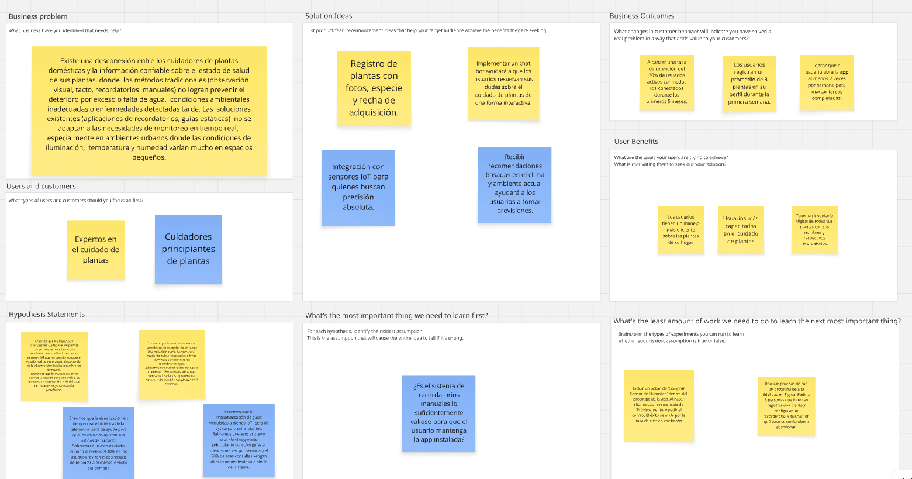
</p>

[Enlace al tablero en Miro](https://miro.com/app/board/uXjVHfgR13k=/?share_link_id=679214059458)


<div style="page-break-before: always;"></div>

<h2>1.3. Segmentos objetivo</h2>

Según Revista Economía (2020), los peruanos realizaron más de cincuenta y un mil búsquedas en línea relacionadas con áreas verdes entre los meses de enero y octubre. De estas consultas, un sesenta y seis por ciento correspondía al mantenimiento y mejora de jardines en el hogar. Además, el sesenta y cuatro por ciento de las personas que realizaron estas búsquedas tenían entre treinta y cuatro y cincuenta años. Esta tendencia nos indica de manera clara que existen segmentos con poder adquisitivo dispuestos a adoptar soluciones tecnológicas para facilitar el cuidado de sus espacios naturales domésticos.

<h3>Principiantes cuidadores de plantas</h3>

Personas interesadas en iniciarse en el cuidado de plantas que buscan evitar el fracaso inicial mediante tecnología sencilla.

<h5>Características demográficas:</h5>

  - Edad: De 18 a 45 años.

  - Ubicación: Residentes de zonas urbanas, específicamente departamentos, con espacio limitado y poco conocimiento botánico.

  - Nivel socioeconómico: Medio. Valoran soluciones que les ahorren tiempo y dinero al evitar que sus plantas mueran.

  - Nivel educativo: Con conocimientos de tecnología e interacción ágil con aplicaciones móviles.

<h3>Expertos cuidadores de plantas</h3>

Personas con amplia experiencia y colecciones botánicas que buscan optimizar el crecimiento de sus ejemplares mediante datos precisos.

<h4>Características demográficas:</h4>

- Edad: De 25 a 55 años.

- Ubicación: Residentes de áreas urbanas y suburbanas con espacios dedicados, tales como terrazas o jardines interiores.

- Nivel socioeconómico: Medio a alto. Dispuestos a invertir en hardware, como nodos IoT, para proteger plantas de alto valor o especies exóticas.

- Nivel educativo: Perfil tecnológico avanzado. Se sienten cómodos analizando gráficas de telemetría y comparando datos históricos.

<div style="page-break-before: always;"></div>

# Capítulo II: Requirements Elicitation & Analysis

## 2.1. Competidores

En la presente sección se analizaron a los principales competidores que representan el liderazgo actual en software de cuidado botánico e integración básica de hardware. El análisis permite identificar la brecha tecnológica que NaturaTech cubrirá mediante la implementación de tecnologías emergentes (Visión Computacional, Agentes Autónomos de IA integrados con IoT, y Smart Contracts sobre Web3), estableciendo una propuesta de valor única en el mercado y cumpliendo con los requerimientos de una arquitectura moderna y distribuida[cite: 3].

### 2.1.1. Análisis competitivo

<table>
  <tr>
    <th colspan="5">Competitive Analysis Landscape</th>
  </tr>
  <tr>
    <td colspan="2" align="center"><b>¿Por qué llevar a cabo este análisis?</b></td>
    <td colspan="3">El objetivo es identificar las limitaciones de las aplicaciones actuales y comparar nuestra capacidad disruptiva (Agente de IA que ejecuta acciones físicas y recompensas Web3) frente a soluciones pasivas, asegurando una experiencia superior y un modelo de retención innovador.</td>
  </tr>
  <tr>
    <th colspan="2">Nombre</th>
    <th>NaturaTech</th>
    <th>Xiaomi Flower Care</th>
    <th>Planta App</th>
    <th>Vera: Plant Care Made Easy</th>
  </tr>
  <tr>
    <td colspan="2" align="center"><b>Logo</b></td>
    <td align="center">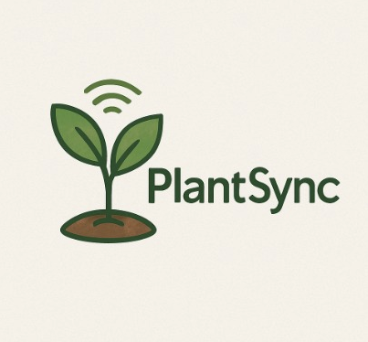</td>
    <td align="center"></td>
    <td align="center">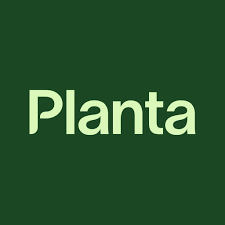</td>
    <td align="center">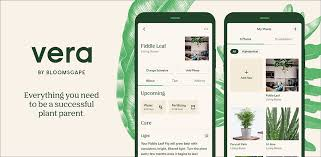</td>
  </tr>
  <tr>
    <td rowspan="2"><b>Perfil</b></td>
    <td><b>Overview</b></td>
    <td>Ecosistema que combina Agentes Autónomos de IA con IoT para ejecutar acciones físicas, diagnósticos por visión computacional consumiendo servicios de terceros y un sistema de gamificación descentralizado (Web3)[cite: 3].</td>
    <td>Sensor físico que mide humedad, fertilidad, luz y temperatura, vinculado a una app pasiva.</td>
    <td>App móvil de suscripción con guías, identificación y planes de cuidado manuales.</td>
    <td>App de inventario botánico con recordatorios de riego y seguimiento fotográfico.</td>
  </tr>
  <tr>
    <td><b>Ventaja competitiva ¿Qué valor ofrece a los clientes?</b></td>
    <td>El Agente IA diagnostica por foto y actúa físicamente en el entorno, premiando el éxito del usuario con Eco-Tokens y NFTs mediante Smart Contracts.</td>
    <td>Precisión de datos de hardware a bajo costo de adquisición.</td>
    <td>Algoritmo de recomendación basado en clima local y gran base de datos.</td>
    <td>Interfaz intuitiva enfocada en el registro visual y emocional.</td>
  </tr>
  <tr>
    <td rowspan="2"><b>Perfil de Marketing</b></td>
    <td><b>Mercado objetivo</b></td>
    <td>Hobbistas y principiantes atraídos por la automatización delegada a la IA y motivados por la "Gamificación Verde" y coleccionables digitales.</td>
    <td>Entusiastas de la tecnología y usuarios del ecosistema Smart Home de Xiaomi.</td>
    <td>Usuarios de smartphones que buscan soluciones de software sin hardware extra.</td>
    <td>Cuidadores jóvenes que priorizan la estética y el seguimiento en redes.</td>
  </tr>
  <tr>
    <td><b>Estrategias de Marketing</b></td>
    <td>Enfoque en "Care-to-Earn" (cuida para ganar recompensas Web3) y demostraciones de la IA actuando en el mundo físico.</td>
    <td>Distribución masiva global y SEO basado en "Smart Garden".</td>
    <td>Publicidad agresiva en TikTok/Instagram con modelo freemium.</td>
    <td>Marketing de comunidad en foros de entusiastas.</td>
  </tr>
  <tr>
    <td rowspan="3"><b>Perfil de Producto</b></td>
    <td><b>Productos &amp; Servicios</b></td>
    <td>App Móvil, Nodos IoT, Agente Autónomo IA (LLM integrado), Diagnóstico visual (API externa) y Billetera de Eco-Tokens (Web3)[cite: 3].</td>
    <td>Sensor físico y app móvil de lectura.</td>
    <td>App móvil con escáner e IA de reconocimiento interno.</td>
    <td>App móvil gratuita de recordatorios.</td>
  </tr>
  <tr>
    <td><b>Precios y Costos</b></td>
    <td>Kits modulares IoT + Suscripción para tokens ilimitados y comandos físicos del Agente IA.</td>
    <td>Pago único por dispositivo ($15-$25 USD).</td>
    <td>Descarga gratuita; suscripción Premium para funciones completas.</td>
    <td>Gratuito (Modelo basado en recolección de datos o futuras funciones premium).</td>
  </tr>
  <tr>
    <td><b>Canales de distribución (Web y/o Móvil)</b></td>
    <td>Venta directa vía Web, DApp integrada y App Store / Play Store.</td>
    <td>Distribuidores de electrónica, tiendas oficiales Xiaomi y e-commerce.</td>
    <td>App Store y Google Play Store.</td>
    <td>App Store y Google Play Store.</td>
  </tr>
  <tr>
    <td rowspan="4"><b>Análisis SWOT</b></td>
    <td><b>Fortalezas</b></td>
    <td>La IA no solo aconseja, actúa. Fuerte retención de usuarios gracias a la acuñación de NFTs y Eco-Tokens basados en telemetría real desplegados sobre Web3[cite: 3].</td>
    <td>Hardware confiable y gran autonomía de batería.</td>
    <td>Marca líder y excelente interfaz de usuario.</td>
    <td>Simplicidad de uso y alta retención emocional.</td>
  </tr>
  <tr>
    <td><b>Debilidades</b></td>
    <td>Costos de consumo de APIs externas de IA (visión/LLM) y fricción inicial para usuarios no familiarizados con billeteras Web3.</td>
    <td>App limitada solo a la lectura; el usuario debe intervenir manualmente.</td>
    <td>Inexactitud al no contar con sensores físicos en tiempo real.</td>
    <td>Funciones muy limitadas sin cruce de datos ambientales.</td>
  </tr>
  <tr>
    <td><b>Oportunidades</b></td>
    <td>Auge de los ecosistemas Web3 y la alta demanda por Agentes de IA orientados a la acción física (IoT).</td>
    <td>Expansión hacia el riego automatizado en su ecosistema.</td>
    <td>Integración de su IA con sensores de terceros mediante APIs.</td>
    <td>Alianzas para venta de insumos in-app.</td>
  </tr>
  <tr>
    <td><b>Amenazas</b></td>
    <td>Fluctuación en los costos transaccionales (Gas) de redes Blockchain y dependencia de servicios externos de visión computacional.</td>
    <td>Obsolescencia de compatibilidad con nuevos SO móviles.</td>
    <td>Saturación del mercado de apps de recordatorios.</td>
    <td>Migración de usuarios hacia apps basadas en datos reales.</td>
  </tr>
</table>

### 2.1.2. Estrategias y tácticas frente a competidores

**Afrontando las fortalezas de nuestros competidores**

Fortalezas de la competencia:
*   **Xiaomi Flower Care:** Bajo costo de adquisición y precisión en la lectura de hardware.
*   **Planta App:** Base de datos masiva, algoritmo consolidado y fuerte reconocimiento de marca.
*   **Vera:** Simplicidad excepcional y experiencia de usuario (UX) fluida y altamente emocional.

Nuestras fortalezas (NaturaTech):
*   **Visión Computacional de Alta Precisión:** Uso de un servicio externo especializado (API de terceros) para garantizar un diagnóstico exacto de hojas amarillas, hongos o marchitez a partir de fotografías[cite: 3].
*   **Agente Autónomo de IA (Action-Oriented AI):** El LLM interpreta el contexto y envía comandos directos vía protocolos como MQTT a la capa física IoT[cite: 3]. La IA no solo brinda recomendaciones, sino que ejecuta acciones en el mundo real.
*   **Gamificación Verde (Web3):** Uso de Smart Contracts para evaluar la telemetría histórica y acuñar (mint) Eco-Tokens o medallas NFT si el usuario mantiene niveles óptimos, desplegando la solución bajo plataformas Web3[cite: 3].

Estrategias:
*   Evolucionar el concepto de "App de jardinería" hacia un modelo de "Care-to-Earn", superando la retención puramente emocional de la competencia mediante recompensas digitales tangibles en la blockchain.
*   Posicionar a NaturaTech como el único asistente virtual verdaderamente autónomo que cierra la brecha entre el consejo digital y la acción física.

Tácticas:
*   Lanzar videos demostrativos donde un usuario escribe: *"Mi planta necesita luz urgente"* y el Agente de IA activa instantáneamente la lámpara IoT de forma autónoma, contrastando esto con las notificaciones pasivas de la competencia.
*   Promocionar galerías de NFTs exclusivos que los usuarios solo pueden desbloquear logrando rachas de 30 días de cuidados óptimos validados por los sensores.

**Afrontando las debilidades de nuestros competidores**

Debilidades clave de la competencia:
*   **Xiaomi:** Falta de actuadores; es un sistema de solo lectura que exige la intervención humana obligatoria.
*   **Planta/Vera:** Carencia total de datos reales del entorno y limitación a recordatorios estáticos.

Nuestras debilidades:
*   Barrera de adopción tecnológica al introducir Web3 (billeteras/tokens) a usuarios tradicionales, sumado a los costos operativos recurrentes de consumir APIs de terceros (LLMs y Visión Computacional).

Estrategias:
*   Abstraer por completo la complejidad de blockchain ("Invisible Web3") para que el usuario obtenga sus recompensas sin fricciones técnicas.
*   Optimizar la estructura de costos ofreciendo un modelo freemium controlado para el consumo de IA.

Tácticas:
*   Crear billeteras digitales automáticas en segundo plano al momento del registro, permitiendo que el usuario coleccione sus medallas NFT sin necesidad de gestionar llaves privadas inicialmente.
*   Limitar el número de diagnósticos por análisis de imagen en la capa gratuita y habilitar el Agente Autónomo (Action-Oriented AI) como característica de los planes premium o mediante el canje de "Eco-Tokens".

**Afrontando las oportunidades de nuestros competidores**

Oportunidades clave por competidor:
*   **Xiaomi Flower Care:** Posibilidad de integrar su hardware con su ecosistema de Smart Home.
*   **Planta App:** Capacidad de abrir su algoritmo vía API para integrarse con hardware de terceros.
*   **Vera:** Potencial para establecer canales de venta B2B (viveros, tiendas).

Nuestras oportunidades (NaturaTech):
*   Liderar el nicho emergente de Agentes de IA Físicos, combinando Server Side, Cloud e IoT bajo una arquitectura multicomponente[cite: 3].
*   Crear la primera economía circular botánica donde los tokens obtenidos por un buen cuidado tengan utilidad real.

Estrategias:
*   Desarrollar alianzas estratégicas con viveros y tiendas ecológicas para que los "Eco-Tokens" acuñados por los Smart Contracts sirvan como moneda de cambio o descuento en el mundo físico.

Tácticas:
*   Desplegar los Smart Contracts en redes Testnet (como Polygon o Ethereum) para asegurar transacciones fluidas y preparar el terreno para integraciones B2B con tiendas de plantas[cite: 3].
*   Habilitar un *marketplace* in-app donde la gamificación Web3 se traduzca en semillas, fertilizantes o actualizaciones para el hardware IoT.

**Afrontando las amenazas de nuestros competidores**

Amenazas clave por competidor:
*   **Xiaomi Flower Care:** Obsolescencia de software con nuevos SO móviles.
*   **Planta App:** Saturación del mercado con clones que ofrecen escaneo fotográfico gratuito.
*   **Vera:** Migración masiva de su base de usuarios hacia plataformas conectadas.

Nuestras amenazas:
*   Fallos de latencia o disponibilidad en las APIs externas de Visión Computacional o en el LLM, afectando la autonomía del Agente.
*   Fluctuación en los costos de gas de las redes blockchain y posible escepticismo inicial del público hacia las tecnologías Web3.

Estrategias:
*   Desvincular el éxito del producto de la especulación financiera, enfocando el componente Web3 estrictamente como un motor de "Gamificación Verde" y prueba de logro inmutable.
*   Diseñar una arquitectura resiliente y asíncrona entre el backend y los servicios de terceros para evitar bloqueos en el flujo del usuario.

Tácticas:
*   Implementar mecanismos de *fallback* e hilos asíncronos en la comunicación MQTT hacia los nodos IoT en caso de que el LLM sufra retrasos de red.
*   Educar al usuario mediante la interfaz sobre cómo sus medallas NFT representan un historial verificado de su habilidad botánica, fomentando la competencia sana y el status dentro de la comunidad de NaturaTech.

<div style="page-break-before: always;"></div>

### 2.2. Entrevistas

### 2.2.1. Diseño de entrevistas

Se diseñaron dos sets de preguntas orientados a recolectar datos demográficos, comportamentales y de validación directa de las tecnologías emergentes que componen el núcleo de NaturaTech: Visión Computacional, Agentes Autónomos de IA integrados con IoT, y Gamificación Verde basada en Web3.

**Entrevista para personas con experiencia como hobbista:**

1.- ¿Cuánto tiempo llevas cuidando plantas en tu hogar y qué motivó ese interés inicial?

2.- ¿Qué dificultades principales enfrentas al momento de diagnosticar a tiempo problemas complejos como plagas, hongos o deficiencias nutricionales?

3.- ¿Llevas algún registro de tus cuidados? ¿Cómo te aseguras de mantener las condiciones óptimas todos los días ante cambios de clima?

4.- ¿Qué opinas sobre utilizar una función de Inteligencia Artificial que identifique la especie exacta y diagnostique enfermedades con solo subir una foto de tu planta?

5.- ¿Qué tan útil te resultaría interactuar con un asistente virtual inteligente (vía chat) al que no solo le pidas consejos, sino que le puedas ordenar ejecutar acciones físicas en tu hogar (ej. "enciende la luz UV de mi suculenta")?

6.- ¿Confiarías en un sistema autónomo donde la IA analice el entorno y active actuadores (riego, luz) por su cuenta para corregir problemas antes de que la planta sufra daños irreversibles?

7.- ¿Estarías interesado en un sistema de "gamificación verde" que evalúe el historial de tu telemetría y te premie con recompensas descentralizadas (como Eco-Tokens o medallas NFT) si mantienes tu planta en niveles óptimos ininterrumpidos durante 30 días?

8.- ¿Sientes que recibir este tipo de incentivos digitales le agregaría valor, competitividad o un sentido de logro a tu experiencia como hobbista?

9.- ¿Qué otras funcionalidades avanzadas te gustaría encontrar en un ecosistema de jardinería que integre IA e Internet de las Cosas (IoT)?

10.- ¿Estarías dispuesto a pagar una suscripción para tener acceso a diagnósticos ilimitados por visión computacional y control automatizado de tu jardín?

11.- ¿Cómo te sentirías delegando parte de la toma de decisiones al software para mantener condiciones adecuadas sin tener que intervenir constantemente?

12.- En general, ¿crees que la integración de diagnósticos por IA, control físico autónomo y recompensas Web3 resolvería los cuellos de botella actuales en el cuidado de tus plantas?

**Entrevista para personas con poca experiencia en el cuidado de plantas:**

1.- ¿Has tenido alguna vez una planta en casa? De ser así, ¿cómo fue esa experiencia y cuánto tiempo sobrevivió?

2.- ¿Qué problemas, miedos o frustraciones te impiden mantener tus plantas vivas actualmente?

3.- ¿Te resulta frustrante no saber qué le pasa a tu planta? ¿Te ayudaría una app donde solo tomas una fotografía y la Inteligencia Artificial te dice exactamente qué enfermedad tiene y cómo curarla?

4.- Si pudieras escribirle a un chat: "Mi planta se está secando, ayúdala", y el asistente virtual automáticamente activara un sistema de riego en tu casa, ¿lo usarías?

5.- ¿Qué tan cómodo/a te sentirías si una Inteligencia Artificial monitorea tu planta 24/7 y toma decisiones físicas por ti, como encender luces o regarla cuando lo necesite, sin que tengas que pedírselo?

6.- Sabiendo que a veces es difícil ser constante, ¿te motivaría un sistema de recompensas (gamificación) que te regale medallas digitales exclusivas (NFTs) o "Eco-Tokens" por lograr el objetivo de mantener viva y sana tu planta durante un mes?

7.- ¿Crees que recibir estos premios digitales haría que el cuidado de las plantas se sienta más como un juego entretenido y menos como una obligación o una tarea pesada?

8.- ¿Utilizas actualmente alguna aplicación, blog o comunidad en línea para orientarte? ¿Qué aspectos te agradan o te confunden de esas plataformas?

9.- ¿Te interesaría usar una aplicación que te envíe notificaciones preventivas y te permita ejecutar acciones de cuidado a distancia con un solo botón desde tu celular?

10.- ¿Estarías dispuesto/a a adquirir un kit básico de hardware inteligente (sensor y actuador de riego) si eso garantiza casi al 100% que tus plantas no mueran?

11.- ¿Pagarías una suscripción por tener a este "agente virtual inteligente" cuidando tus plantas de forma autónoma?

12.- ¿Consideras que delegar el cuidado a la tecnología disruptiva es la solución definitiva para perder el miedo a tener plantas en casa por falta de tiempo o conocimiento?

### 2.2.2. Registro de entrevistas
Se han realizado las entrevistas de acuerdo al diseño de preguntas. Se puede visualizar el video de las entrevistas en el siguiente enlace: 

**[Hacer clic aquí para ver el video de las entrevistas](https://upcedupe-my.sharepoint.com/:v:/g/personal/u202219481_upc_edu_pe/IQB9oQbZhBX7RoBPiVA2usHiAaafYcwj3awpWjlGIKXH0w0?nav=eyJyZWZlcnJhbEluZm8iOnsicmVmZXJyYWxBcHAiOiJPbmVEcml2ZUZvckJ1c2luZXNzIiwicmVmZXJyYWxBcHBQbGF0Zm9ybSI6IldlYiIsInJlZmVycmFsTW9kZSI6InZpZXciLCJyZWZlcnJhbFZpZXciOiJNeUZpbGVzTGlua0NvcHkifX0&e=UsbHgV)**


<h4>Principiantes cuidadores de plantas:</h4>

<table cellpadding="8" cellspacing="0">
  <tbody>
    <tr>
      <td>Entrevista 1</td>
      <td></td>
    </tr>
    <tr>
      <td>Nombre Entrevistado</td>
      <td>Marcelo Barrientos Quispe</td>
    </tr>
    <tr>
      <td>Edad</td>
      <td>20</td>
    </tr>
    <tr>
      <td>Distrito</td>
      <td>San Isidro</td>
    </tr>
    <tr>
      <td>Ocupacion</td>
      <td>Estudiante Ingenieria de Software</td>
    </tr>
    <tr>
      <td>Duración Entrevista</td>
      <td>5:03</td>
    </tr>
    <tr>
      <td>Minuto de Inicio</td>
      <td>0:08</td>
    </tr>
        <tr>
      <td><strong>Resumen:</strong></td>
      <td>Marcelo Barrientos, estudiante de Ingenieria de software de 20 años, nos cuenta su experiencia al momento de cuidar sus plantas, se guia por foros y comunidades externas, nos mostro su postura a favor de que contar con una aplicación que le brinde los conocimientos necesarios, seria ideal para subsanar sus dudas</td>
    </tr>
  </tbody>
</table>

<br>

<table cellpadding="8" cellspacing="0">
  <tbody>
    <tr>
      <td>Entrevista 2</td>
      <td></td>
    </tr>
    <tr>
      <td>Nombre Entrevistado</td>
      <td>Marcelo Barretos Gonzales</td>
    </tr>
    <tr>
      <td>Edad</td>
      <td>21</td>
    </tr>
    <tr>
      <td>Distrito</td>
      <td>Lima</td>
    </tr>
    <tr>
      <td>Ocupacion</td>
      <td>Estudiante</td>
    </tr>
    <tr>
      <td>Duración Entrevista</td>
      <td>09:52 </td>
    </tr>
    <tr>
      <td>Minuto de Inicio</td>
      <td>5:16</td>
    </tr>
        <tr>
      <td><strong>Resumen:</strong></td>
      <td>Marcelo Barrientos, el cual se le pregunta acerca de que tan beneficioso seria para el una aplicación tecnológica relacionada con la agricultura o el cultivo, posiblemente enfocada en el análisis de imágenes (fotos) para diagnosticar problemas en plantas, recomendar soluciones y facilitar el control automático mediante sensores y retroalimentación.</td>
    </tr>
  </tbody>
</table>

<br>

<table cellpadding="8" cellspacing="0">
  <tbody>
    <tr>
      <td>Entrevista 3</td>
      <td></td>
    </tr>
    <tr>
      <td>Nombre Entrevistado</td>
      <td>Marcia Melgarejo Gomez</td>
    </tr>
    <tr>
      <td>Edad</td>
      <td>21</td>
    </tr>
    <tr>
      <td>Distrito</td>
      <td>San Miguel</td>
    </tr>
    <tr>
      <td>Ocupacion</td>
      <td>Estudiante</td>
    </tr>
    <tr>
      <td>Duración Entrevista</td>
      <td>7:01</td>
    </tr>
    <tr>
      <td>Minuto de Inicio</td>
      <td>15:08</td>
    </tr>
        <tr>
      <td><strong>Resumen:</strong></td>
      <td>Marcia Melgarejo Gómez (21), estudiante con problemas de falta de tiempo y olvidos para cuidar plantas. Su principal dificultad es no saber identificar las causas cuando se marchitan y la información confusa en internet. Considera muy útil una IA con reconocimiento fotográfico de enfermedades, control de riego remoto y automatización con supervisión. Le motiva la gamificación con tokens para crear el hábito y estaría dispuesta a comprar hardware accesible y pagar una suscripción económica si el sistema funciona.</td>
    </tr>
  </tbody>
</table>


<br>


<h4>Expertos cuidadores de plantas:</h4>
 
<table cellpadding="8" cellspacing="0">
  <tbody>
    <tr>
      <td>Entrevista 4</td>
      <td></td>
    </tr>
    <tr>
      <td>Nombre Entrevistado</td>
      <td>Henry Diaz Gutierrez</td>
    </tr>
    <tr>
      <td>Edad</td>
      <td>26 años</td>
    </tr>
    <tr>
      <td>Distrito</td>
      <td>Chorrillos</td>
    </tr>
    <tr>
      <td>Ocupacion</td>
      <td>Estudiante universitario</td>
    </tr>
    <tr>
      <td>Duración Entrevista</td>
      <td>05:10</td>
    </tr>
    <tr>
      <td>Minuto de Inicio</td>
      <td>22:17</td>
    </tr>
        <tr>
      <td><strong>Resumen:</strong></td>
      <td>Henry Díaz Gutiérrez (26), estudiante universitario de Chorrillos, cuida plantas desde hace cinco años. Su principal dificultad es identificar enfermedades o deficiencias y recordar algunos cuidados. Le interesa una aplicación con IA para diagnosticar problemas mediante fotos y controlar riego o iluminación con IoT. Confiaría en la automatización si recibe avisos previos y pagaría una suscripción económica si realmente le resulta útil.</td>
    </tr>
  </tbody>
</table>

<br>

<table cellpadding="8" cellspacing="0">
  <tbody>
    <tr>
      <td>Entrevista 5</td>
      <td></td>
    </tr>
    <tr>
      <td>Nombre Entrevistado</td>
      <td>Marllely Arias Segil</td>
    </tr>
    <tr>
      <td>Edad</td>
      <td>23 años</td>
    </tr>
    <tr>
      <td>Distrito</td>
      <td>Chorrillos</td>
    </tr>
    <tr>
      <td>Ocupacion</td>
      <td>Estudiante universitario</td>
    </tr>
    <tr>
      <td>Duración Entrevista</td>
      <td>04:26</td>
    </tr>
    <tr>
      <td>Minuto de Inicio</td>
      <td>27:28</td>
    </tr>
        <tr>
      <td><strong>Resumen:</strong></td>
      <td>Marllely Arias (23), estudiante universitaria, cuida plantas desde hace tres años. Su mayor dificultad es reconocer la causa de los problemas y no lleva un registro fijo de cuidados. Considera útil la IA para identificar plantas y detectar enfermedades, además del control remoto de riego e iluminación. Usaría funciones automáticas con supervisión y pagaría si el precio es accesible.</td>
    </tr>
  </tbody>
</table>

<br>

<table cellpadding="8" cellspacing="0">
  <tbody>
    <tr>
      <td>Entrevista 6</td>
      <td></td>
    </tr>
    <tr>
      <td>Nombre Entrevistado</td>
      <td>Genaro Ledesma</td>
    </tr>
    <tr>
      <td>Edad</td>
      <td>23 </td>
    </tr>
    <tr>
      <td>Distrito</td>
      <td>Lima Cercado</td>
    </tr>
    <tr>
      <td>Ocupacion</td>
      <td>Estudiante</td>
    </tr>
    <tr>
      <td>Duración Entrevista</td>
      <td>06:41</td>
    </tr>
    <tr>
      <td>Minuto de Inicio</td>
      <td>31:56</td>
    </tr>
        <tr>
      <td><strong>Resumen:</strong></td>
      <td>Genaro Ledesma (23), estudiante de ingeniería Civil en la UNMSM, con 7 años de experiencia, vive en Lima y busca profesionalizar el cuidado de sus plantas mediante tecnología. Aunque domina la inspección visual, enfrenta retos con las plagas, el clima inestable y el seguimiento de la fertilización. Le interesa integrar detección de hongos por IA y sistemas IoT para automatizar la humedad y luz, estando dispuesto a pagar por diagnósticos de alta precisión y contacto con especialistas para llevar su hobby al siguiente nivel.</td>
    </tr>
  </tbody>
</table>

<br>

### 2.2.3. Análisis de entrevistas


**Segmento 1: Principiantes cuidadores de plantas**

Los entrevistados Marcelo Barrientos Quispe, Marcelo Barrientos y Marcia Melgarejo Gómez presentan poca experiencia en el cuidado de plantas y recurren principalmente a información externa para resolver sus dudas. Entre las principales dificultades identificadas se encuentran la falta de conocimientos específicos, la dificultad para reconocer qué problema presenta una planta y, en algunos casos, la falta de tiempo o los olvidos relacionados con el cuidado diario. Esta situación puede generar inseguridad al momento de decidir cuándo regar, cómo tratar una enfermedad o qué acción realizar cuando una planta comienza a deteriorarse.

Los entrevistados muestran interés por herramientas tecnológicas que simplifiquen estas tareas. Destacan principalmente el uso de inteligencia artificial para identificar plantas o diagnosticar problemas mediante fotografías, así como la posibilidad de recibir recomendaciones claras sin tener que buscar información en distintas fuentes. También existe interés en funciones relacionadas con sensores, automatización del riego y control remoto. En algunos casos, la gamificación mediante recompensas digitales podría ayudar a crear mayor constancia y convertir el cuidado de las plantas en una actividad más entretenida.

| **Característica** | **Frecuencia (n/3)** | **Porcentaje** | **Entrevistas relacionadas** |
| --- | :---: | :---: | --- |
| Necesidad de orientación para el cuidado de plantas | 3/3 | **100%** | 1(Marcelo Barrientos Quispe), 2(Marcelo Barrientos), 3(Marcia Melgarejo) |
| Interés en soluciones digitales para facilitar el cuidado | 3/3 | **100%** | 1, 2, 3 |
| Interés en diagnóstico o reconocimiento mediante imágenes e IA | 2/3 | 67% | 2, 3 |
| Interés en automatización mediante sensores o control de riego | 2/3 | 67% | 2, 3 |
| Uso o consulta de fuentes externas para resolver dudas | 2/3 | 67% | 1, 3 |
| Problemas relacionados con falta de tiempo u olvidos | 1/3 | 33% | 3 |
| Interés en gamificación o recompensas digitales | 1/3 | 33% | 3 |
| Disposición a adquirir hardware o pagar por el servicio | 1/3 | 33% | 3 |

**Segmento 2: Expertos cuidadores de plantas**

Los entrevistados Henry Díaz Gutiérrez, Marllely Arias Segil y Dione Ostos Guillén cuentan con mayor experiencia en el cuidado de plantas y poseen conocimientos adquiridos mediante la práctica. Sin embargo, todavía enfrentan dificultades para identificar correctamente enfermedades, plagas, hongos o deficiencias, debido a que distintos problemas pueden presentar síntomas similares. Además, algunos realizan el seguimiento de sus plantas de manera manual, mediante observación directa de las hojas, la humedad del suelo o recordando cuándo realizaron determinadas actividades.

En este segmento existe un interés considerable por utilizar inteligencia artificial como apoyo para reconocer especies, diagnosticar enfermedades mediante fotografías y recibir recomendaciones más precisas. También valoran funciones relacionadas con el clima, alertas de riego, fertilización y automatización mediante IoT. Aunque existe disposición a delegar algunas tareas al sistema, Henry y Marllely prefieren mantener cierto nivel de supervisión antes de permitir que la aplicación tome decisiones completamente autónomas. Asimismo, los tres entrevistados muestran disposición a pagar si la solución ofrece beneficios reales y mantiene un precio accesible.

| **Característica** | **Frecuencia (n/3)** | **Porcentaje** | **Entrevistas relacionadas** |
| --- | :---: | :---: | --- |
| Interés en identificación o diagnóstico mediante IA y fotografías | 3/3 | **100%** | 4(Henry), 5(Marllely), 6(Dione) |
| Interés en recomendaciones relacionadas con clima y cuidado | 3/3 | **100%** | 4, 5, 6 |
| Interés en automatización del cuidado mediante tecnología o IoT | 3/3 | **100%** | 4, 5, 6 |
| Disposición a pagar si la solución proporciona beneficios reales | 3/3 | **100%** | 4, 5, 6 |
| Seguimiento manual o poco estructurado del cuidado | 2/3 | 67% | 4, 5 |
| Dificultad para identificar la causa exacta de problemas en las plantas | 2/3 | 67% | 4, 5 |
| Preferencia por supervisar las decisiones automáticas del sistema | 2/3 | 67% | 4, 5 |
| Interés en gamificación, medallas o Eco-Tokens | 2/3 | 67% | 4, 5 |

Ambos segmentos muestran interés en utilizar tecnología para facilitar el cuidado de plantas, especialmente mediante inteligencia artificial, reconocimiento mediante fotografías y automatización. Sin embargo, sus necesidades presentan algunas diferencias. Los principiantes requieren principalmente orientación, simplicidad y apoyo para saber qué hacer ante un problema, mientras que los usuarios con mayor experiencia buscan herramientas que complementen sus conocimientos, automaticen tareas repetitivas y les proporcionen información más precisa.

Por ello, NaturaTech podría priorizar un núcleo funcional compuesto por reconocimiento de plantas mediante fotografías, diagnóstico asistido por inteligencia artificial, recomendaciones personalizadas, alertas de cuidado y monitoreo mediante sensores IoT. Posteriormente, podrían incorporarse funciones complementarias como automatización avanzada, control remoto, historial de cuidados y gamificación mediante Eco-Tokens o medallas digitales. De esta manera, la solución podría atender tanto a usuarios principiantes que necesitan acompañamiento como a usuarios experimentados que buscan mayor eficiencia y control en el cuidado de sus plantas.

## 2.3. Competidores

Después de realizar las entrevistas y detectar los problemas, necesidades y expectativas del público objetivo, se procede a construir los User Persona y otros elementos relacionados con la experiencia del usuario antes de interactuar con la solución propuesta.

### 2.3.1. User Personas

Para desarrollar estos artefactos se consideraron factores como edad, ocupación, ubicación, intereses y frustraciones de los entrevistados. Estos perfiles reflejan usuarios reales que desean incorporar plantas en su rutina diaria, pero requieren orientación clara y soluciones acordes a su estilo de vida. A continuación, se presentan los User Persona definidos.

- #### User Persona: Interesados en comenzar a cuidar plantas
  <a href="https://ibb.co/zVvHPdpN"></a>

- #### User Persona: Personas con experiencia en el cuidado de plantas
  <a href="https://ibb.co/Ps5YMsfV"></a>

### 2.3.2. User Task Matrix

En esta sección se construye la User Task Matrix considerando los dos segmentos definidos y vinculados a los User Persona. Se analizan perfiles como estudiantes universitarios que buscan adquirir experiencia y gerentes interesados en incorporar talento joven para sus proyectos.

<table border="1" cellpadding="8" cellspacing="0" style="border-collapse: collapse; text-align: center; width: 100%;">
  <thead>
    <tr>
      <th rowspan="2">Tarea</th>
      <th colspan="2">Experto</th>
      <th colspan="2">Persona sin experiencia</th>
    </tr>
    <tr>
      <th>Frecuencia</th>
      <th>Importancia</th>
      <th>Frecuencia</th>
      <th>Importancia</th>
    </tr>
  </thead>
  <tbody>
    <tr>
      <td>Adquirir nuevas plantas</td>
      <td>Sometimes</td>
      <td>Medium</td>
      <td>Rarely</td>
      <td>Low</td>
    </tr>
    <tr>
      <td>Ajustar los cuidados de acuerdo al clima</td>
      <td>Sometimes</td>
      <td>Medium</td>
      <td>Never</td>
      <td>Low</td>
    </tr>
    <tr>
      <td>Registrar todas las actividades de cuidado</td>
      <td>Sometimes</td>
      <td>High</td>
      <td>Never</td>
      <td>Low</td>
    </tr>
    <tr>
      <td>Evaluar el estado de salud de sus plantas</td>
      <td>Often</td>
      <td>High</td>
      <td>Rarely</td>
      <td>Medium</td>
    </tr>
    <tr>
      <td>Comprar los insumos para el cuidado</td>
      <td>Sometimes</td>
      <td>Medium</td>
      <td>Rarely</td>
      <td>Low</td>
    </tr>
    <tr>
      <td>Consultar guías o videos sobre plantas</td>
      <td>Rarely</td>
      <td>Medium</td>
      <td>Often</td>
      <td>High</td>
    </tr>
    <tr>
      <td>Decorar su habitación con plantas</td>
      <td>Rarely</td>
      <td>Low</td>
      <td>Medium</td>
      <td>High</td>
    </tr>
    <tr>
      <td>Preguntar por consejos a sus conocidos</td>
      <td>Rarely</td>
      <td>Low</td>
      <td>Sometimes</td>
      <td>Medium</td>
    </tr>
    <tr>
      <td>Buscar soluciones digitales de apoyo</td>
      <td>Sometimes</td>
      <td>Medium</td>
      <td>Sometimes</td>
      <td>High</td>
    </tr>
    <tr>
      <td>Tomar fotos para seguimiento del crecimiento</td>
      <td>Sometimes</td>
      <td>Low</td>
      <td>Sometimes</td>
      <td>Medium</td>
    </tr>
  </tbody>
</table>

A partir de esta matriz se pueden extraer las siguientes conclusiones sobre las actividades de los User Persona:

- Para el usuario con experiencia, las tareas más relevantes son evaluar la salud de sus plantas y llevar un registro de los cuidados. En contraste, el usuario principiante se enfoca más en aprender y en encontrar herramientas digitales de apoyo.

- Ambos perfiles coinciden en su interés por documentar el crecimiento mediante fotografías y en la búsqueda de soluciones tecnológicas que faciliten el cuidado.

- Las diferencias se evidencian en el nivel de experiencia: el usuario experto dedica más tiempo a monitorear y mantener un plan estructurado, mientras que el principiante prioriza el aprendizaje y valora más el aspecto estético de las plantas.

### 2.3.3. Empathy Mapping

<h4>Segmento 1 — Principiante cuidador de plantas</h4>

A continuación se presenta el mapa de empatía correspondiente al segmento de principiantes, representado por Alejandro Flores, joven de 20 años de Chorrillos, Lima, quien se inició en el cuidado de plantas en 2025 sin conocimientos previos ni herramientas de apoyo.
<p align="center">
  
</p>

<h4>Segmento 2 — Experto cuidador de plantas</h4>
A continuación se presenta el mapa de empatía correspondiente al segmento de expertos, representado por Leonor Gonzales, cuidadora de 60 años de San Miguel, Lima, con más de 6 años de experiencia en jardinería doméstica y una amplia colección de plantas que gestiona sin ningún sistema de registro formal.
<p align="center">
  
</p>
<div style="page-break-before: always;"></div>


#### 2.3.4. As-is Scenario Mapping

Segmento 1: José Avedaño


Segmento 2: Mariana Mendoza


## 2.5. Ubiquitous Language

En esta sección se define el glosario de términos y conceptos utilizados en el dominio del negocio de NaturaTech. Para mantener una comunicación clara y sin ambigüedades entre los stakeholders y el equipo de desarrollo, los términos principales se definen en inglés (con su equivalente en español) y excluyen jerga técnica de ingeniería de software, enfocándose puramente en el ecosistema botánico, la automatización y la gamificación verde[cite: 3].

<table>
  <thead>
    <tr>
      <th>Término (Inglés / Español)</th>
      <th>Tipo</th>
      <th>Definición en el dominio de NaturaTech</th>
      <th>Ejemplo de uso</th>
    </tr>
  </thead>
  <tbody>
    <tr>
      <td><strong>Plant Profile (Perfil de Planta)</strong></td>
      <td>Dominio</td>
      <td>Representación digital de una planta física en el sistema, que contiene su información biológica, especie y el hardware asociado a ella.</td>
      <td>"El <em>Plant Profile</em> de la Monstera está vinculado al nodo de la sala."</td>
    </tr>
    <tr>
      <td><strong>Sensor Node (Nodo Sensor)</strong></td>
      <td>Sistema</td>
      <td>Dispositivo físico instalado en el entorno de la planta que captura datos ambientales en tiempo real (humedad, temperatura, luz).</td>
      <td>"El <em>Sensor Node</em> detectó una caída crítica de humedad en el sustrato."</td>
    </tr>
    <tr>
      <td><strong>Autonomous Actuator (Actuador Autónomo)</strong></td>
      <td>Sistema</td>
      <td>Componente de hardware (ej. bomba de riego, lámpara UV) con permisos para ejecutar acciones correctivas en el mundo físico basándose en decisiones inteligentes.</td>
      <td>"El <em>Autonomous Actuator</em> inició el riego por goteo durante 5 minutos."</td>
    </tr>
    <tr>
      <td><strong>Visual Diagnosis (Diagnóstico Visual)</strong></td>
      <td>Evento / Dominio</td>
      <td>Proceso de análisis de una fotografía botánica para identificar la especie exacta y detectar automáticamente enfermedades, hongos o marchitez.</td>
      <td>"El <em>Visual Diagnosis</em> confirmó que las hojas amarillas son por exceso de riego."</td>
    </tr>
    <tr>
      <td><strong>Autonomous Agent (Agente Autónomo)</strong></td>
      <td>Actor (Sistema)</td>
      <td>Asistente virtual inteligente capaz de interpretar comandos en lenguaje natural y tomar decisiones proactivas para accionar mecanismos físicos sin intervención manual.</td>
      <td>"El usuario pidió luz, y el <em>Autonomous Agent</em> encendió la lámpara UV."</td>
    </tr>
    <tr>
      <td><strong>Telemetry (Telemetría)</strong></td>
      <td>Dominio</td>
      <td>Flujo continuo de datos ambientales capturados por el nodo sensor, que sirve como historial de salud y base para las recompensas.</td>
      <td>"Revisando la <em>Telemetry</em>, la planta mantuvo niveles óptimos por 30 días."</td>
    </tr>
    <tr>
      <td><strong>Eco-Token (Eco-Token)</strong></td>
      <td>Dominio / Recompensa</td>
      <td>Recompensa digital y descentralizada otorgada al usuario por mantener la telemetría de su planta en niveles óptimos de forma ininterrumpida.</td>
      <td>"El usuario ganó 50 <em>Eco-Tokens</em> por un mes de cuidado perfecto."</td>
    </tr>
    <tr>
      <td><strong>Achievement Badge (Medalla de Logro / NFT)</strong></td>
      <td>Dominio / Recompensa</td>
      <td>Certificado digital único y de propiedad del usuario que valida un hito importante en la supervivencia o cuidado de especies exóticas.</td>
      <td>"Se acuñó un <em>Achievement Badge</em> en la billetera del usuario por revivir su orquídea."</td>
    </tr>
    <tr>
      <td><strong>Threshold Policy (Política de Umbral)</strong></td>
      <td>Política</td>
      <td>Regla agronómica que establece los límites saludables de un entorno; si se vulnera, dispara la intervención inmediata del Agente Autónomo.</td>
      <td>"La <em>Threshold Policy</em> indica que si la luz baja de 200 lux, se debe activar la lámpara."</td>
    </tr>
    <tr>
      <td><strong>Care Log (Historial de Cuidados)</strong></td>
      <td>Dominio</td>
      <td>Registro cronológico e inmutable de todas las acciones realizadas sobre una planta, ya sean manuales del usuario o automatizadas por el agente.</td>
      <td>"El <em>Care Log</em> muestra que el actuador regó la planta el martes pasado."</td>
    </tr>
  </tbody>
</table>

<div style="page-break-before: always;"></div>


# Capítulo III: Requirements Specification

## 3.1. User Stories

<table border="1">
  <tbody>
    <tr>
      <td><strong>Epic / Story ID</strong></td>
      <td><strong>Título</strong></td>
      <td><strong>Descripción</strong></td>
      <td><strong>Criterios de Aceptación</strong></td>
      <td><strong>Relación con Epic</strong></td>
    </tr>
    <tr>
      <td>EP01</td>
      <td>Presencia Digital y Conversión</td>
      <td>
        <strong>Como</strong> visitante o cliente potencial, <strong>quiero</strong> explorar una página de aterrizaje informativa y confiable, <strong>para</strong> entender los beneficios del sistema y registrarme fácilmente en la plataforma.
      </td>
      <td>No corresponde</td>
      <td>No corresponde</td>
    </tr>
    <tr>
      <td>EP02</td>
      <td>Gestión de Identidad y Perfil de Usuario</td>
      <td>
        <strong>Como</strong> usuario de la plataforma, <strong>quiero</strong> gestionar mi identidad, seguridad y personalizar la interfaz, <strong>para</strong> tener una experiencia de uso cómoda y visualizar mis estadísticas personales.
      </td>
      <td>No corresponde</td>
      <td>No corresponde</td>
    </tr>
    <tr>
      <td>EP03</td>
      <td>Gestión del Inventario Botánico</td>
      <td>
        <strong>Como</strong> cuidador de plantas, <strong>quiero</strong> registrar, editar y documentar visualmente el ciclo de vida de mis plantas, <strong>para</strong> mantener un inventario botánico digital organizado.
      </td>
      <td>No corresponde</td>
      <td>No corresponde</td>
    </tr>
    <tr>
      <td>EP04</td>
      <td>Integración IoT y Monitoreo de Variables</td>
      <td>
        <strong>Como</strong> usuario con hardware IoT, <strong>quiero</strong> vincular mis sensores y actuadores a la aplicación, <strong>para</strong> monitorear las métricas ambientales y automatizar el entorno físico de mis plantas.
      </td>
      <td>No corresponde</td>
      <td>No corresponde</td>
    </tr>
    <tr>
      <td>EP05</td>
      <td>Planificación y Registro de Cuidados</td>
      <td>
        <strong>Como</strong> usuario, <strong>quiero</strong> programar recordatorios automáticos y registrar el historial de mis acciones manuales, <strong>para</strong> planificar adecuadamente los cuidados y no olvidar ninguna tarea.
      </td>
      <td>No corresponde</td>
      <td>No corresponde</td>
    </tr>
    <tr>
      <td>EP06</td>
      <td>Inteligencia Botánica y Análisis Externo</td>
      <td>
        <strong>Como</strong> usuario, <strong>quiero</strong> recibir asesoría de un asistente inteligente y consultar datos climáticos locales, <strong>para</strong> obtener recomendaciones expertas y personalizadas según cada especie.
      </td>
      <td>No corresponde</td>
      <td>No corresponde</td>
    </tr>
    <tr>
        <tr>
      <td>EP07</td>
      <td>Gamificación y Recompensas Web3</td>
      <td>
        <strong>Como</strong> usuario constante, <strong>quiero</strong> ser recompensado mediante tecnología blockchain descentralizada, <strong>para</strong> mantener la motivación a largo plazo en el cuidado de mis plantas.
      </td>
      <td>No corresponde</td>
      <td>No corresponde</td>
    </tr>
    <tr>
      <td>US01</td>
      <td>Visualización de beneficios botánicos en el Landing Page</td>
      <td>
        <strong>Como</strong> visitante, <strong>quiero</strong> visualizar una sección informativa sobre los beneficios psicológicos del cuidado de plantas, <strong>para</strong> motivarme a adquirir la solución.
      </td>
      <td>
        <strong>Escenario 1: Acceso a información de bienestar.</strong><br>
        <strong>Dado que</strong> el visitante se encuentra en la página de inicio, <strong>cuando</strong> navega hacia la sección de beneficios, <strong>entonces</strong> el sistema muestra los datos de salud mental y reducción de estrés vinculados a la horticultura.
      </td>
      <td>EP01</td>
    </tr>
    <tr>
      <td>US02</td>
      <td>Vinculación de dispositivo IoT con la cuenta</td>
      <td>
        <strong>Como</strong> usuario, <strong>quiero</strong> vincular mi dispositivo físico con mi cuenta en la aplicación móvil, <strong>para</strong> visualizar los datos capturados de forma privada y exclusiva.
      </td>
      <td>
        <strong>Escenario 1: Asociación exitosa de hardware.</strong><br>
        <strong>Dado que</strong> el usuario ha iniciado sesión en la aplicación, <strong>cuando</strong> ingresa el identificador único de su kit IoT, <strong>entonces</strong> el sistema vincula el dispositivo a su perfil y confirma la conexión.
      </td>
      <td>EP04</td>
    </tr>
    <tr>
      <td>US03</td>
      <td>Metricas de Sensor de Gas (Calidad de aire)</td>
      <td>
        <strong>Como</strong> usuario, <strong>quiero</strong> quiero poder ver las metricas del sensor de gas del dispositivo IoT, <strong>para</strong> estar informado de la calidad del aire y cuidar mejor mi planta.
      </td>
      <td>
        <strong>Escenario 1: Ver metrica de sensor de gas</strong><br>
        <strong>Dado que</strong> miro el dashboard de mi planta, <strong>cuando</strong> verifico el sensor de gas, <strong>entonces</strong> debo poder ver la data de ese sensor
      </td>
      <td>EP04</td>
    </tr>
    <tr>
      <td>US04</td>
      <td>Redirección a plataformas desde el Landing Page</td>
      <td>
        <strong>Como</strong> visitante, <strong>quiero</strong> encontrar enlaces directos a la aplicación web y a las tiendas de descarga móvil, <strong>para</strong> acceder a las herramientas de gestión botánica.
      </td>
      <td>
        <strong>Escenario 1: Uso de Call-to-Action (CTA).</strong><br>
        <strong>Dado que</strong> el visitante se encuentra en el Landing Page, <strong>cuando</strong> selecciona el botón de "Acceder a la plataforma" o "Descargar App", <strong>entonces</strong> el sistema le redirige al punto de acceso correspondiente.
      </td>
      <td>EP01</td>
    </tr>
    <tr>
      <td>US05</td>
      <td>Sistema de Alarma por Extremos</td>
      <td>
        <strong>Como</strong> Usuario, <strong>quiero</strong> que el dispositivo emita una alerta sonora (Buzzer), <strong>para</strong> reaccionar a tiempo si la temperatura sale del rango (10°C - 35°C) o la humedad supera el 50%, <strong>para</strong> asegurar la persistencia de la información.
      </td>
      <td>
        <strong>Escenario 1: Activación de alarma.</strong><br>
        <strong>Dado que</strong> el buzzer está habilitado, <strong>cuando</strong> la temperatura cae a 9°C, <strong>entonces</strong> el componente físico emite un sonido de alerta de forma inmediata.
      </td>
      <td>EP04</td>
    </tr>
    <tr>
      <td>US06</td>
      <td>Registro de nueva planta y asignación de especie</td>
      <td>
        <strong>Como</strong> usuario, <strong>quiero</strong> registrar una nueva planta seleccionando su especie específica (ej. Portulacaria afra), <strong>para</strong> que el sistema asigne automáticamente los umbrales ideales de temperatura, humedad y luz al dispositivo IoT.
      </td>
      <td>
        <strong>Escenario 1: Carga de umbrales automáticos.</strong><br>
        <strong>Dado que</strong> el usuario registra una nueva planta, <strong>cuando</strong> selecciona la especie "Portulacaria afra", <strong>entonces</strong> el sistema configura sus límites biológicos (ej. 10°C - 35°C) y la muestra en el dashboard.<br><br>
        <strong>Escenario 2: Registro de planta desde mobile.</strong><br>
        <strong>Dado que</strong> el usuario se encuentra en la vista de registro de planta de la aplicación móvil, <strong>cuando</strong> completa los campos de nombre, especie, descripción, fecha de adquisición (máximo el día actual), nivel de humedad (alta/riego cada 2 días, media/riego cada 4 días, baja/riego cada 7 días), foto mediante URL y umbrales de alerta IoT (temperatura, humedad, luz mínima), <strong>entonces</strong> el sistema guarda la planta con todos los parámetros y la muestra en el listado de plantas.
      </td>
      <td>EP03</td>
    </tr>
    <tr>
      <td>US07</td>
      <td>Visualización del historial de cuidados</td>
      <td>
        <strong>Como</strong> usuario, <strong>quiero</strong> consultar el historial de acciones realizadas sobre cada una de mis plantas, <strong>para</strong> identificar patrones y mejorar mis rutinas de cuidado.
      </td>
      <td>
        <strong>Escenario 1: Acceso al historial.</strong><br>
        <strong>Dado que</strong> el usuario se encuentra en el detalle de una planta, <strong>cuando</strong> selecciona la opción "Ver historial", <strong>entonces</strong> el sistema muestra una lista cronológica de las acciones registradas.<br><br>
        <strong>Escenario 2: Historial vacío.</strong><br>
        <strong>Dado que</strong> el usuario accede al historial de una planta recién registrada, <strong>cuando</strong> no existe ninguna acción previa, <strong>entonces</strong> el sistema muestra un mensaje indicando que aún no hay cuidados registrados.
      </td>
      <td>EP05</td>
    </tr>
    <tr>
      <td>US08</td>
      <td>Monitoreo de Humedad de Tierra</td>
      <td>
        <strong>Como</strong> usuario, <strong>quiero</strong> ver el porcentaje de humedad del suelo, <strong>para</strong> saber si la tierra está seca.
      </td>
      <td>
        <strong>Escenario 1: Visualización de humedad.</strong><br>
        <strong>Dado que</strong> el sensor de humedad envía datos, <strong>cuando</strong> el usuario abre la app, <strong>entonces</strong> visualiza el porcentaje real de agua en el sustrato.
      </td>
      <td>EP04</td>
    </tr>
    <tr>
      <td>US09</td>
      <td>Registro manual de cuidados complementarios</td>
      <td>
        <strong>Como</strong> usuario, <strong>quiero</strong> registrar manualmente acciones que el sistema IoT no realiza (como poda, cambio de sustrato o fertilización), <strong>para</strong> mantener un inventario botánico digital 100% completo.
      </td>
      <td>
        <strong>Escenario 1: Adición de cuidado físico.</strong><br>
        <strong>Dado que</strong> el usuario realizó una tarea de mantenimiento, <strong>cuando</strong> selecciona "Registrar cuidado", elige "Fertilización" y confirma, <strong>entonces</strong> el sistema lo agrega a la línea de tiempo cronológica de la planta.
      </td>
      <td>EP05</td>
    </tr>
    <tr>
      <td>US10</td>
      <td>Integración de API de IA</td>
      <td>
        <strong>Como</strong> Developer, <strong>quiero</strong> conectar un LLM al frontend, <strong>para</strong> procesar consultas botánicas de forma ágil.
      </td>
      <td>
        <strong>Escenario 1: Generación de respuesta en el cliente.</strong><br>
        <strong>Dado que</strong> el usuario envía un mensaje, <strong>cuando</strong> el frontend procesa la solicitud directamente con la API de IA, <strong>entonces</strong> la interfaz renderiza una respuesta coherente basada en conocimiento botánico.
      </td>
      <td>EP06</td>
    </tr>
    <tr>
      <td>US11</td>
      <td>Subir fotos de una planta</td>
      <td>
        <strong>Como</strong> usuario, <strong>quiero</strong> subir una imagen de una planta a lo largo del tiempo, <strong>para</strong> saber qué planta es.
      </td>
      <td>
        <strong>Escenario 1: Foto añadida desde web.</strong><br>
        <strong>Dado que</strong> el usuario selecciona una foto desde su dispositivo, <strong>cuando</strong> se procesa el archivo, <strong>entonces</strong> el sistema la carga y muestra la imagen de la planta.<br><br>
        <strong>Escenario 2: Foto mediante URL desde mobile.</strong><br>
        <strong>Dado que</strong> el usuario se encuentra en la vista de registro o edición de planta en la aplicación móvil, <strong>cuando</strong> ingresa una URL de imagen válida, <strong>entonces</strong> el sistema muestra la vista previa y guarda la referencia de la imagen.
      </td>
      <td>EP03</td>
    </tr>
    <tr>
      <td>US12</td>
      <td>Eliminación de planta</td>
      <td>
        <strong>Como</strong> usuario, <strong>quiero</strong> eliminar una planta de mi lista, <strong>para</strong> quitar aquellas que ya no tengo o que se han perdido.
      </td>
      <td>
        <strong>Escenario 1: Eliminación confirmada.</strong><br>
        <strong>Dado que</strong> el usuario solicitó eliminar la planta, <strong>cuando</strong> confirma la acción, <strong>entonces</strong> el sistema elimina la planta y muestra: "Planta eliminada correctamente".<br><br>
        <strong>Escenario 2: Cancelación de eliminación.</strong><br>
        <strong>Dado que</strong> el usuario es consultado sobre la eliminación, <strong>cuando</strong> cancela la acción, <strong>entonces</strong> el sistema no realiza cambios.
      </td>
      <td>EP03</td>
    </tr>
    <tr>
      <td>US13</td>
      <td>Inicio sesión de usuario</td>
      <td>
        <strong>Como</strong> usuario registrado, <strong>quiero</strong> iniciar sesión con mi correo y contraseña, <strong>para</strong> acceder a mi cuenta y mis plantas monitoreadas.
      </td>
      <td>
        <strong>Escenario 1: Inicio de sesión exitoso.</strong><br>
        <strong>Dado que</strong> el usuario ingresó credenciales correctas, <strong>cuando</strong> presiona "Iniciar sesión", <strong>entonces</strong> el sistema lo redirige a su panel principal.<br><br>
        <strong>Escenario 2: Credenciales incorrectas.</strong><br>
        <strong>Dado que</strong> el usuario ingresó mal sus datos, <strong>cuando</strong> presiona "Iniciar sesión", <strong>entonces</strong> el sistema muestra: "Correo o contraseña incorrectos".<br><br>
        <strong>Escenario 3: Campos vacíos.</strong><br>
        <strong>Dado que</strong> el usuario dejó campos vacíos, <strong>cuando</strong> intenta iniciar sesión, <strong>entonces</strong> el sistema muestra: "Por favor, completa todos los campos".
      </td>
      <td>EP02</td>
    </tr>
    <tr>
      <td>US14</td>
      <td>Registrarse en la app</td>
      <td>
        <strong>Como</strong> usuario, <strong>quiero</strong> registrarme en la app, <strong>para</strong> crear mi cuenta y acceder a sus funcionalidades.
      </td>
      <td>
        <strong>Escenario 1: Registro exitoso.</strong><br>
        <strong>Dado que</strong> el usuario se encuentra en la pantalla de registro, <strong>cuando</strong> completa los datos requeridos y pulsa "Registrarse", <strong>entonces</strong> el sistema debe crear una cuenta nueva y mostrarle la pantalla principal.
      </td>
      <td>EP02</td>
    </tr>
    <tr>
      <td>US15</td>
      <td>Edición de datos personales</td>
      <td>
        <strong>Como</strong> usuario registrado, <strong>quiero</strong> poder actualizar mis datos personales, <strong>para</strong> mantener mi perfil al día con mi información actual.
      </td>
      <td>
        <strong>Escenario 1: Visualización de datos.</strong><br>
        <strong>Dado que</strong> el usuario ha iniciado sesión, <strong>cuando</strong> accede a la sección de perfil, <strong>entonces</strong> el sistema debe mostrar los datos actuales en campos editables.<br><br>
        <strong>Escenario 2: Actualización exitosa desde web.</strong><br>
        <strong>Dado que</strong> el usuario ha editado su información en la web, <strong>cuando</strong> hace clic en "Guardar cambios", <strong>entonces</strong> el sistema valida los campos y actualiza la base de datos.<br><br>
        <strong>Escenario 3: Edición de nombre desde mobile.</strong><br>
        <strong>Dado que</strong> el usuario se encuentra en la vista de edición de perfil de la aplicación móvil, <strong>cuando</strong> modifica únicamente el nombre y presiona guardar, <strong>entonces</strong> el sistema actualiza el nombre en la base de datos y muestra la confirmación.
      </td>
      <td>EP02</td>
    </tr>
    <tr>
      <td>US16</td>
      <td>Edición de datos de planta</td>
      <td>
        <strong>Como</strong> usuario que cuida plantas, <strong>quiero</strong> editar la información de una planta registrada, <strong>para</strong> actualizar datos como su nombre, tipo o imagen.
      </td>
      <td>
        <strong>Escenario 1: Edición exitosa.</strong><br>
        <strong>Dado que</strong> el usuario accedió a los datos de la planta, <strong>cuando</strong> cambió los datos y guardó, <strong>entonces</strong> el sistema muestra: "Datos de la planta actualizados correctamente".
      </td>
      <td>EP03</td>
    </tr>
    <tr>
      <td>US17</td>
      <td>Modo oscuro en la interfaz</td>
      <td>
        <strong>Como</strong> usuario, <strong>quiero</strong> activar el modo oscuro, <strong>para</strong> usar la aplicación en ambientes con poca luz.
      </td>
      <td>
        <strong>Escenario 1: Tema aplicado.</strong><br>
        <strong>Dado que</strong> la opción está disponible en configuración, <strong>cuando</strong> el usuario activa el modo oscuro, <strong>entonces</strong> el sistema cambia la interfaz a colores oscuros inmediatamente.
      </td>
      <td>EP02</td>
    </tr>
    <tr>
      <td>US18</td>
      <td>Comparar planes de suscripción</td>
      <td>
        <strong>Como</strong> visitante de la landing page, <strong>quiero</strong> comparar fácilmente los planes de suscripción, <strong>para</strong> elegir el que mejor se ajuste a mis necesidades.
      </td>
      <td>
        <strong>Escenario 1: Comparación de planes.</strong><br>
        <strong>Dado que</strong> el visitante se encuentra en la landing page, <strong>cuando</strong> se desplaza hasta la sección de planes, <strong>entonces</strong> debe visualizar claramente los distintos planes de suscripción con sus características.
      </td>
      <td>EP01</td>
    </tr>
    <tr>
      <td>US19</td>
      <td>Cambio de correo electrónico asociado</td>
      <td>
        <strong>Como</strong> usuario, <strong>quiero</strong> cambiar el correo electrónico asociado a mi cuenta, <strong>para</strong> asegurar que las notificaciones lleguen a la dirección correcta.
      </td>
      <td>
        <strong>Escenario 1: Cambio exitoso.</strong><br>
        <strong>Dado que</strong> el usuario ha ingresado un nuevo correo válido, <strong>cuando</strong> hace clic en "Guardar cambios", <strong>entonces</strong> el sistema verifica el formato y actualiza el correo en la base de datos.
      </td>
      <td>EP02</td>
    </tr>
    <tr>
      <td>US20</td>
      <td>Selección de idioma</td>
      <td>
        <strong>Como</strong> usuario, <strong>quiero</strong> elegir el idioma de la página web, <strong>para</strong> usarla cómodamente.
      </td>
      <td>
        <strong>Escenario 1: Selección de idioma.</strong><br>
        <strong>Dado que</strong> se muestra un selector de idioma, <strong>cuando</strong> el usuario selecciona "Español", <strong>entonces</strong> todo el contenido visible cambia a ese idioma y se mantiene al navegar.
      </td>
      <td>EP01</td>
    </tr>
    <tr>
      <td>US21</td>
      <td>Preguntas Frecuentes - FAQ</td>
      <td>
        <strong>Como</strong> usuario, <strong>quiero</strong> visualizar una sección de dudas comunes sobre el cuidado de plantas, <strong>para</strong> entender rápido cómo me ayudará la plataforma.
      </td>
      <td>
        <strong>Escenario 1: Despliegue de respuestas.</strong><br>
        <strong>Dado que</strong> el usuario se encuentra en la sección de FAQ, <strong>cuando</strong> hace clic sobre una pregunta específica, <strong>entonces</strong> el sistema despliega el texto con la respuesta detallada de forma fluida.
      </td>
      <td>EP01</td>
    </tr>
    <tr>
      <td>US22</td>
      <td>Visualización de Testimonios de Usuarios</td>
      <td>
        <strong>Como</strong> visitante, <strong>quiero</strong> leer experiencias breves de otros usuarios, <strong>para</strong> tener mayor confianza en el producto antes de registrarme.
      </td>
      <td>
        <strong>Escenario 1: Lectura de reseñas.</strong><br>
        <strong>Dado que</strong> el visitante se desplaza por el Landing Page, <strong>cuando</strong> visualiza la sección de testimonios, <strong>entonces</strong> el sistema le muestra un carrusel o cuadrícula estática con reseñas.
      </td>
      <td>EP01</td>
    </tr>
    <tr>
      <td>US23</td>
      <td>Botones de llamado a la acción para Registro</td>
      <td>
        <strong>Como</strong> usuario, <strong>quiero</strong> encontrar botones llamativos de "Empieza ahora", <strong>para</strong> ser redirigido de inmediato al formulario de registro.
      </td>
      <td>
        <strong>Escenario 1: Redirección exitosa a la Web App.</strong><br>
        <strong>Dado que</strong> el usuario lee una sección del Landing Page, <strong>cuando</strong> hace clic en "Empieza ahora" o "Únete", <strong>entonces</strong> el sistema lo redirige a la vista de sign-up.
      </td>
      <td>EP01</td>
    </tr>
    <tr>
      <td>US24</td>
      <td>Acceso a Redes Sociales y Contacto en Footer</td>
      <td>
        <strong>Como</strong> usuario, <strong>quiero</strong> encontrar enlaces a las redes sociales del proyecto en el pie de página, <strong>para</strong> comunicarme con el equipo de soporte.
      </td>
      <td>
        <strong>Escenario 1: Redirección a redes sociales.</strong><br>
        <strong>Dado que</strong> el visitante se encuentra en el footer, <strong>cuando</strong> hace clic en uno de los íconos de redes sociales, <strong>entonces</strong> el sistema abre una nueva pestaña al perfil oficial.<br><br>
        <strong>Escenario 2: Enlace de contacto por correo.</strong><br>
        <strong>Dado que</strong> el visitante está en el footer, <strong>cuando</strong> hace clic en el correo de soporte, <strong>entonces</strong> se abre la aplicación de correo predeterminada.
      </td>
      <td>EP01</td>
    </tr>
    <tr>
      <td>US25</td>
      <td>Visualización de perfil de usuario</td>
      <td>
        <strong>Como</strong> usuario, <strong>quiero</strong> ver mi perfil, <strong>para</strong> tener una visión general de mis actividades de cuidado.
      </td>
      <td>
        <strong>Escenario 1: Perfil con datos.</strong><br>
        <strong>Dado que</strong> el usuario tiene plantas y tareas, <strong>cuando</strong> ingresa al perfil, <strong>entonces</strong> el perfil muestra estadísticas como cantidad de plantas y tareas realizadas.<br><br>
        <strong>Escenario 2: Perfil sin datos.</strong><br>
        <strong>Dado que</strong> el usuario es nuevo, <strong>cuando</strong> ingresa al perfil, <strong>entonces</strong> el sistema muestra: "Aún no has registrado plantas ni actividades".<br><br>
        <strong>Escenario 3: Perfil desde mobile.</strong><br>
        <strong>Dado que</strong> el usuario se encuentra en la vista de perfil de la aplicación móvil, <strong>cuando</strong> accede a la sección, <strong>entonces</strong> el sistema muestra el nombre, el correo registrado, el plan de suscripción actual (Basic, Premium o Pro), un toggle para activar o desactivar notificaciones y un botón para cerrar sesión.
      </td>
      <td>EP02</td>
    </tr>
    <tr>
      <td>US26</td>
      <td>Visualización de tareas con fechas</td>
      <td>
        <strong>Como</strong> usuario, <strong>quiero</strong> ver mis tareas del día por fechas, <strong>para</strong> poder organizarme mejor en el cuidado de las plantas.
      </td>
      <td>
        <strong>Escenario 1: Tareas con fechas.</strong><br>
        <strong>Dado que</strong> el usuario tiene tareas, <strong>cuando</strong> accede a Tareas, <strong>entonces</strong> el sistema muestra las tareas con sus respectivas fechas.<br><br>
        <strong>Escenario 2: No hay tareas.</strong><br>
        <strong>Dado que</strong> no hay tareas programadas, <strong>cuando</strong> ingresa, <strong>entonces</strong> el sistema no muestra tareas ni fechas.
      </td>
      <td>EP05</td>
    </tr>
    <tr>
      <td>US27</td>
      <td>Visualización de tareas de cuidado</td>
      <td>
        <strong>Como</strong> usuario con plantas registradas, <strong>quiero</strong> ver las tareas pendientes de cuidado, <strong>para</strong> saber qué debo hacer cada día.
      </td>
      <td>
        <strong>Escenario 1: Tareas del día visibles.</strong><br>
        <strong>Dado que</strong> el usuario tiene tareas programadas, <strong>cuando</strong> entra al panel principal o calendario, <strong>entonces</strong> se muestra la lista de tareas del día.<br><br>
        <strong>Escenario 2: Sin tareas pendientes.</strong><br>
        <strong>Dado que</strong> no hay tareas para hoy, <strong>cuando</strong> entra al panel, <strong>entonces</strong> se muestra: "No hay tareas para hoy".
      </td>
      <td>EP05</td>
    </tr>
    <tr>
      <td>US28</td>
      <td>Configuración de tareas</td>
      <td>
        <strong>Como</strong> usuario que cuida plantas, <strong>quiero</strong> configurar tareas para regar o fertilizar, <strong>para</strong> no olvidar sus cuidados.
      </td>
      <td>
        <strong>Escenario 1: Tarea creada.</strong><br>
        <strong>Dado que</strong> el usuario eligió la tarea, hora y frecuencia, <strong>cuando</strong> guarda la tarea, <strong>entonces</strong> el sistema confirma: "Tarea creada correctamente".<br><br>
        <strong>Escenario 2: Notificación enviada.</strong><br>
        <strong>Dado que</strong> el usuario tiene una tarea activa, <strong>cuando</strong> llega la hora de la tarea, <strong>entonces</strong> el sistema muestra una notificación de recordatorio.<br><br>
        <strong>Escenario 3: Creación de tarea desde mobile.</strong><br>
        <strong>Dado que</strong> el usuario se encuentra en la vista de nueva tarea de la aplicación móvil, <strong>cuando</strong> ingresa el nombre de la tarea, selecciona una planta de su listado, escoge una fecha y agrega notas opcionales, <strong>entonces</strong> el sistema crea la tarea y la muestra en la vista de tareas programadas.
      </td>
      <td>EP05</td>
    </tr>
    <tr>
      <td>US29</td>
      <td>Acceder a perfil de planta</td>
      <td>
        <strong>Como</strong> usuario, <strong>quiero</strong> acceder a los perfiles de las plantas que poseo, <strong>para</strong> ver su información actual.
      </td>
      <td>
        <strong>Escenario 1: Usuario accede al perfil de una planta.</strong><br>
        <strong>Dado que</strong> el usuario se encuentra en la pantalla principal donde se listan sus plantas, <strong>cuando</strong> selecciona una planta de la lista, <strong>entonces</strong> debe visualizar el perfil detallado de la planta con su información actual.
      </td>
      <td>EP03</td>
    </tr>
    <tr>
      <td>US30</td>
      <td>Vinculación con datos climáticos locales</td>
      <td>
        <strong>Como</strong> usuario, <strong>quiero</strong> que el sistema tenga en cuenta el clima local al recomendar cuidados, <strong>para</strong> evitar regar cuando ya ha llovido.
      </td>
      <td>
        <strong>Escenario 1: Clima disponible.</strong><br>
        <strong>Dado que</strong> el usuario ha autorizado su ubicación, <strong>cuando</strong> consulta las recomendaciones de cuidado, <strong>entonces</strong> el sistema informa si ha llovido y sugiere evitar el riego.<br><br>
        <strong>Escenario 2: Clima no disponible.</strong><br>
        <strong>Dado que</strong> no es posible obtener el clima, <strong>cuando</strong> consulta, <strong>entonces</strong> el sistema muestra el mensaje de error verificando la conexión.
      </td>
      <td>EP06</td>
    </tr>
    <tr>
      <td>US31</td>
      <td>Telemetría de Temperatura Ambiental</td>
      <td>
        <strong>Como</strong> usuario, <strong>quiero</strong> visualizar la temperatura ambiental de mi planta, <strong>para</strong> evitar que se queme o se congele.
      </td>
      <td>
        <strong>Escenario 1: Visualización de temperatura.</strong><br>
        <strong>Dado que</strong> el sensor de temperatura está activo, <strong>cuando</strong> el usuario revisa el perfil de la planta, <strong>entonces</strong> ve la temperatura en grados Celsius actualizada.
      </td>
      <td>EP04</td>
    </tr>
    <tr>
      <td>US32</td>
      <td>Control Manual de Riego</td>
      <td>
        <strong>Como</strong> usuario, <strong>quiero</strong> activar la bomba de agua desde mi celular, <strong>para</strong> regar mi planta a distancia.
      </td>
      <td>
        <strong>Escenario 1: Solicitud de regado exitoso.</strong><br>
        <strong>Dado que</strong> el dispositivo IoT está vinculado, <strong>cuando</strong> el usuario presiona "Regar ahora", <strong>entonces</strong> la señal llega al kit, el actuador se activa y confirma el éxito en la app.
      </td>
      <td>EP04</td>
    </tr>
    <tr>
      <td>US33</td>
      <td>Control Manual y Automático de Luz UV</td>
      <td>
        <strong>Como</strong> usuario, <strong>quiero</strong> gestionar el foco UV en modos ON, OFF o AUTO, <strong>para</strong> asegurar que mi planta reciba luz cuando el sensor LDR detecte niveles inferiores a los umbrales establecidos.
      </td>
      <td>
        <strong>Escenario 1: Activación automática por baja luz.</strong><br>
        <strong>Dado que</strong> el sistema está en modo AUTO, <strong>cuando</strong> el LDR registra luz, <strong>entonces</strong> el Relay enciende el foco UV y actualiza el estado en la interfaz.
      </td>
      <td>EP04</td>
    </tr>
    <tr>
      <td>US34</td>
      <td>Visualización y Control Físico (LCD y Botones)</td>
      <td>
        <strong>Como</strong> usuario, <strong>quiero</strong> usar botones físicos y pantallas LCD, <strong>para</strong> alternar los modos de los actuadores y ver las métricas sin necesidad de abrir la aplicación.
      </td>
      <td>
        <strong>Escenario 1: Cambio de modo mediante botón.</strong><br>
        <strong>Dado que</strong> eel usuario presiona el botón físico correspondiente al Servo, <strong>cuando</strong> el sistema registra el evento, <strong>entonces</strong> el LCD 2 actualiza el texto de estado alternando entre ON, OFF y AUTO.<br><br>
      </td>
      <td>EP04</td>
    </tr>
    <tr>
      <td>US35</td>
      <td>Consulta a Agente Autónomo Botánico</td>
      <td>
        <strong>Como</strong> usuario, <strong>quiero</strong> interactuar con el Agente Inteligente, <strong>para</strong> recibir diagnósticos personalizados y delegar acciones sobre mis plantas.
      </td>
      <td>
        <strong>Escenario 1: Asistencia mediante Chat Inteligente.</strong><br>
        <strong>Dado que</strong> el Agente está disponible, <strong>cuando</strong> el usuario hace una consulta botánica, <strong>entonces</strong> el Agente procesa el contexto mediante LLM y responde con consejos precisos.
      </td>
      <td>EP06</td>
    </tr>
    <tr>
      <td>US36</td>
      <td>Monitoreo de Luminosidad (Sensor LDR)</td>
      <td>
        <strong>Como</strong> usuario, <strong>quiero</strong> visualizar el porcentaje de luz que recibe mi planta en tiempo real, <strong>para</strong> garantizar que mantenga su color y salud óptima.
      </td>
      <td>
        <strong>Escenario 1: Recepción de datos de luz.</strong><br>
        <strong>Dado que</strong> el fotorresistor está activo, <strong>cuando</strong> ocurren cambios significativos en la iluminación, <strong>entonces</strong> el sistema mapea el valor de 0 a 100% y lo muestra en el dashboard.
      </td>
      <td>EP04</td>
    </tr>
    <tr>
      <td>US37</td>
      <td>Monitoreo climático local desde mobile</td>
      <td>
        <strong>Como</strong> usuario mobile, <strong>quiero</strong> ver la temperatura y humedad de mi zona geográfica detectada por el teléfono, <strong>para</strong> cuidar mejor mis plantas.
      </td>
      <td>
        <strong>Escenario 1: Clima disponible.</strong><br>
        <strong>Dado que</strong> el usuario ha autorizado el permiso de ubicación, <strong>cuando</strong> abre la vista plantas en la aplicación móvil, <strong>entonces</strong> el sistema muestra la temperatura ambiental y humedad de su zona geográfica actual.<br><br>
        <strong>Escenario 2: Permiso de ubicación no concedido.</strong><br>
        <strong>Dado que</strong> el usuario no ha concedido el permiso de ubicación, <strong>cuando</strong> abre la vista plantas, <strong>entonces</strong> el sistema muestra un mensaje indicando que no se puede obtener el clima local.
      </td>
      <td>EP06</td>
    </tr>
    <tr>
      <td>US38</td>
      <td>Configurar nivel de humedad en registro de planta</td>
      <td>
        <strong>Como</strong> usuario, <strong>quiero</strong> seleccionar nivel de humedad (alta/riego cada 2 días, media/riego cada 4 días, baja/riego cada 7 días) al registrar una planta desde mobile, <strong>para</strong> que el sistema calcule automáticamente la frecuencia de riego.
      </td>
      <td>
        <strong>Escenario 1: Selección exitosa de nivel.</strong><br>
        <strong>Dado que</strong> el usuario está registrando una nueva planta en la aplicación móvil, <strong>cuando</strong> selecciona un nivel de humedad (alta, media o baja), <strong>entonces</strong> el sistema asigna automáticamente la frecuencia de riego correspondiente y la guarda junto con los datos de la planta.
      </td>
      <td>EP03</td>
    </tr>
    <tr>
      <td>US39</td>
      <td>Configurar umbrales de alerta IoT al registrar planta</td>
      <td>
        <strong>Como</strong> usuario, <strong>quiero</strong> definir umbrales de temperatura, humedad y luz mínima al registrar mi planta, <strong>para</strong> recibir alertas personalizadas según las necesidades de mi especie.
      </td>
      <td>
        <strong>Escenario 1: Umbrales configurados.</strong><br>
        <strong>Dado que</strong> el usuario se encuentra en el registro de planta, <strong>cuando</strong> completa los campos de umbral de temperatura mínima, temperatura máxima, humedad mínima, humedad máxima y luz mínima, <strong>entonces</strong> el sistema guarda los umbrales y los asocia al perfil de la planta.
      </td>
      <td>EP04</td>
    </tr>
    <tr>
      <td>US40</td>
      <td>Vincular dispositivo IoT desde perfil de planta</td>
      <td>
        <strong>Como</strong> usuario, <strong>quiero</strong> acceder a la vista de vinculación IoT desde el detalle de mi planta, <strong>para</strong> conectar el hardware a la planta registrada.
      </td>
      <td>
        <strong>Escenario 1: Redirección a vinculación.</strong><br>
        <strong>Dado que</strong> el usuario ha abierto el card de una planta en la aplicación móvil, <strong>cuando</strong> presiona el botón de vincular dispositivo IoT, <strong>entonces</strong> el sistema redirige a la vista de emparejamiento IoT para asociar el hardware.
      </td>
      <td>EP04</td>
    </tr>
    <tr>
      <td>US41</td>
      <td>Marcar tarea como completada</td>
      <td>
        <strong>Como</strong> usuario, <strong>quiero</strong> marcar una tarea como completada, <strong>para</strong> llevar un registro de las actividades realizadas.
      </td>
      <td>
        <strong>Escenario 1: Tarea marcada como completada.</strong><br>
        <strong>Dado que</strong> el usuario tiene una tarea pendiente en la vista de tareas, <strong>cuando</strong> presiona el botón de completar, <strong>entonces</strong> el sistema actualiza el estado de la tarea a "completada" y la muestra visualmente como realizada.<br><br>
        <strong>Escenario 2: Tarea ya completada.</strong><br>
        <strong>Dado que</strong> la tarea ya fue marcada como completada previamente, <strong>cuando</strong> el usuario intenta marcarla nuevamente, <strong>entonces</strong> el botón de completar ya no está disponible.
      </td>
      <td>EP05</td>
    </tr>
    <tr>
      <td>US42</td>
      <td>Eliminar tarea programada</td>
      <td>
        <strong>Como</strong> usuario, <strong>quiero</strong> borrar una tarea programada, <strong>para</strong> eliminar las que ya no necesito.
      </td>
      <td>
        <strong>Escenario 1: Eliminación confirmada.</strong><br>
        <strong>Dado que</strong> el usuario solicitó eliminar una tarea, <strong>cuando</strong> confirma la acción en el modal de confirmación, <strong>entonces</strong> el sistema elimina la tarea y la remueve de la lista.<br><br>
        <strong>Escenario 2: Cancelación de eliminación.</strong><br>
        <strong>Dado que</strong> el usuario es consultado sobre la eliminación, <strong>cuando</strong> cancela la acción, <strong>entonces</strong> el sistema no realiza cambios en la lista de tareas.
      </td>
      <td>EP05</td>
    </tr>
    <tr>
      <td>US43</td>
      <td>Visualizar datos de cuenta en perfil mobile</td>
      <td>
        <strong>Como</strong> usuario mobile, <strong>quiero</strong> ver mi nombre, correo y plan de suscripción en el perfil, <strong>para</strong> conocer el estado de mi cuenta.
      </td>
      <td>
        <strong>Escenario 1: Datos visibles en perfil.</strong><br>
        <strong>Dado que</strong> el usuario ha iniciado sesión en la aplicación móvil, <strong>cuando</strong> accede a la vista de perfil, <strong>entonces</strong> el sistema muestra su nombre, correo electrónico registrado y plan de suscripción actual.
      </td>
      <td>EP02</td>
    </tr>
    <tr>
      <td>US44</td>
      <td>Cambiar plan de suscripción desde mobile</td>
      <td>
        <strong>Como</strong> usuario, <strong>quiero</strong> alternar entre Basic, Premium y Pro desde el perfil, <strong>para</strong> ajustar mi plan según mis necesidades.
      </td>
      <td>
        <strong>Escenario 1: Cambio de plan exitoso.</strong><br>
        <strong>Dado que</strong> el usuario se encuentra en la vista de perfil de la aplicación móvil, <strong>cuando</strong> selecciona un nuevo plan de suscripción (Basic, Premium o Pro), <strong>entonces</strong> el sistema actualiza el plan y muestra la confirmación del cambio.
      </td>
      <td>EP02</td>
    </tr>
    <tr>
      <td>US45</td>
      <td>Gestionar notificaciones push en mobile</td>
      <td>
        <strong>Como</strong> usuario, <strong>quiero</strong> activar o desactivar las notificaciones de la app móvil, <strong>para</strong> controlar las alertas que recibo.
      </td>
      <td>
        <strong>Escenario 1: Notificaciones activadas.</strong><br>
        <strong>Dado que</strong> el usuario accede al perfil, <strong>cuando</strong> activa el toggle de notificaciones, <strong>entonces</strong> el sistema habilita las notificaciones push para la aplicación móvil.<br><br>
        <strong>Escenario 2: Notificaciones desactivadas.</strong><br>
        <strong>Dado que</strong> el usuario accede al perfil, <strong>cuando</strong> desactiva el toggle de notificaciones, <strong>entonces</strong> el sistema deshabilita las notificaciones push para la aplicación móvil.
      </td>
      <td>EP02</td>
    </tr>
    <tr>
      <td>US46</td>
      <td>Cerrar sesión desde mobile</td>
      <td>
        <strong>Como</strong> usuario, <strong>quiero</strong> un botón para cerrar sesión desde el perfil, <strong>para</strong> salir de mi cuenta de forma segura.
      </td>
      <td>
        <strong>Escenario 1: Cierre de sesión exitoso.</strong><br>
        <strong>Dado que</strong> el usuario se encuentra en la vista de perfil de la aplicación móvil, <strong>cuando</strong> presiona el botón "Cerrar sesión", <strong>entonces</strong> el sistema cierra la sesión y redirige a la pantalla de inicio de sesión.
      </td>
      <td>EP02</td>
    </tr>
    <tr>
      <td>US47</td>
      <td>Diagnóstico mediante Visión Computacional</td>
      <td>
        <strong>Como</strong> usuario, <strong>quiero</strong> que la aplicación analice una fotografía de mi planta mediante IA, <strong>para</strong> obtener un diagnóstico automático de posibles enfermedades.
      </td>
      <td>
        <strong>Escenario 1: Diagnóstico exitoso.</strong><br>
        <strong>Dado que</strong> el usuario sube una foto de una hoja con manchas, <strong>cuando</strong> el backend procesa la imagen con la API externa de botánica, <strong>entonces</strong> el sistema muestra la patología detectada y sugiere el tratamiento.
      </td>
      <td>EP06</td>
    </tr>
    <tr>
      <td>US48</td>
      <td>Ejecución de acciones vía Agente Autónomo</td>
      <td>
        <strong>Como</strong> usuario ocupado, <strong>quiero</strong> ordenar acciones físicas a través del chat interactivo con el asistente, <strong>para</strong> que la IA actúe directamente sobre los dispositivos IoT.
      </td>
      <td>
        <strong>Escenario 1: Comando ejecutado por IA.</strong><br>
        <strong>Dado que</strong> el usuario escribe "mi planta necesita luz" en el chat, <strong>cuando</strong> el LLM interpreta la intención, <strong>entonces</strong> el Agente envía la orden de encendido al hardware IoT y responde confirmando la acción.
      </td>
      <td>EP06</td>
    </tr>
    <tr>
      <td>US49</td>
      <td>Acuñación (Minting) de Eco-Tokens en Web3</td>
      <td>
        <strong>Como</strong> usuario constante, <strong>quiero</strong> recibir un Eco-Token (NFT) automáticamente en mi billetera, <strong>para</strong> ser recompensado tras mantener la telemetría de mi planta en niveles óptimos durante 30 días.
      </td>
      <td>
        <strong>Escenario 1: Entrega de recompensa.</strong><br>
        <strong>Dado que</strong> la base de datos confirma 30 días continuos de salud óptima, <strong>cuando</strong> se cumple el plazo, <strong>entonces</strong> el sistema ejecuta el Smart Contract para crear un Eco-Token en la blockchain y notifica al usuario.
      </td>
      <td>EP07</td>
    </tr>
    <tr>
      <td>US50</td>
      <td>Visualización de Billetera Web3</td>
      <td>
        <strong>Como</strong> usuario, <strong>quiero</strong> ver mis Eco-Tokens acumulados en mi perfil o dashboard, <strong>para</strong> llevar un registro tangible y gamificado de mis logros como cuidador botánico.
      </td>
      <td>
        <strong>Escenario 1: Consulta de medallas digitales.</strong><br>
        <strong>Dado que</strong> el usuario navega a la sección de logros, <strong>cuando</strong> el sistema consulta la red blockchain, <strong>entonces</strong> la interfaz renderiza la cantidad de Eco-Tokens ganados y su respectivo arte digital.
      </td>
      <td>EP07</td>
    </tr>
  </tbody>
</table>
<div style="page-break-before: always;"></div>

## 3.2. Impact Mapping

<p align="center">
  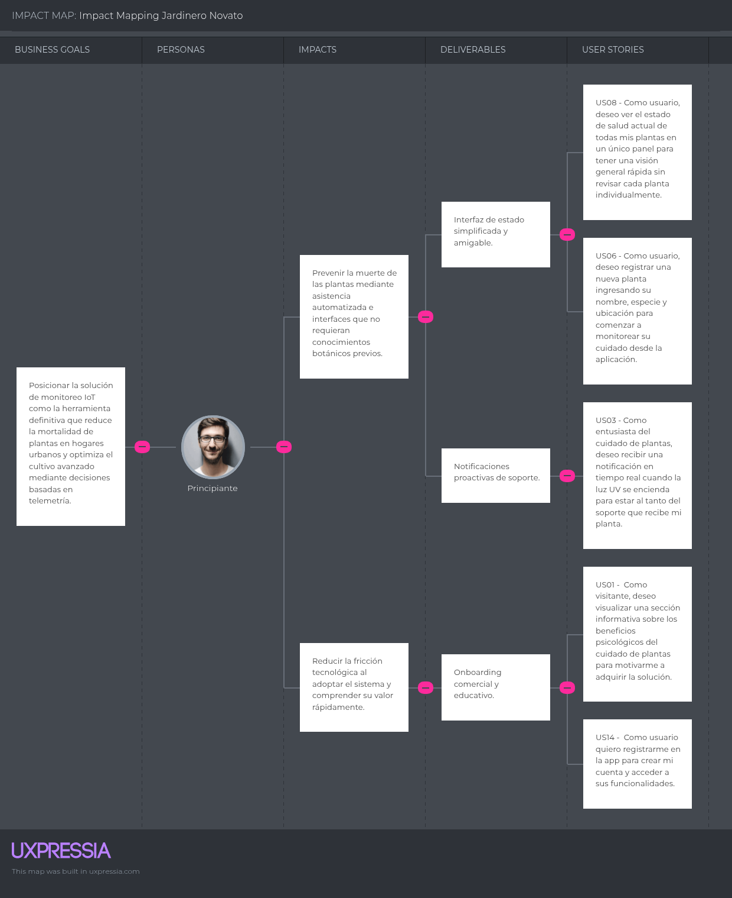
</p>

<p align="center">
  Impact Mapping 1 - Elaboración propia
</p>

<br>


<p align="center">
  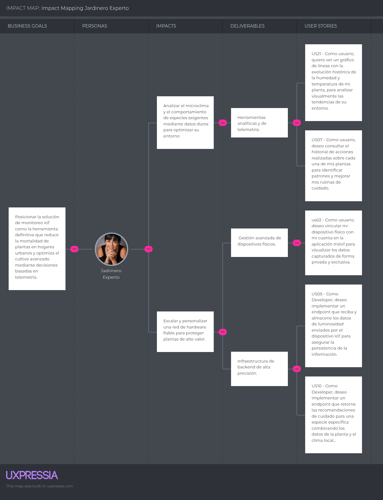
</p>

<p align="center">
  Impact Mapping 2 - Elaboración propia
</p>


<div style="page-break-before: always;"></div>

## 3.3. Product Backlog

| # Orden | User Story Id | Título | Descripción | Story Points (1 / 2 / 3 / 5 / 8) |
| :--- | :--- | :--- | :--- | :--- |
| 1 | US01 | Visualización de beneficios botánicos en el Landing Page | Como visitante, quiero visualizar una sección informativa sobre los beneficios psicológicos del cuidado de plantas para motivarme a adquirir la solución. | 2 |
| 2 | US18 | Comparar planes de suscripción | Como visitante de la landing page, quiero comparar fácilmente los planes de suscripción para elegir el que mejor se ajuste a mis necesidades. | 2 |
| 3 | US21 | Preguntas Frecuentes - FAQ | Como usuario, quiero visualizar una sección de dudas comunes sobre el cuidado de plantas, para entender rápido cómo me ayudará la plataforma. | 2 |
| 4 | US22 | Visualización de Testimonios de Usuarios | Como usuario, quiero leer experiencias breves de otros usuarios que han utilizado la aplicación, para tener mayor confianza en el producto antes de tomar la decisión de registrarme. | 2 |
| 5 | US04 | Redirección a plataformas desde el Landing Page | Como visitante, quiero encontrar enlaces directos a la aplicación web y a las tiendas de descarga móvil para acceder a las herramientas de gestión botánica. | 1 |
| 6 | US23 | Botones de llamado a la acción para Registro | Como usuario, quiero encontrar botones llamativos de "Empieza ahora" en puntos estratégicos de la página, para ser redirigido de inmediato y sin fricciones al formulario de registro. | 1 |
| 7 | US24 | Acceso a Redes Sociales y Contacto en Footer | Como usuario, quiero encontrar enlaces a las redes sociales del proyecto y medios de contacto en el pie de página, para seguir sus actualizaciones o comunicarme con el equipo de soporte. | 1 |
| 8 | US20 | Selección de idioma | Como usuario, quiero elegir el idioma de la pagina web para usarla cómodamente. | 3 |
| 9 | US14 | Registrarse en la app | Como usuario quiero registrarme en la app para crear mi cuenta y acceder a sus funcionalidades. | 5 |
| 10 | US13 | Inicio sesión de usuario | Como usuario registrado, quiero iniciar sesión con mi correo y contraseña, para acceder a mi cuenta y mis plantas monitoreadas. | 3 |
| 11 | US25 | Visualización de perfil de usuario | Como usuario, quiero ver mi perfil, para tener una visión general de mis actividades de cuidado. | 2 |
| 12 | US15 | Edición de datos personales | Como usuario registrado, quiero poder actualizar mis datos personales, para mantener mi perfil al día con mi información actual. | 3 |
| 13 | US19 | Cambio de correo electrónico asociado | Como usuario, quiero cambiar el correo electrónico asociado a mi cuenta, para asegurar que las notificaciones y comunicaciones lleguen a la dirección correcta. | 2 |
| 14 | US17 | Modo oscuro en la interfaz | Como usuario, quiero activar el modo oscuro, para usar la aplicación en ambientes con poca luz. | 3 |
| 15 | US06 | Registro de nueva planta y asignación de especie | Como usuario, quiero registrar una nueva planta seleccionando su especie específica, para que el sistema asigne automáticamente los umbrales ideales al dispositivo IoT. | 5 |
| 16 | US11 | Subir fotos de una planta | Como usuario, quiero subir una imagen de una planta a lo largo del tiempo, para saber que planta es. | 3 |
| 17 | US29 | Acceder a perfil de planta | Como usuario, quiero acceder a los perfiles de las plantas que poseo para ver su información actual. | 2 |
| 18 | US16 | Edición de datos de planta | Como usuario que cuida plantas, quiero editar la información de una planta registrada, para actualizar datos como su nombre, tipo o imagen. | 3 |
| 19 | US12 | Eliminación de planta | Como usuario, quiero eliminar una planta de mi lista, para quitar aquellas que ya no tengo o que se han perdido. | 2 |
| 20 | US28 | Configuración de tareas | Como usuario que cuida plantas, quiero configurar tareas para regar o fertilizar, para no olvidar sus cuidados. | 5 |
| 21 | US27 | Visualización de tareas de cuidado | Como usuario con plantas registradas, quiero ver las tareas pendientes de cuidado, para saber qué debo hacer cada día. | 2 |
| 22 | US26 | Visualización de tareas con fechas | Como usuario, quiero ver mis tareas del día por fechas para poder organizarme mejor en el cuidado de las mismas. | 3 |
| 23 | US09 | Registro manual de cuidados complementarios | Como usuario, quiero registrar manualmente acciones que el sistema IoT no realiza, para mantener un inventario botánico digital 100% completo. | 3 |
| 24 | US07 | Visualización del historial de cuidados | Como usuario, quiero consultar el historial de acciones realizadas sobre cada una de mis plantas para identificar patrones y mejorar mis rutinas de cuidado. | 3 |
| 25 | US34 | Visualización y Control Físico (LCD y Botones) | Como usuario frente al dispositivo, quiero usar botones físicos y pantallas LCD, para alternar los modos de los actuadores y ver las métricas sin necesidad de abrir la aplicación móvil. | 5 |
| 26 | US02 | Vinculación de dispositivo IoT con la cuenta | Como usuario, quiero vincular mi dispositivo físico con mi cuenta en la aplicación móvil para visualizar los datos capturados de forma privada y exclusiva. | 5 |
| 27 | US05 | Sistema de Alarma por Extremos (Buzzer) | Como usuario, quiero que el dispositivo emita una alerta sonora (Buzzer), para reaccionar a tiempo si la temperatura sale del rango o la humedad supera el límite. | 5 |
| 28 | US08 | Monitoreo de Humedad Ambiental | Como usuario, quiero ver el porcentaje de humedad relativa del ambiente capturado por el sensor, para saber si el entorno es demasiado seco o húmedo. | 3 |
| 29 | US31 | Telemetría de Temperatura Ambiental | Como usuario, quiero visualizar la temperatura ambiental de mi planta para evitar que se queme o se congele. | 3 |
| 30 | US32 | Control Manual de Riego | Como usuario, quiero activar la bomba de agua desde mi celular para regar mi planta a distancia. | 5 |
| 31 | US33 | Control Manual y Automático de Luz UV | Como usuario, quiero gestionar el foco UV en modos ON, OFF o AUTO, para asegurar que mi planta reciba luz cuando el sensor LDR detecte niveles bajos. | 3 |
| 32 | US03 | Metricas de Sensor de Gas (Calidad de aire) | Como usuario, quiero poder ver las metricas del sensor de gas del dispositivo IoT, para estar informado de la calidad del aire y cuidar mejor mi planta. | 5 |
| 33 | US30 | Vinculación con datos climáticos locales | Como usuario, quiero que el sistema tenga en cuenta el clima local al recomendar cuidados, para evitar regar cuando ya ha llovido. | 5 |
| 34 | US10 | Integración de API de IA en el Frontend | Como Developer, quiero conectar un modelo de lenguaje (LLM) directamente desde la interfaz del cliente, para procesar consultas botánicas de forma ágil. | 8 |
| 35 | US35 | Consulta a Agente Autónomo Botánico | Como usuario, quiero interactuar con el Agente Inteligente, para recibir diagnósticos personalizados y delegar acciones sobre mis plantas. | 5 |
| 36 | US36 | Monitoreo de Luminosidad (Sensor LDR) | Como usuario, quiero visualizar el porcentaje de luz que recibe mi planta en tiempo real, para garantizar que mantenga su color y salud óptima. | 8 |
| 37 | US37 | Monitoreo climático local desde mobile | Como usuario mobile, quiero ver la temperatura y humedad de mi zona geográfica detectada por el teléfono, para cuidar mejor mis plantas. | 5 |
| 38 | US38 | Configurar nivel de humedad en registro de planta | Como usuario, quiero seleccionar nivel de humedad al registrar una planta, para que el sistema calcule automáticamente la frecuencia de riego. | 3 |
| 39 | US39 | Configurar umbrales de alerta IoT al registrar planta | Como usuario, quiero definir umbrales de temperatura, humedad y luz mínima al registrar mi planta, para recibir alertas personalizadas según las necesidades de mi especie. | 5 |
| 40 | US40 | Vincular dispositivo IoT desde perfil de planta | Como usuario, quiero acceder a la vista de vinculación IoT desde el detalle de mi planta, para conectar el hardware a la planta registrada. | 3 |
| 41 | US41 | Marcar tarea como completada | Como usuario, quiero marcar una tarea como completada, para llevar un registro de las actividades realizadas. | 2 |
| 42 | US42 | Eliminar tarea programada | Como usuario, quiero borrar una tarea programada, para eliminar las que ya no necesito. | 2 |
| 43 | US43 | Visualizar datos de cuenta en perfil mobile | Como usuario mobile, quiero ver mi nombre, correo y plan de suscripción en el perfil, para conocer el estado de mi cuenta. | 2 |
| 44 | US44 | Cambiar plan de suscripción desde mobile | Como usuario, quiero alternar entre Basic, Premium y Pro desde el perfil, para ajustar mi plan según mis necesidades. | 3 |
| 45 | US45 | Gestionar notificaciones push en mobile | Como usuario, quiero activar o desactivar las notificaciones de la app móvil, para controlar las alertas que recibo. | 2 |
| 46 | US46 | Cerrar sesión desde mobile | Como usuario, quiero un botón para cerrar sesión desde el perfil, para salir de mi cuenta de forma segura. | 1 |
| 47 | US47 | Diagnóstico mediante Visión Computacional | Como usuario, quiero que la aplicación analice una fotografía de mi planta mediante IA, para obtener un diagnóstico automático de posibles enfermedades. | 5 |
| 48 | US48 | Ejecución de acciones vía Agente Autónomo | Como usuario ocupado, quiero ordenar acciones físicas a través del chat interactivo con el asistente, para que la IA actúe directamente sobre los dispositivos IoT. | 8 |
| 49 | US49 | Acuñación (Minting) de Eco-Tokens en Web3 | Como usuario constante, quiero recibir un Eco-Token (NFT) automáticamente en mi billetera, para ser recompensado tras mantener la telemetría en niveles óptimos durante 30 días. | 8 |
| 50 | US50 | Visualización de Billetera Web3 | Como usuario, quiero ver mis Eco-Tokens acumulados en mi perfil o dashboard, para llevar un registro tangible y gamificado de mis logros como cuidador botánico. | 3 |

<br>

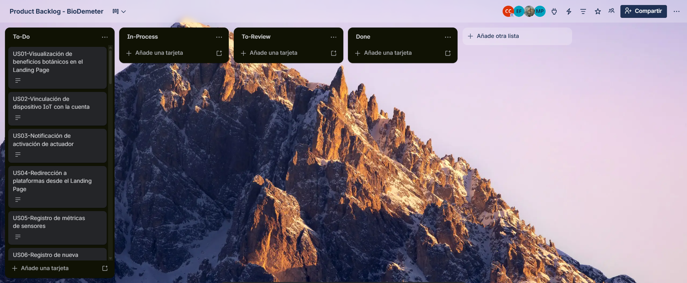

<p align="center">
  Product Backlog - Elaboración propia
</p>

<div style="page-break-before: always;"></div>


# Capítulo IV: Strategic-Level Software Design

## 4.1. Strategic-Level Attribute-Driven Design

### 4.1.1. Design Purpose

El propósito del Attribute-Driven Design (ADD) es traducir los requisitos funcionales, los atributos de calidad y las restricciones del sistema en decisiones arquitectónicas verificables. En NaturaTech, este proceso orienta el diseño hacia una solución modular, segura, observable y capaz de integrar dispositivos IoT con los servicios de gestión y orientación para el cuidado de plantas.

### 4.1.2. Attribute-Driven Design Inputs

Los insumos utilizados para el diseño arquitectónico se organizan en funcionalidad primaria, escenarios de atributos de calidad y restricciones del proyecto.

#### 4.1.2.1. Primary Functionality (Primary User Stories)

Las funcionalidades principales consideradas para el diseño son el registro e inicio de sesión de usuarios, la gestión del perfil, el registro y mantenimiento de plantas, la recepción de datos de sensores, la activación de actuadores, la programación de tareas de cuidado y la consulta de recomendaciones personalizadas mediante inteligencia artificial. Estas capacidades corresponden a las historias de usuario priorizadas en el Product Backlog del Capítulo III.

#### 4.1.2.2. Quality Attribute Scenarios

Los escenarios de calidad más relevantes son los siguientes:

+ **Seguridad:** ante una solicitud de acceso o modificación de información, el sistema debe autenticar al usuario y autorizar la operación según sus roles, evitando el acceso no permitido.
+ **Disponibilidad:** ante la pérdida temporal de comunicación con un dispositivo IoT, el sistema debe conservar el último estado válido y reanudar la sincronización cuando el dispositivo vuelva a estar disponible.
+ **Rendimiento:** ante la recepción de telemetría, el sistema debe procesar y publicar los datos sin retrasos que impidan detectar condiciones críticas de la planta.
+ **Modificabilidad:** ante la incorporación de un nuevo tipo de sensor o regla de cuidado, el cambio debe limitarse al contexto y los componentes relacionados sin afectar el resto del sistema.
+ **Interoperabilidad:** ante el intercambio de información entre bounded contexts y servicios externos, los mensajes deben mantener contratos claros y trazables.

#### 4.1.2.3. Constraints

El diseño está condicionado por el uso de una arquitectura orientada a servicios y bounded contexts, la integración con dispositivos Arduino y sensores, la comunicación con servicios externos de inteligencia artificial, la necesidad de persistir información de usuarios y plantas, y el uso de tecnologías compatibles con el proyecto. También se considera la separación de responsabilidades entre los contextos de IAM, Profiles, PlantProfiles, IoT Management, CareScheduling y PlantGuidance.

### 4.1.3. Architectural Drivers Backlog

Los principales drivers arquitectónicos priorizados son: proteger la identidad y los datos del usuario; garantizar la comunicación confiable con los dispositivos IoT; procesar telemetría y detectar condiciones críticas; mantener límites claros entre los bounded contexts; permitir la evolución independiente de cada capacidad; y ofrecer recomendaciones oportunas a partir de la información de las plantas y sus sensores.

### 4.1.4. Architectural Design Decisions

Se decidió organizar el dominio mediante bounded contexts independientes, utilizar una arquitectura por capas dentro de cada contexto, separar las responsabilidades de dominio, aplicación, interfaces e infraestructura, y emplear contratos explícitos para la comunicación entre contextos. La integración con capacidades externas se realiza mediante fachadas o adaptadores, reduciendo el acoplamiento con proveedores y servicios de terceros. La arquitectura C4 se utiliza para representar el sistema, sus contenedores y sus relaciones.

### 4.1.5. Quality Attribute Scenario Refinements

Los escenarios iniciales se refinan asociando cada atributo con un contexto y una respuesta verificable. IAM concentra autenticación y autorización; IoT Management concentra la recepción, validación y procesamiento de telemetría; PlantProfiles mantiene la información de las plantas; CareScheduling administra las tareas programadas; y PlantGuidance consume la información necesaria para generar recomendaciones. Esta distribución permite evaluar seguridad, disponibilidad, rendimiento y modificabilidad en el límite arquitectónico donde cada decisión tiene efecto.

## 4.2. Strategic-Level Domain-Driven Design

### 4.2.1. EventStorming
Como grupo llevamos a cabo una reunión de EventStorming con la finalidad de entender el ámbito del problema y proponer un enfoque inicial al modelado general de Innospace. Esta actividad tuvo una duración aproximada de 1-2 horas, durante las cuales identificamos los eventos clave, los participantes y las normas que determinan las interacciones entre los estudiantes y las empresas.

A lo largo de la sesión, utilizamos una herramienta colaborativa para estructurar y visualizar los elementos, lo que nos permitió conversar, llegar a un acuerdo y definir los primeros contextos delimitados del sistema. El resultado es un mapa preliminar del ámbito que servirá como fundamento para el análisis y diseño más detallado en las etapas siguientes.

__Paleta de colores aplicados a los post-its utilizados:__

+ 🟧 Naranja: Domain Event (Evento que ya ocurrió, siempre en pasado. Ej: Luz Registrada).
+ 🟦 Azul: Command (Acción o intención. Ej: Registrar Luz).
+ 🟨 Amarillo Claro (pequeño): Actor (El usuario).
+ 🟪 Rosado: External System (Sensores, Actuadores, APIs externas).
+ 🟩 Verde: Read Model (Lo que el usuario ve: Dashboards, Notificaciones).
+ 🟨 Amarillo Oscuro (grande): Aggregate / System (El componente de software que procesa la lógica).
+ 🟪 Lila: Policy (Regla de negocio: "Si pasa X, entonces haz Y"). 

__Primer paso:__
<p align="center">
  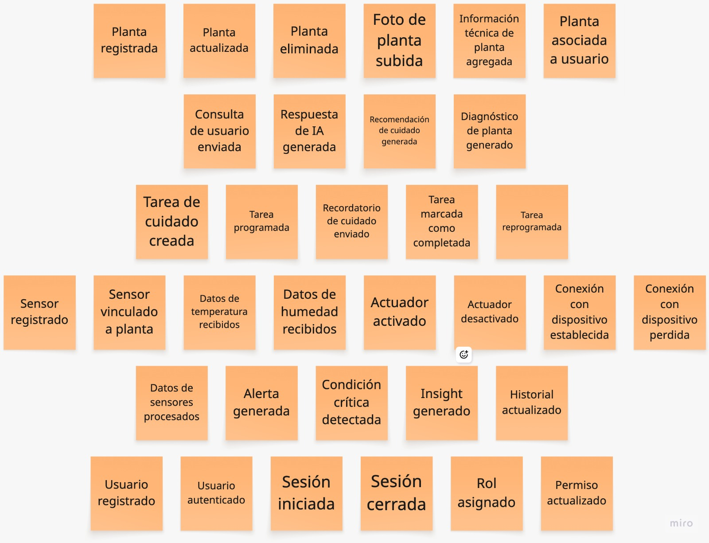
</p>
<p align="center">
  Event Storming 1 - Elaboración propia
</p>

__Segundo paso:__
<p align="center">
  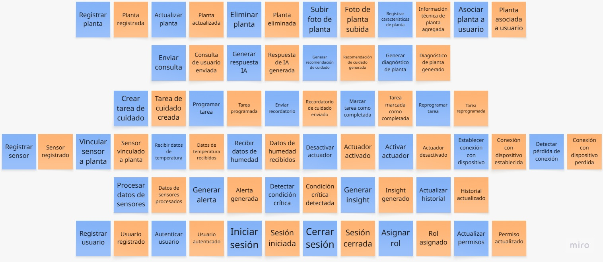
</p>
<p align="center">
  Event Storming 2 - Elaboración propia
</p>

__Tercer paso:__
<p align="center">
  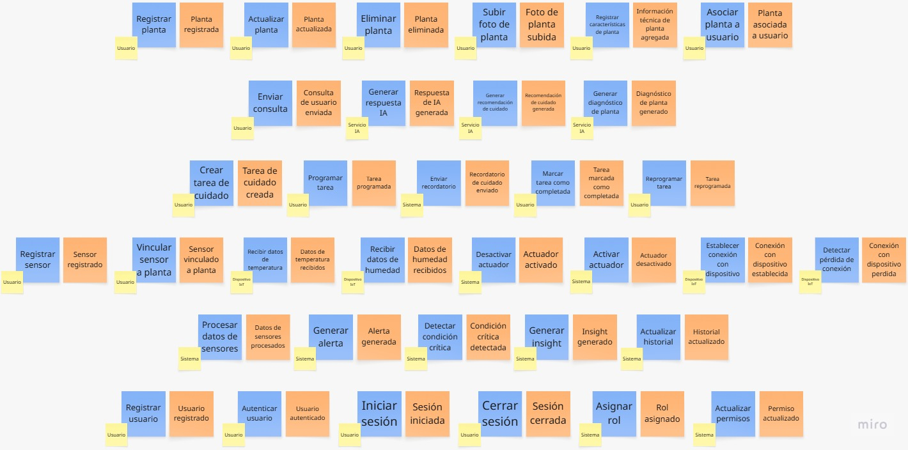
</p>
<p align="center">
  Event Storming 3 - Elaboración propia
</p>

__Cuarto paso:__
<p align="center">
  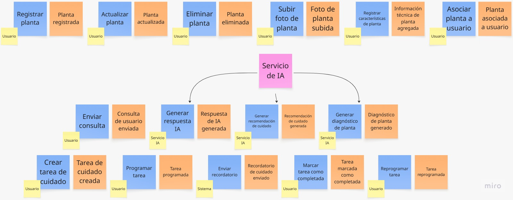
</p>
<p align="center">
  Event Storming 4.1 - Elaboración propia
</p>
<p align="center">
  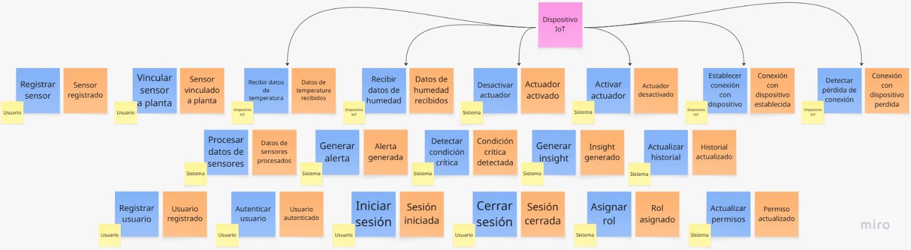
</p>
<p align="center">
  Event Storming 4.2 - Elaboración propia
</p>

__Quinto paso:__
<p align="center">
  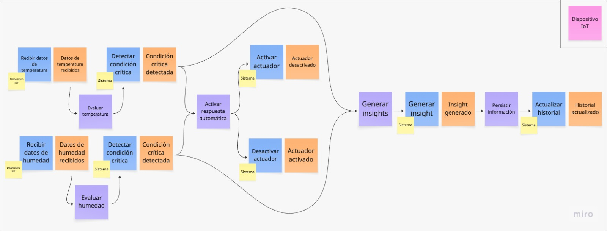
</p>
<p align="center">
  Event Storming 5.1 - Elaboración propia
</p>
<p align="center">
  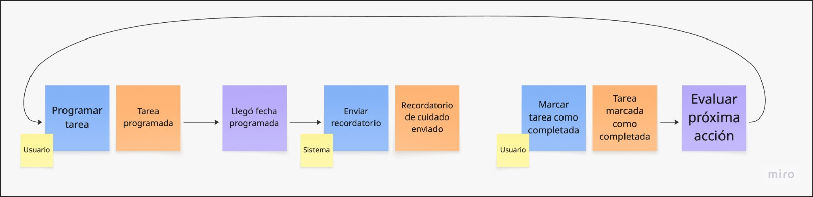
</p>
<p align="center">
  Event Storming 5.2 - Elaboración propia
</p>
<p align="center">
  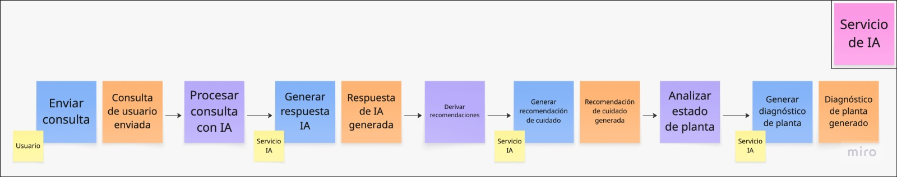
</p>
<p align="center">
  Event Storming 5.3 - Elaboración propia
</p><p align="center">
  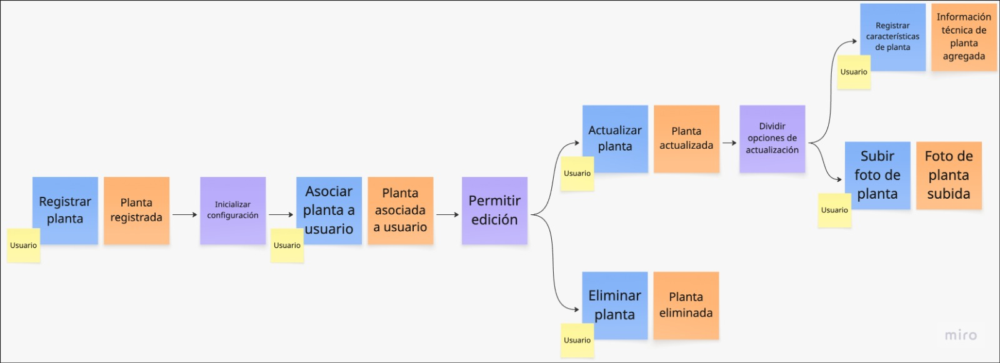
</p>
<p align="center">
  Event Storming 5.4 - Elaboración propia
</p><p align="center">
  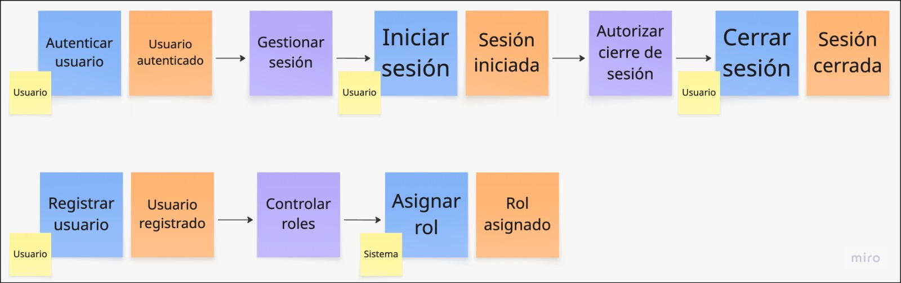
</p>
<p align="center">
  Event Storming 5.5 - Elaboración propia
</p>

__Sexto paso:__
<p align="center">
  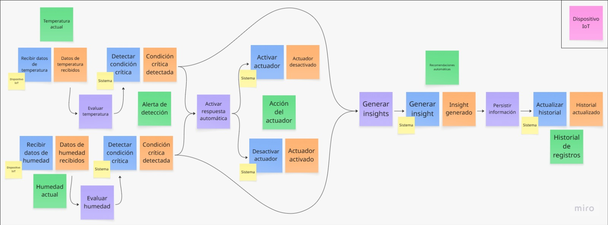
</p>
<p align="center">
  Event Storming 6.1 - Elaboración propia
</p>
<p align="center">
  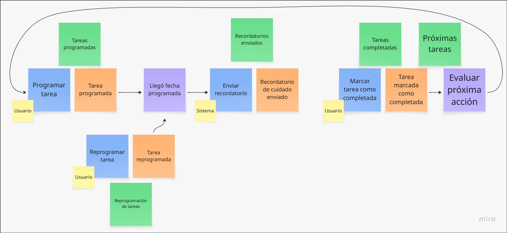
</p>
<p align="center">
  Event Storming 6.2 - Elaboración propia
</p>
<p align="center">
  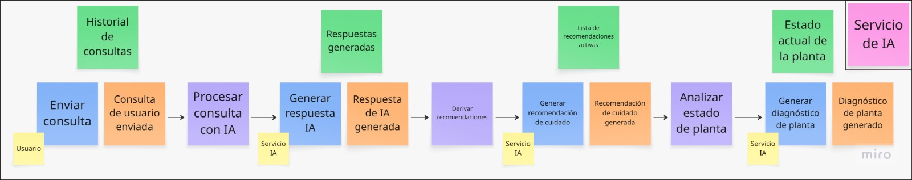
</p>
<p align="center">
  Event Storming 6.3 - Elaboración propia
</p>
<p align="center">
  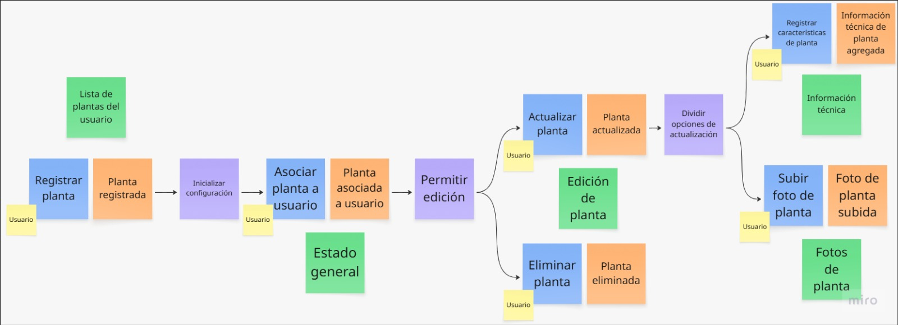
</p>
<p align="center">
  Event Storming 6.4 - Elaboración propia
</p>
<p align="center">
  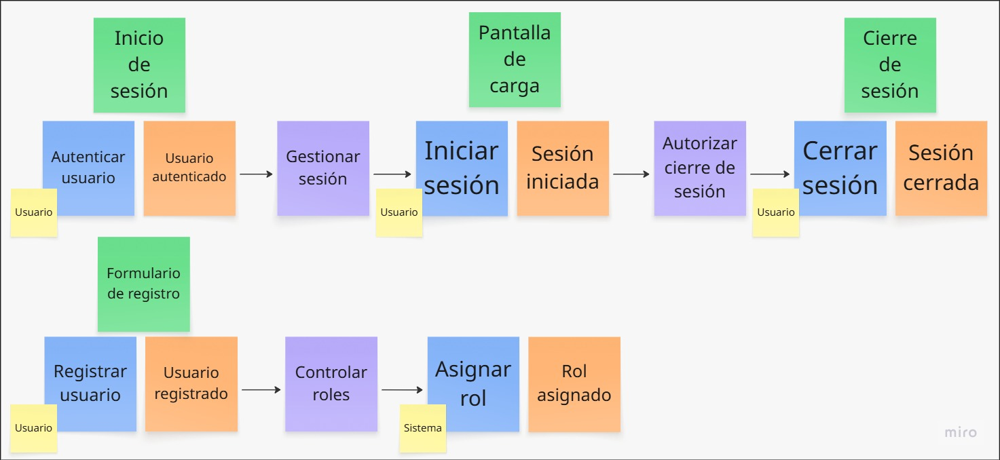
</p>
<p align="center">
  Event Storming 6.5 - Elaboración propia
</p>

__Séptimo paso:__
<p align="center">
  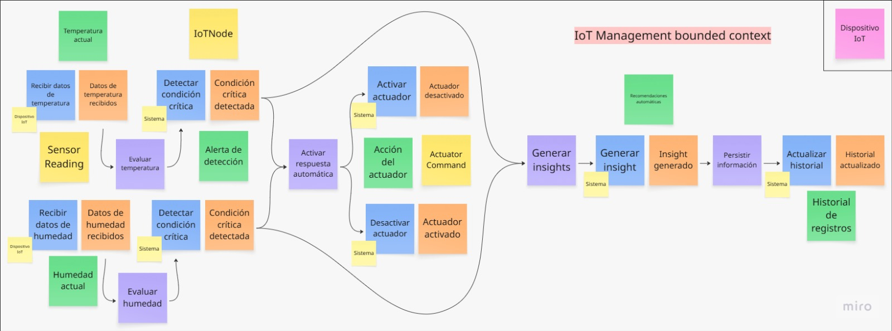
</p>
<p align="center">
  Event Storming 7.1 - Elaboración propia
</p>
<p align="center">
  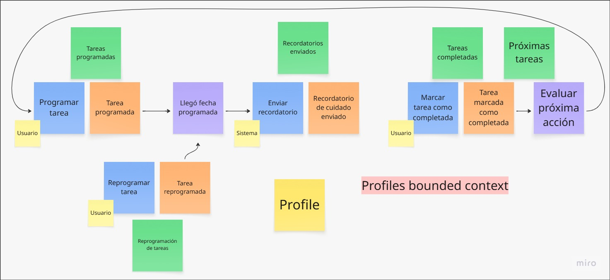
</p>
<p align="center">
  Event Storming 7.2 - Elaboración propia
</p>
<p align="center">
  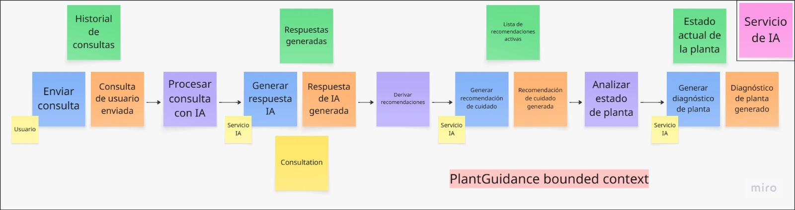
</p>
<p align="center">
  Event Storming 7.3 - Elaboración propia
</p>
<p align="center">
  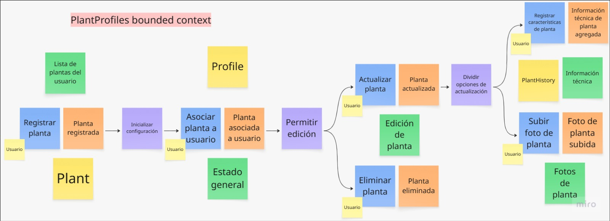
</p>
<p align="center">
  Event Storming 7.4 - Elaboración propia
</p>
<p align="center">
  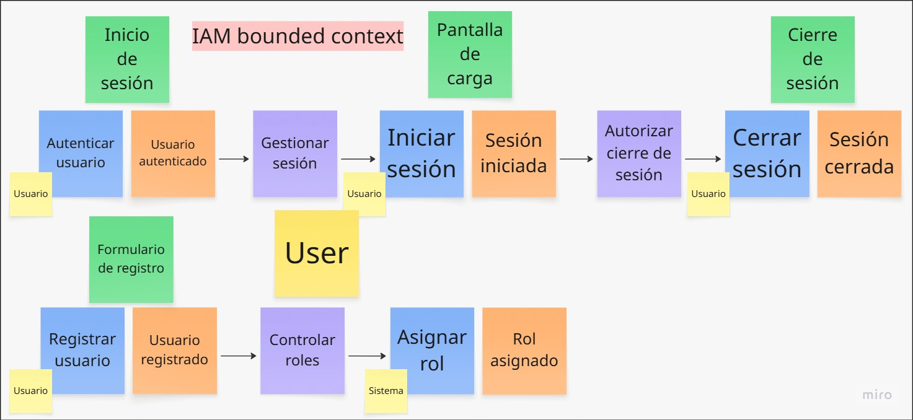
</p>
<p align="center">
  Event Storming 7.5 - Elaboración propia
</p>

### 4.2.2. Candidate Context Discovery

Después de completar la sesión de tormenta de eventos, se realizó un análisis detallado de los eventos detectados con la herramienta Miro para identificar los contextos candidatos más relevantes para el dominio. Este trabajo implicó reconocer patrones y relaciones entre eventos y crear flujos a partir de ellos. Como resultado, se organizaron una serie de eventos que correspondían a un mismo proceso dentro de la aplicación.

__IoT Management context:__
<p align="center">
  
</p>
<p align="center">
  IoT Management - Elaboración propia
</p>

__Profiles context:__
<p align="center">
  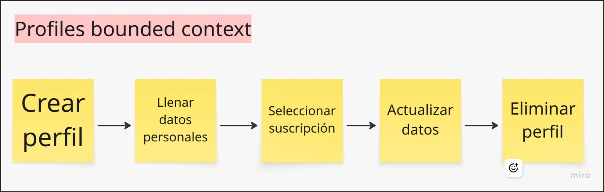
</p>
<p align="center">
  Profiles - Elaboración propia
</p>

__PlantGuidance context:__
<p align="center">
  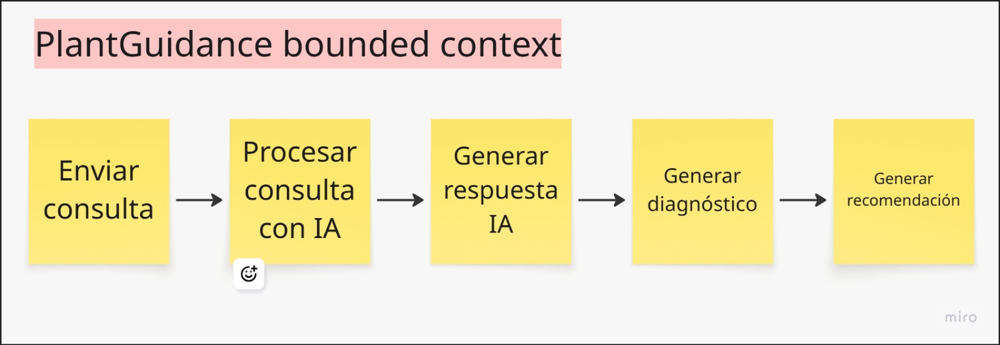
</p>
<p align="center">
  PlantGuidance - Elaboración propia
</p>

__PlantProfiles context:__
<p align="center">
  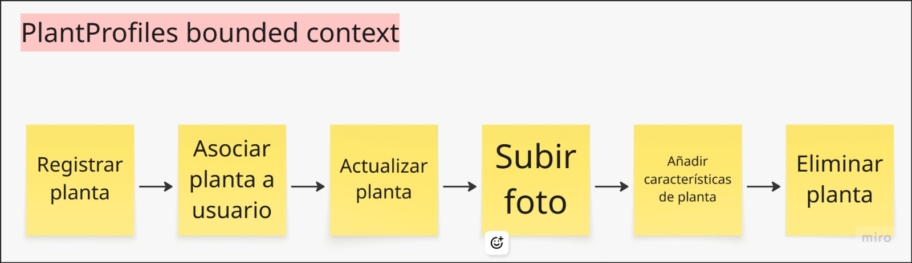
</p>
<p align="center">
  PlantProfiles - Elaboración propia
</p>

__IAM context:__
<p align="center">
  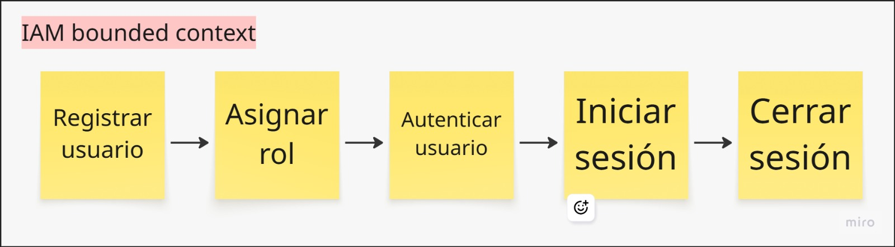
</p>
<p align="center">
  IAM - Elaboración propia
</p>

Después de identificar los flujos de eventos dentro de la aplicación, se determinaron los pivotal points (eventos que cambian el curso del sistema), los cuales representan momentos clave en la interacción del usuario con la plataforma y el comportamiento del sistema IoT:

+ El registro y autenticación de un usuario en la plataforma
+ La creación y gestión de una planta por parte del usuario
+ La recepción de datos de sensores (temperatura y humedad) desde dispositivos IoT
+ La detección de condiciones críticas en el entorno de la planta
+ La activación o desactivación automática de actuadores
+ El envío de consultas del usuario al sistema de inteligencia artificial
+ La generación de respuestas, diagnósticos y recomendaciones de cuidado

Al identificar estos pivotal points, se puede observar cómo los eventos se agrupan naturalmente en distintos contextos del dominio, permitiendo definir los siguientes bounded contexts:

+ __IAM:__ Encargado de la gestión de identidad y acceso, incluyendo el registro, autenticación y control de sesiones de los usuarios.
+ __Profiles:__ Responsable de la administración de la información personal del usuario, como datos personales, suscripción y configuración del perfil.
+ __PlantProfiles:__ Gestiona el ciclo de vida de las plantas registradas por el usuario, incluyendo su creación, actualización, asociación, eliminación y almacenamiento de información relevante como fotos y características.
+ __IoT Management:__ Maneja la interacción con los dispositivos IoT, incluyendo la conexión, recepción de datos de sensores, detección de condiciones críticas y ejecución de acciones sobre actuadores.
+ __PlantGuidance:__ Encargado de procesar las consultas del usuario mediante inteligencia artificial, generando respuestas, diagnósticos y recomendaciones para el cuidado de las plantas.

Finalmente, utilizando la herramienta Miro, se realizó la división de estos bounded contexts, representando de manera visual los flujos de eventos dentro de cada uno y facilitando la comprensión de las responsabilidades y límites de cada contexto dentro del sistema.

### 4.2.3. Domain Message Flows Modeling

En esta sección se desarrollan los Domain Message Flow Models para representar cómo fluyen los mensajes entre usuarios, sistemas externos y bounded contexts en los escenarios principales del sistema. Estos diagramas permiten visualizar la secuencia de commands, events y queries que ocurren durante cada proceso, facilitando la comprensión de las interacciones del dominio y validando que las responsabilidades de cada contexto estén correctamente definidas.

<h4>Scenario: User Registration</h4>

<a href="https://ibb.co/qMhLcW9X"></a>

<h4>Scenario: User Login</h4>

<a href="https://ibb.co/5xzYdK29"></a>

<h4>Scenario: Registering a New Plant</h4>

<a href="https://ibb.co/JjQkfBPb"></a>

<h4>Scenario: Linking an IoT Device to a Plant</h4>

<a href="https://ibb.co/SXSLN5F3"></a>

<h4>Scenario: Receiving Temperature and Humidity Sensor Data</h4>

<a href="https://ibb.co/gF7nfyrq"></a>

<h4>Scenario: Generating Plant Alerts From Sensor Data</h4>

<a href="https://ibb.co/qY9Xz0hm"></a>

<h4>Scenario: Activating an IoT Actuator Automatically</h4>

<a href="https://ibb.co/NnpsHjF0"></a>

<h4>Scenario: Viewing Plant Health Status</h4>

<a href="https://ibb.co/gZZnTS9r"></a>

<h4>Scenario: Scheduling a Plant Care Task</h4>

<a href="https://ibb.co/nqznW1mr"></a>

<h4>Scenario: Getting Plant Care Guidance From RootBot (bot temporal name)</h4>

<a href="https://ibb.co/hF4cmh9w"></a>

<h4>Scenario: Viewing Plant Care History</h4>

<a href="https://ibb.co/gF7R6cGb"></a>

<h4>Scenario: Viewing Sensor History and Insights</h4>

<a href="https://ibb.co/JR9NdkMq"></a>

### 4.2.4. Bounded Context Canvases

En esta sección se desarrollan los Bounded Context Canvases correspondientes a los contextos identificados en la arquitectura del dominio. Cada canvas permite describir el propósito, responsabilidades, comunicaciones, lenguaje ubicuo, decisiones de negocio, supuestos, métricas y preguntas abiertas de un bounded context específico. De esta manera, se documenta con mayor detalle el rol que cumple cada contexto dentro del sistema y se facilita la validación de su diseño.

<h4>IOT Management</h4>

<a href="https://ibb.co/WvBW2x1B"></a>

<h4>Plant Profile</h4>

<a href="https://ibb.co/HSRd1Fr"></a>

<h4>Care Scheduling</h4>

<a href="https://ibb.co/bRPJNV7f"></a>

<h4>Analytics</h4>

<a href="https://ibb.co/wZYWzfyj"></a>

<h4>Plant Guidance</h4>

<a href="https://ibb.co/Tqpqxdsr"></a>

<h4>IAM</h4>

<a href="https://ibb.co/n8gv6wfs"></a>

### 4.2.5. Context Mapping

En esta sección elaboramos un conjunto de context maps para representar las relaciones entre los bounded contexts del sistema. A partir de la información recolectada, analizamos distintas alternativas de diseño, evaluando cómo cambiaría la estructura si se reubican, agrupan, dividen o aíslan determinadas capabilities. Para ello, consideramos patrones de Domain-Driven Design como Customer/Supplier, Conformist, Anti-corruption Layer y Shared Kernel, con el fin de identificar la mejor aproximación para la arquitectura del dominio. A continuación, presentamos las opciones evaluadas para Tavolo y la propuesta seleccionada.

<h4> Opción 1: </h4>

En esta alternativa se mantienen los seis bounded contexts separados, con relaciones claramente definidas entre ellos. Esta opción permite una mejor separación de responsabilidades, ya que cada contexto se concentra en una funcionalidad específica del sistema, facilitando su comprensión y evolución. Como desventaja, implica una mayor cantidad de dependencias e interacciones entre contextos, lo que incrementa la complejidad de integración y sincronización.

<p align="center">
    
</p>

<h4> Opción 2: </h4>

En esta alternativa se agrupan los bounded contexts PlantProfile y Care Scheduling en un solo contexto denominado Plant Management, debido a que ambos trabajan directamente sobre la gestión de plantas y sus cuidados programados. Esta opción reduce la cantidad de relaciones entre contextos y simplifica la coordinación entre el perfil de la planta y sus tareas de mantenimiento. Sin embargo, como desventaja, el nuevo contexto concentra más responsabilidades, mezclando la administración de información de la planta con la planificación de tareas, lo que podría dificultar su evolución independiente si el sistema crece.

<p align="center">
    
</p>

<h4> Opción 3: </h4>

En esta alternativa se agrupan los bounded contexts IoT Management y Analytics en un solo contexto denominado IoT Operations, debido a que ambos trabajan directamente con la captura, procesamiento e interpretación de datos provenientes de sensores. Esta opción simplifica la comunicación entre el hardware y el análisis de datos, reduciendo dependencias internas del flujo IoT. Sin embargo, como desventaja, mezcla la gestión técnica de dispositivos con la generación de insights y alertas, lo que podría dificultar la evolución independiente de ambas capacidades si el sistema crece.

<p align="center">
    
</p>

Finalmente, se seleccionó la Opción 1, ya que permite mantener los seis bounded contexts separados y con responsabilidades claramente delimitadas. Esta alternativa resulta más adecuada porque evita mezclar capacidades distintas, como la gestión de plantas, la planificación de cuidados, la comunicación IoT, el análisis de datos y el soporte mediante chatbot. Aunque implica una mayor cantidad de relaciones entre contextos, ofrece una arquitectura más ordenada, escalable y fácil de mantener, permitiendo que cada contexto evolucione de forma independiente según las necesidades del sistema.

## 4.3. Software Architecture

### 4.3.1. Software Architecture System Landscape Diagram

Este diagrama representa la visión de más alto nivel del ecosistema de la startup BioDemeter, mostrando las interacciones que mantienen los diferentes actores con la plataforma PlantSync, el hardware IoT y los servicios externos.

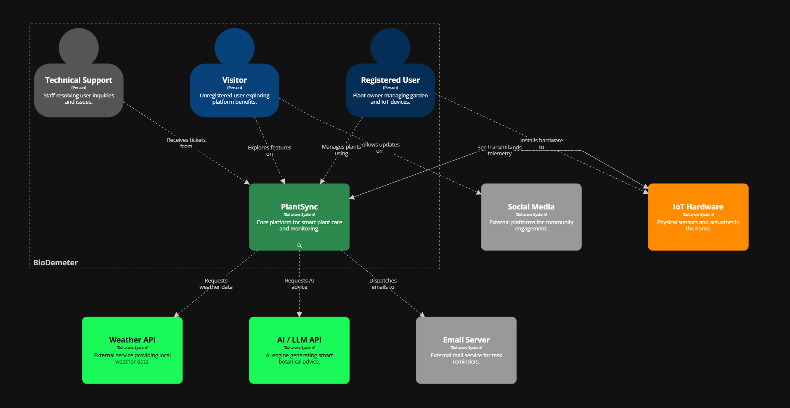

<p align="center">
  Elaboración propia
</p>

### 4.3.2. Software Architecture Context Level Diagrams

Este diagrama representa el enfoque central de la solución PlantSync, mostrando las interacciones directas que mantiene la plataforma principal con sus distintos tipos de usuarios, el hardware IoT y las dependencias tecnológicas externas.

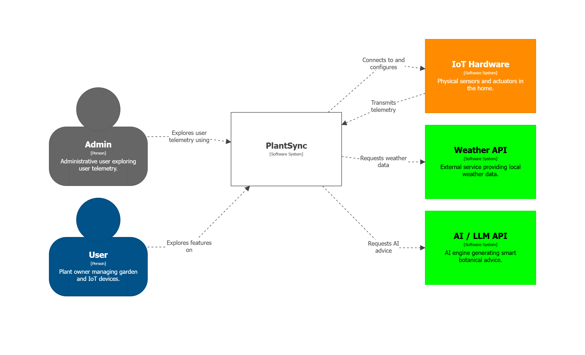

<p align="center">
  Elaboración propia
</p>

### 4.3.3. Software Architecture Container Level Diagrams

Este diagrama detalla la arquitectura interna de la plataforma PlantSync, exponiendo los diferentes contenedores de software, las tecnologías empleadas en cada uno y los flujos de comunicación y datos entre estas piezas.

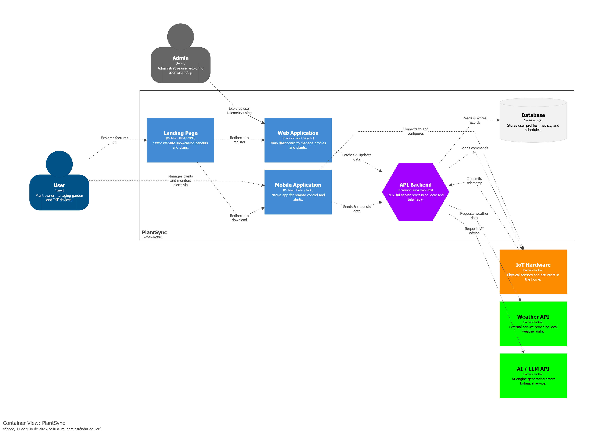

<p align="center">
  Elaboración propia
</p>

### 4.3.4. Software Architecture Deployment Diagrams

Este diagrama ilustra la infraestructura y el entorno de ejecución de la solución PlantSync, mapeando cómo se distribuyen físicamente los contenedores de software en la nube de Microsoft Azure, los dispositivos cliente de los usuarios y los microcontroladores IoT instalados en sus hogares.

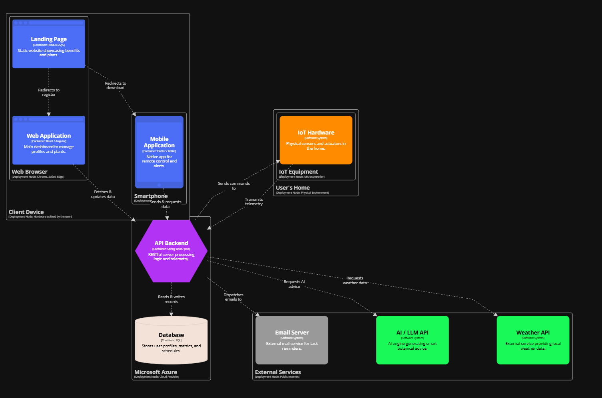

<p align="center">
  Elaboración propia
</p>

<div style="page-break-before: always;"></div>

# Capítulo V: Tactical-Level Domain-Driven Design

### 5.1. Bounded Context: \<IAM\>

#### 5.1.1. Domain Layer

En esta capa se define el núcleo de la seguridad y gestión de identidades, encapsulando las reglas de negocio para la autenticación y autorización de usuarios.

**Aggregate: `User`**

El agregado User es la raíz que gestiona la identidad de los usuarios en el sistema, asegurando que las credenciales y los roles asignados sean consistentes y válidos.

| Atributos      | Tipo de dato     | Visibilidad | Descripción                                     |
|----------------|-----------------|------------|------------------------------------------------|
| id     | Long            | Private    | Identificador único del usuario.            |
| email      | String           | Private    | Correo electrónico único para la autenticación.    |
| password       | String          | Private    | Contraseña del usuario almacenada de forma segura (hasheada).                      |
| roles    | Set<Role>         | Private    | Conjunto de roles asignados para el control de acceso.          |


| Métodos                         | Tipo de retorno | Visibilidad | Descripción                                      |
|---------------------------------|----------------|------------|------------------------------------------------|
| getId()                 | Long           | Public     | Devuelve el ID del usuario.                   |
| getEmail()                 | String          | Public     | Devuelve el correo electrónico.    |
| getPassword()                      | String         | Public     | Devuelve la contraseña hasheada.              |
| addRole(Role)                | User       | Public     | Agrega un nuevo rol al usuario.        |
| addRoles(List<Role>)                     | User  | Public     | Añade una lista de roles validando que no esté vacía.       |
| updateInformation(String)                       | User           | Public     | Actualiza el correo electrónico del usuario. |

**Value Objects**

| Value Object   | Descripción                                                                 |
|----------------|-----------------------------------------------------------------------------|
| Roles  | Enumeración que define los tipos de roles permitidos: `ROLE_USER`, `ROLE_ADMIN`, etc.      |
| Role | Entidad de dominio que representa un rol persistido con su respectivo nombre.|

**Clase: `UserQueryService`**

| Título       | UserQueryService |
|--------------|----------------------|
| Descripción  | Interfaz de servicio de consultas para operaciones de lectura de identidades y usuarios. |

**Métodos**

| Método                             | Descripción                                               |
|-----------------------------------|-----------------------------------------------------------|
| handle(GetUserByIdQuery)        | Obtiene la información detallada de un usuario por su identificador único.   |
| handle(GetUserByEmailQuery) | Busca un usuario en el sistema utilizando su dirección de correo electrónico.     |
| handle(GetAllUsersQuery) | Recupera la lista completa de usuarios registrados en el sistema. |

**Clase: `UserCommandService`**

| Título       | UserCommandService |
|--------------|------------------------|
| Descripción  | Interfaz de servicio de comandos para la gestión de registros y autenticación. |

**Métodos**

| Método                           | Descripción                                                        |
|---------------------------------|--------------------------------------------------------------------|
| handle(SignUpCommand)     | Registra un nuevo usuario, gestionando el hasheo de contraseña y asignación de roles iniciales.            |
| handle(SignInCommand)     | Procesa el inicio de sesión y genera el token de acceso correspondiente. |
| handle(UpdateUserCommand)    | Actualiza los datos de identidad de un usuario existente.                          |

#### 5.1.2. Interface Layer

La capa de interfaz del contexto IAM expone controladores REST para la seguridad y gestión de perfiles. Utiliza assemblers especializados para transformar las solicitudes HTTP en comandos y queries, asegurando que el dominio no se vea afectado por cambios en la API externa.

**Controlador: `AuthenticationController`**

Maneja los procesos críticos de entrada al sistema, permitiendo el registro de nuevos usuarios y la obtención de tokens de acceso Bearer.

**Metodos**

| Método           | Ruta                              | Descripción                                               |
|-----------------|----------------------------------|-----------------------------------------------------------|
| signUp   | POST /api/v1/authentication/sign-up        | Registra un usuario y devuelve sus datos básicos. |
| signIn| POST /api/v1/authentication/sign-in | Autentica al usuario y devuelve el token JWT generado. |

**Controlador: `UserController`**

Gestiona la administración y consulta de los usuarios dentro de la plataforma.

**Metodos**

| Método           | Ruta                              | Descripción                                               |
|-----------------|----------------------------------|-----------------------------------------------------------|
| getUserById   | GET /api/v1/users/{id}        | Recupera un usuario por su ID. |
| getAllUsers | GET /api/v1/users | Lista todos los usuarios del sistema. |
| updateUser    | PUT /api/v1/users/{id}            | Actualiza la información de un usuario. |

**Dependencias**

| Dependencia                         | Descripción                                                                 |
|------------------------------------|-----------------------------------------------------------------------------|
| UserCommandService                 | Servicio para ejecutar comandos de registro y autenticación.               |
| UserQueryService               | Servicio para recuperación de datos de usuarios. |
| SignUpCommandFromResourceAssembler | Mapea el recurso de registro a un comando SignUp.           |
| SignInCommandFromResourceAssembler | Mapea las credenciales a un comando SignIn.      |
| UserResourceFromEntityAssembler | Convierte la entidad User en un recurso para la respuesta API.         |

#### 5.1.3. Application Layer

Los servicios internos implementan la lógica de orquestación de la seguridad. Se encargan de validar la existencia de usuarios, interactuar con servicios de hashing y gestionar la generación de tokens, coordinando el flujo de datos entre el dominio y la infraestructura.

**Clase: `UserCommandServiceImpl`**

| Título       | UserCommandServiceImpl |
|--------------|--------------------------|
| Descripción  | Implementación del servicio de comandos para gestionar la creación y actualización de usuarios. |

**Dependencias**

| Dependencia            | Descripción                                   |
|-------------------------|-----------------------------------------------|
| UserRepository       | Repositorio para la persistencia de usuarios.  |
| RoleRepository     | Repositorio para buscar y asignar roles.  |
| HashingService     | Servicio para el cifrado seguro de contraseñas.  |
| TokenService    | Servicio para la generación de tokens JWT.  |

**Clase: `UserQueryServiceImpl`**

| Título       | ProjectCommandServiceImpl |
|--------------|----------------------------|
| Descripción  | Implementación del servicio de consultas para operaciones de lectura de usuarios. |

**Dependencias**

| Dependencia            | Descripción                                   |
|-------------------------|-----------------------------------------------|
| UserRepository       | Repositorio para el acceso a la base de datos de usuarios. |

#### 5.1.4. Infrastructure Layer

Esta capa implementa los mecanismos de persistencia mediante JPA y la integración con Spring Security para la protección de recursos.

**Clase: `UserRepository`**

| Título       | UserRepository |
|-------------|------------------|
| Descripción | Interfaz de persistencia para operaciones CRUD y búsqueda de usuarios por email o ID. |

**Metodos**

| Método             | Descripción                                           |
|-------------------|-------------------------------------------------------|
| findByUsername(String) | Recupera un usuario basándose en su email/username. |
| existsByUsername(String)   | Verifica si un correo electrónico ya está registrado en el sistema.                        |
| save(User)    | Persiste o actualiza la información del usuario en la base de datos.                        |

**Clase: `BCryptHashingService`**

| Título       | BCryptHashingService |
|-------------|------------------|
| Descripción | Implementación del servicio de hashing utilizando el algoritmo BCrypt para proteger las contraseñas. |

#### 5.1.5. Bounded Context Software Architecture Component Level Diagrams

Este diagrama representa cómo el Bounded Context de IAM gestiona la seguridad. 

El `AuthenticationController` es el punto de entrada principal para el flujo de autenticación, delegando al `UserCommandService`, el cual utiliza servicios de infraestructura como `TokenService` y `HashingService`. 

La persistencia se realiza en una base de datos relacional MySQL a través de `UserRepository`.

<p align="center">
  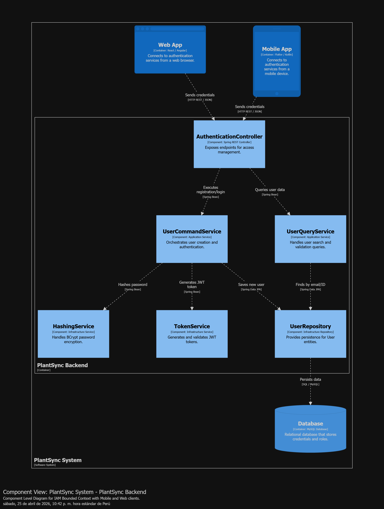
</p>

<p align="center">
  Elaboración propia
</p>

#### 5.1.6. Bounded Context Software Architecture Code Level Diagrams

En esta sección, se explica los diagramas que presentan un mayor detalle sobre la implementación de componentes en el bounded context de IAM.

##### 5.1.6.1. Bounded Context Domain Layer Class Diagrams

<br>

<p align="center">
  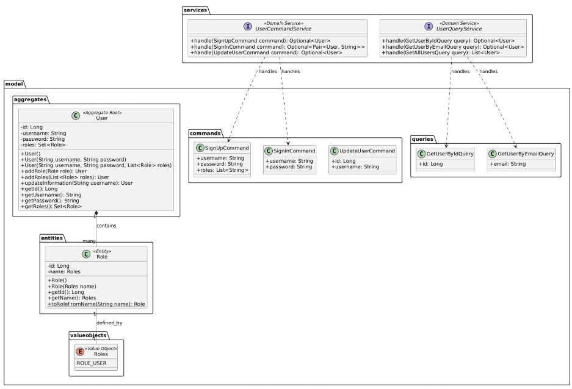
</p>

<p align="center">
    Bounded Context Class Diagram - Elaboración propia
</p>

##### 5.1.6.2. Bounded Context Database Design Diagram

<p align="center">
  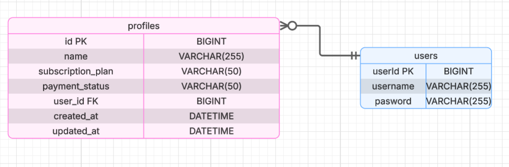
</p>

<p align="center">
  Elaboración propia
</p>

<div style="page-break-before: always;"></div>


### 5.2. Bounded Context: Profiles

#### 5.2.1. Domain Layer

En esta capa se define el núcleo de la gestión de perfiles de usuario, encapsulando las reglas de negocio para la información personal, suscripción y estado de pago.

**Aggregate: `Profile`**

El agregado Profile es la raíz que gestiona los perfiles de usuario en el sistema, asegurando que los datos personales y la suscripción sean consistentes y válidos.

| Atributos | Tipo de dato | Visibilidad | Descripción |
|---|---|---|---|
| id | Long | Private | Identificador único del perfil. |
| personName | PersonName | Private | Nombre completo de la persona asociada al perfil. |
| subscriptionPlan | SubscriptionPlan | Private | Plan de suscripción actual del usuario. |
| userId | UserId | Private | ID del usuario asociado al perfil. |
| paymentStatus | PaymentStatus | Private | Estado de pago de la suscripción. |

| Métodos | Tipo de retorno | Visibilidad | Descripción |
|---|---|---|---|
| getId() | Long | Public | Devuelve el ID del perfil. |
| getPersonName() | PersonName | Public | Devuelve el nombre completo. |
| getSubscriptionPlan() | SubscriptionPlan | Public | Devuelve el plan de suscripción. |
| getUserId() | UserId | Public | Devuelve el ID del usuario asociado. |
| getPaymentStatus() | PaymentStatus | Public | Devuelve el estado de pago. |
| updateInformation(PersonName, SubscriptionPlan) | Profile | Public | Actualiza el nombre y el plan de suscripción del perfil. |
| Profile(CreateProfileCommand) | Constructor | Public | Crea un nuevo perfil a partir de un comando. |

**Value Objects**

| Value Object | Descripción |
|---|---|
| PersonName | Registro que representa el nombre de una persona. Valida que no sea nulo o esté en blanco. |
| UserId | Registro que representa el identificador de un usuario. Valida que no sea nulo o menor o igual a cero. |
| SubscriptionPlan | Enumeración que define los planes de suscripción permitidos: `BASIC`, `PREMIUM`, `PRO`. |
| PaymentStatus | Enumeración que define los estados de pago: `PENDING`, `PAID`. |

**Excepciones de Dominio**

| Excepción | Descripción |
|---|---|
| ProfileNotFoundException | Se lanza cuando no se encuentra un perfil para actualizar. |
| ProfileUpdateException | Se lanza cuando ocurre un error durante la actualización de un perfil. |

**Clase: `ProfileQueryService`**

| Título | ProfileQueryService |
|---|---|
| Descripción | Interfaz de servicio de consultas para operaciones de lectura de perfiles. |

**Métodos**

| Método | Descripción |
|---|---|
| handle(GetProfileByIdQuery) | Obtiene un perfil por su identificador único. |
| handle(GetProfileByUserIdQuery) | Busca un perfil utilizando el ID del usuario. |
| handle(GetAllProfilesQuery) | Recupera la lista completa de perfiles registrados en el sistema. |

**Clase: `ProfileCommandService`**

| Título | ProfileCommandService |
|---|---|
| Descripción | Interfaz de servicio de comandos para la gestión de perfiles. |

**Métodos**

| Método | Descripción |
|---|---|
| handle(CreateProfileCommand) | Crea un nuevo perfil a partir del comando. |
| handle(UpdateProfileCommand) | Actualiza la información de un perfil existente. |

#### 5.2.2. Interface Layer

La capa de interfaz del contexto Profiles expone controladores REST para la gestión de perfiles. Utiliza assemblers especializados para transformar las solicitudes HTTP en comandos y queries, asegurando que el dominio no se vea afectado por cambios en la API externa.

**Controlador: `ProfilesCommandController`**

Maneja las operaciones de escritura sobre perfiles, permitiendo la creación y actualización de los mismos.

**Métodos**

| Método | Ruta | Descripción |
|---|---|---|
| createProfile | POST /api/v1/profiles | Crea un nuevo perfil y devuelve sus datos. |
| updateProfile | PUT /api/v1/profiles/{id} | Actualiza la información de un perfil existente. |

**Controlador: `ProfilesQueryController`**

Gestiona la administración y consulta de los perfiles dentro de la plataforma.

**Métodos**

| Método | Ruta | Descripción |
|---|---|---|
| getProfileById | GET /api/v1/profiles/{profileId} | Recupera un perfil por su ID. |
| getAllProfiles | GET /api/v1/profiles | Lista todos los perfiles del sistema. |
| getProfileByUserId | GET /api/v1/profiles/by-user-id | Recupera un perfil por ID de usuario. |

**Dependencias**

| Dependencia | Descripción |
|---|---|
| ProfileCommandService | Servicio para ejecutar comandos de creación y actualización de perfiles. |
| ProfileQueryService | Servicio para recuperación de datos de perfiles. |
| CreateProfileCommandFromResourceAssembler | Mapea el recurso de creación a un comando CreateProfileCommand. |
| UpdateProfileCommandFromResourceAssembler | Mapea el recurso de actualización a un comando UpdateProfileCommand. |
| ProfileResourceFromEntityAssembler | Convierte la entidad Profile en un recurso para la respuesta API. |

**Recursos**

| Recurso | Descripción |
|---|---|
| CreateProfileResource | Contiene los campos personName, subscriptionPlan y userId para crear un perfil. |
| UpdateProfileResource | Contiene los campos personName y subscriptionPlan para actualizar un perfil. |
| ProfileResource | Contiene los campos id, personName, subscriptionPlan y userId para la respuesta API. |

**ACL (Anticorruption Layer)**

| Clase | Descripción |
|---|---|
| ProfilesContextFacade | Interfaz de fachada para que otros contextos interactúen con Profiles. |
| ProfilesContextFacadeImpl | Implementación que permite crear un perfil desde otro contexto. |

#### 5.2.3. Application Layer

Los servicios internos implementan la lógica de orquestación de los perfiles. Se encargan de validar la existencia de perfiles, ejecutar comandos y gestionar la persistencia.

**Clase: `ProfileCommandServiceImpl`**

| Título | ProfileCommandServiceImpl |
|---|---|
| Descripción | Implementación del servicio de comandos para gestionar la creación y actualización de perfiles. |

**Dependencias**

| Dependencia | Descripción |
|---|---|
| ProfileRepository | Repositorio para la persistencia de perfiles. |

**Clase: `ProfileQueryServiceImpl`**

| Título | ProfileQueryServiceImpl |
|---|---|
| Descripción | Implementación del servicio de consultas para operaciones de lectura de perfiles. |

**Dependencias**

| Dependencia | Descripción |
|---|---|
| ProfileRepository | Repositorio para el acceso a la base de datos de perfiles. |

#### 5.2.4. Infrastructure Layer

Esta capa implementa los mecanismos de persistencia mediante JPA y Spring Data JPA.

**Clase: `ProfileRepository`**

| Título | ProfileRepository |
|---|---|
| Descripción | Interfaz de persistencia para operaciones CRUD y búsqueda de perfiles por usuario. |

**Métodos**

| Método | Descripción |
|---|---|
| findById(Long) | Recupera un perfil por su ID. |
| findByUserId(UserId) | Recupera un perfil basándose en el ID del usuario asociado. |
| save(Profile) | Persiste o actualiza la información del perfil en la base de datos. |
| findAll() | Recupera todos los perfiles. |


#### 5.2.5. Bounded Context Software Architecture Component Level Diagrams

Este diagrama representa cómo el Bounded Context de Profiles gestiona los perfiles de usuario.
El ProfilesCommandController es el punto de entrada principal para el flujo de creación y actualización de perfiles, mientras que el ProfilesQueryController maneja las consultas de lectura. Ambos controladores delegan respectivamente en ProfileCommandService y ProfileQueryService.
La persistencia se realiza en una base de datos relacional MySQL a través de ProfileRepository.
<p __align__="center">
  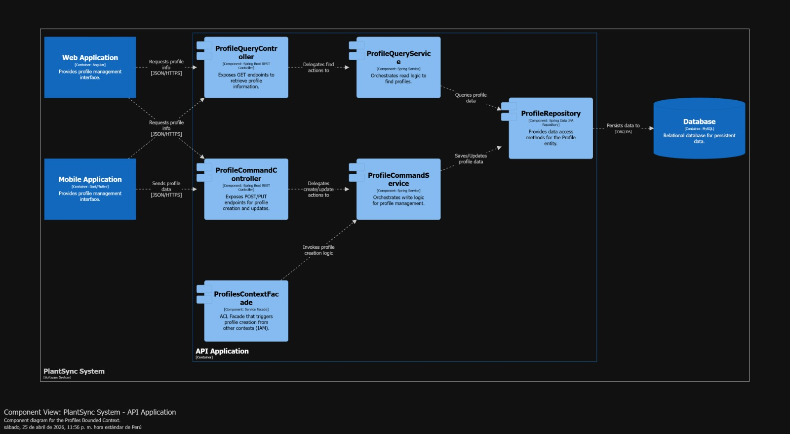
</p>
<p __align__="center">
  Elaboración propia
</p>

#### 5.2.6. Bounded Context Software Architecture Code Level Diagrams

En esta sección, se explica los diagramas que presentan un mayor detalle sobre la implementación de componentes en el bounded context de Profiles.

##### 5.2.6.1. Bounded Context Domain Layer Class Diagrams

<br>
<p __align__="center">
  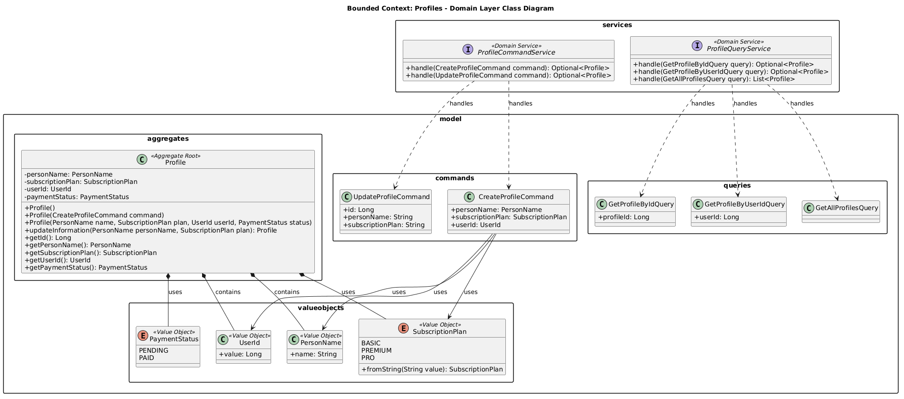
</p>
<p __align__="center">
    Bounded Context Class Diagram - Elaboración propia
</p>


##### 5.2.6.2. Bounded Context Database Design Diagram

<p align="center">
  
</p>

<p align="center">
  Elaboración propia
</p>

<div style="page-break-before: always;"></div>


### 5.3. Bounded Context: PlantProfiles

#### 5.3.1. Domain Layer

En esta capa se define el núcleo de la gestión de plantas, encapsulando las reglas de negocio para la información botánica, cuidados y seguimiento histórico de cada planta asociada a un perfil de usuario.

**Aggregate: `Plant`**

El agregado Plant es la raíz que gestiona las plantas en el sistema, asegurando que los datos botánicos y de cuidado sean consistentes y válidos.

| Atributos | Tipo de dato | Visibilidad | Descripción |
|---|---|---|---|
| id | Long | Private | Identificador único de la planta. |
| name | PlantName | Private | Nombre de la planta (valor object). |
| species | String | Private | Especie de la planta (ej. Monstera, Cactus). |
| acquisitionDate | LocalDate | Private | Fecha de adquisición de la planta. |
| humidity | HumidityLevel | Private | Nivel de humedad preferido para la planta. |
| nextWateringDate | LocalDate | Private | Próxima fecha programada para riego. |
| imageUrl | String | Private | URL o Base64 de la imagen de la planta. |
| notificationsEnabled | Boolean | Private | Indica si las notificaciones están habilitadas. |
| profileId | ProfileId | Private | ID del perfil propietario de la planta. |

| Métodos | Tipo de retorno | Visibilidad | Descripción |
|---|---|---|---|
| getId() | Long | Public | Devuelve el ID de la planta. |
| getName() | PlantName | Public | Devuelve el nombre de la planta. |
| getSpecies() | String | Public | Devuelve la especie. |
| getAcquisitionDate() | LocalDate | Public | Devuelve la fecha de adquisición. |
| getHumidity() | HumidityLevel | Public | Devuelve el nivel de humedad preferido. |
| getNextWateringDate() | LocalDate | Public | Devuelve la próxima fecha de riego. |
| getImageUrl() | String | Public | Devuelve la URL de la imagen. |
| getNotificationsEnabled() | Boolean | Public | Devuelve si las notificaciones están habilitadas. |
| getProfileId() | ProfileId | Public | Devuelve el ID del perfil propietario. |
| updateInformation(...) | Plant | Public | Actualiza toda la información de la planta. |
| Plant(CreatePlantCommand) | Constructor | Public | Crea una nueva planta a partir de un comando. |

**Aggregate: `PlantHistory`**

El agregado PlantHistory representa un registro histórico de cuidado o datos de sensores de una planta.

| Atributos | Tipo de dato | Visibilidad | Descripción |
|---|---|---|---|
| id | Long | Private | Identificador único del registro histórico. |
| plantId | PlantId | Private | ID de la planta asociada. |
| type | String | Private | Tipo de acción registrada (ej. WATERED, FERTILIZED). |
| date | LocalDate | Private | Fecha de la acción o lectura. |
| time | LocalTime | Private | Hora de la acción o lectura. |
| humidity | Integer | Private | Nivel de humedad registrado (si aplica). |

| Métodos | Tipo de retorno | Visibilidad | Descripción |
|---|---|---|---|
| getId() | Long | Public | Devuelve el ID del registro histórico. |
| getPlantId() | PlantId | Public | Devuelve el ID de la planta asociada. |
| getType() | String | Public | Devuelve el tipo de acción. |
| getDate() | LocalDate | Public | Devuelve la fecha. |
| getTime() | LocalTime | Public | Devuelve la hora. |
| getHumidity() | Integer | Public | Devuelve el nivel de humedad registrado. |
| PlantHistory(CreatePlantHistoryCommand) | Constructor | Public | Crea un nuevo registro histórico a partir de un comando. |

**Value Objects**

| Value Object | Descripción |
|---|---|
| PlantName | Registro que representa el nombre de una planta. Valida que no sea nulo o esté en blanco, y que no exceda 100 caracteres. |
| PlantId | Registro que representa el identificador de una planta. Valida que no sea nulo o menor o igual a cero. |
| ProfileId | Registro que representa el identificador de un perfil. Valida que no sea nulo o menor o igual a cero. |
| HumidityLevel | Enumeración que define los niveles de humedad: `BAJA`, `MEDIA`, `ALTA`. |

**Excepciones de Dominio**

| Excepción | Descripción |
|---|---|
| PlantNotFoundException | Se lanza cuando no se encuentra una planta por su ID. |
| PlantCreationException | Se lanza cuando ocurre un error durante la creación de una planta. |
| PlantUpdateException | Se lanza cuando ocurre un error durante la actualización de una planta. |
| PlantDeletionException | Se lanza cuando ocurre un error durante la eliminación de una planta. |
| PlantHistoryNotFoundException | Se lanza cuando no se encuentra un historial de planta por su ID. |

**Clase: `PlantQueryService`**

| Título | PlantQueryService |
|---|---|
| Descripción | Interfaz de servicio de consultas para operaciones de lectura de plantas. |

**Métodos**

| Método | Descripción |
|---|---|
| handle(GetAllPlantsQuery) | Recupera la lista completa de plantas registradas en el sistema. |
| handle(GetAllPlantsByProfileIdQuery) | Recupera las plantas asociadas a un ID de perfil específico. |
| handle(GetPlantByIdQuery) | Obtiene una planta por su identificador único. |

**Clase: `PlantCommandService`**

| Título | PlantCommandService |
|---|---|
| Descripción | Interfaz de servicio de comandos para la gestión de plantas. |

**Métodos**

| Método | Descripción |
|---|---|
| handle(CreatePlantCommand) | Crea una nueva planta a partir del comando y retorna su ID. |
| handle(UpdatePlantCommand) | Actualiza la información de una planta existente. |
| handle(DeletePlantCommand) | Elimina una planta del sistema. |

**Clase: `PlantHistoryQueryService`**

| Título | PlantHistoryQueryService |
|---|---|
| Descripción | Interfaz de servicio de consultas para operaciones de lectura de historiales de planta. |

**Métodos**

| Método | Descripción |
|---|---|
| handle(GetPlantHistoryByPlantIdQuery) | Obtiene un registro histórico por ID de planta. |
| handle(GetAllPlantHistoriesByPlantIdQuery) | Recupera todos los registros históricos asociados a un ID de planta. |

**Clase: `PlantHistoryCommandService`**

| Título | PlantHistoryCommandService |
|---|---|
| Descripción | Interfaz de servicio de comandos para la gestión de historiales de planta. |

**Métodos**

| Método | Descripción |
|---|---|
| handle(CreatePlantHistoryCommand) | Crea un nuevo registro histórico a partir del comando y retorna su ID. |

#### 5.3.2. Interface Layer

La capa de interfaz del contexto PlantProfiles expone controladores REST para la gestión de plantas y sus historiales. Utiliza assemblers especializados para transformar las solicitudes HTTP en comandos y consultas, asegurando que el dominio no se vea afectado por cambios en la API externa.

**Controlador: `PlantCommandController`**

Maneja las operaciones de escritura sobre plantas, permitiendo la creación, actualización y eliminación de las mismas.

**Métodos**

| Método | Ruta | Descripción |
|---|---|---|
| createPlant | POST /api/v1/plants | Crea una nueva planta y devuelve sus datos. |
| updatePlant | PUT /api/v1/plants/{plantId} | Actualiza la información de una planta existente. |
| deletePlant | DELETE /api/v1/plants/{plantId} | Elimina una planta del sistema. |

**Controlador: `PlantQueryController`**

Gestiona las operaciones de consulta y lectura de plantas en la plataforma.

**Métodos**

| Método | Ruta | Descripción |
|---|---|---|
| getAllPlants | GET /api/v1/plants | Lista todas las plantas del sistema. |
| getAllPlantsByProfileId | GET /api/v1/plants/by-profile/{profileId} | Recupera las plantas asociadas a un perfil. |
| getPlantById | GET /api/v1/plants/{plantId} | Recupera una planta por su ID. |

**Controlador: `PlantHistoryCommandController`**

Maneja las operaciones de escritura sobre historiales de planta.

**Métodos**

| Método | Ruta | Descripción |
|---|---|---|
| createPlantHistory | POST /api/v1/plantHistories | Crea un nuevo registro histórico de planta. |

**Controlador: `PlantHistoryQueryController`**

Gestiona las operaciones de consulta y lectura de historiales de planta.

**Métodos**

| Método | Ruta | Descripción |
|---|---|---|
| getPlantHistoryByPlantId | GET /api/v1/plantHistories/by-plant/plantId | Recupera un registro histórico por ID de planta. |
| getAllPlantsByProfileId | GET /api/v1/plantHistories/plantId | Recupera todos los historiales asociados a una planta. |

**Controlador adicional: `WeatherQueryController`**

Controlador proxy para consultas meteorológicas externas.

| Método | Ruta | Descripción |
|---|---|---|
| getWeatherByCity | GET /api/v1/weather/city | Obtiene datos climáticos de OpenWeather API por ciudad. |

**Recursos (DTOs)**

| Recurso | Descripción |
|---|---|
| CreatePlantResource | Contiene los datos para crear una planta: name, species, acquisitionDate, humidity, nextWateringDate, imageUrl, notificationsEnabled, profileId. |
| UpdatePlantResource | Contiene los datos actualizables de una planta. |
| PlantResource | Representa la respuesta de una planta: id, name, species, acquisitionDate, humidity, nextWateringDate, imageUrl, notificationsEnabled, profileId. |
| CreatePlantHistoryResource | Contiene los datos para crear un historial: plantId, type, date, time, humidity. |
| PlantHistoryResource | Representa la respuesta de un historial: id, plantId, type, date, time, humidity. |

**Assemblers (Transformadores)**

| Assembler | Descripción |
|---|---|
| CreatePlantCommandFromResourceAssembler | Convierte un CreatePlantResource en un CreatePlantCommand. |
| UpdatePlantCommandFromResourceAssembler | Convierte un UpdatePlantResource en un UpdatePlantCommand. |
| PlantResourceFromEntityAssembler | Convierte la entidad Plant en un PlantResource. |
| CreatePlantHistoryCommandFromResourceAssembler | Convierte un CreatePlantHistoryResource en un CreatePlantHistoryCommand. |
| PlantHistoryResourceFromEntityAssembler | Convierte la entidad PlantHistory en un PlantHistoryResource. |

#### 5.3.3. Application Layer

Los servicios internos implementan la lógica de orquestación para la gestión de plantas y sus historiales. Se encargan de validar la existencia de entidades, ejecutar comandos, coordinar la persistencia y manejar excepciones específicas del dominio.

**Clase: `PlantCommandServiceImpl`**

| Título | PlantCommandServiceImpl |
|---|---|
| Descripción | Implementación del servicio de comandos para gestionar la creación, actualización y eliminación de plantas. |

**Dependencias**

| Dependencia | Descripción |
|---|---|
| PlantRepository | Repositorio para la persistencia de plantas. |

**Clase: `PlantQueryServiceImpl`**

| Título | PlantQueryServiceImpl |
|---|---|
| Descripción | Implementación del servicio de consultas para operaciones de lectura de plantas. |

**Dependencias**

| Dependencia | Descripción |
|---|---|
| PlantRepository | Repositorio para el acceso a la base de datos de plantas. |

**Clase: `PlantHistoryCommandServiceImpl`**

| Título | PlantHistoryCommandServiceImpl |
|---|---|
| Descripción | Implementación del servicio de comandos para gestionar la creación de historiales de planta. |

**Dependencias**

| Dependencia | Descripción |
|---|---|
| PlantHistoryRepository | Repositorio para la persistencia de historiales de planta. |

**Clase: `PlantHistoryQueryServiceImpl`**

| Título | PlantHistoryQueryServiceImpl |
|---|---|
| Descripción | Implementación del servicio de consultas para operaciones de lectura de historiales de planta. |

**Dependencias**

| Dependencia | Descripción |
|---|---|
| PlantHistoryRepository | Repositorio para el acceso a la base de datos de historiales de planta. |

#### 5.3.4. Infrastructure Layer

Esta capa implementa los mecanismos de persistencia mediante JPA y Spring Data JPA.

**Clase: `PlantRepository`**

| Título | PlantRepository |
|---|---|
| Descripción | Interfaz de persistencia para operaciones CRUD y búsqueda de plantas por perfil. |

**Métodos**

| Método | Descripción |
|---|---|
| findById(Long) | Recupera una planta por su ID. |
| findAll() | Recupera todas las plantas. |
| findByProfileId(ProfileId) | Recupera las plantas asociadas a un ID de perfil. |
| save(Plant) | Persiste o actualiza la información de la planta. |
| deleteById(Long) | Elimina una planta por su ID. |
| existsById(Long) | Verifica si una planta existe por su ID. |

**Clase: `PlantHistoryRepository`**

| Título | PlantHistoryRepository |
|---|---|
| Descripción | Interfaz de persistencia para operaciones CRUD y búsqueda de historiales por planta. |

**Métodos**

| Método | Descripción |
|---|---|
| findById(Long) | Recupera un historial por su ID. |
| findByPlantId(PlantId) | Recupera todos los historiales asociados a un ID de planta. |
| save(PlantHistory) | Persiste o actualiza el historial de planta. |
| existsById(Long) | Verifica si un historial existe por su ID. |

#### 5.3.5. Bounded Context Software Architecture Component Level Diagrams

Este diagrama representa cómo el Bounded Context de PlantProfiles gestiona las plantas y sus historiales.
El PlantCommandController es el punto de entrada principal para el flujo de creación, actualización y eliminación de plantas, mientras que el PlantQueryController maneja las consultas de lectura. Adicionalmente, el PlantHistoryCommandController y PlantHistoryQueryController gestionan los registros históricos de cuidado de las plantas. Todos los controladores delegan respectivamente en PlantCommandService, PlantQueryService, PlantHistoryCommandService y PlantHistoryQueryService.
La persistencia se realiza en una base de datos relacional MySQL a través de PlantRepository y PlantHistoryRepository.
<p __align__="center">
  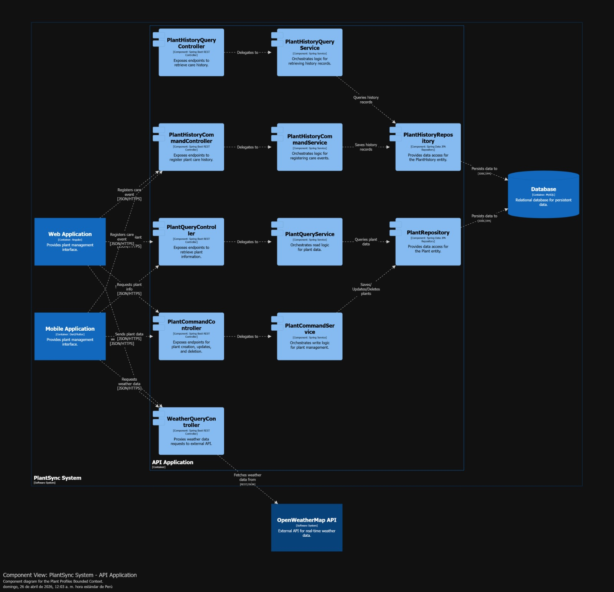
</p>
<p __align__="center">
  Elaboración propia
</p>

#### 5.3.6. Bounded Context Software Architecture Code Level Diagrams

En esta sección, se explica los diagramas que presentan un mayor detalle sobre la implementación de componentes en el bounded context de PlantProfiles.

##### 5.3.6.1. Bounded Context Domain Layer Class Diagrams

<br>
<p __align__="center">
  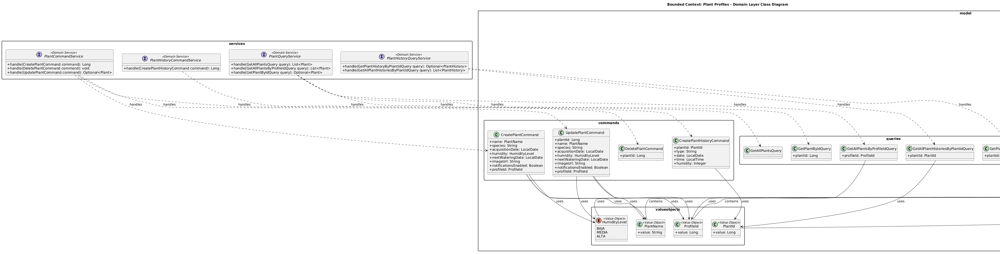
</p>
<p __align__="center">
    Bounded Context Class Diagram - Elaboración propia
</p>

##### 5.3.6.2. Bounded Context Database Design Diagram

<p align="center">
  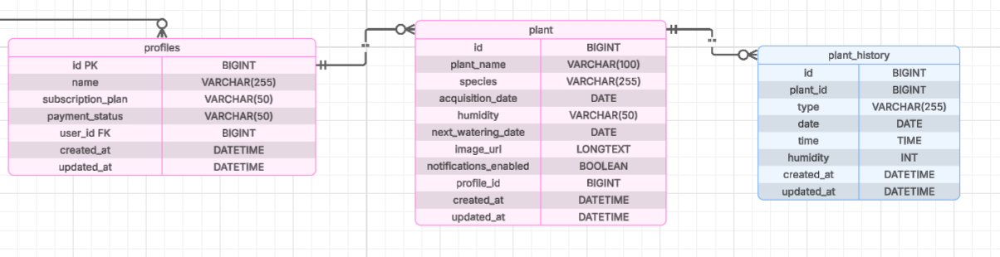
</p>

<p align="center">
  Elaboración propia
</p>

<div style="page-break-before: always;"></div>

### 5.4. Bounded Context: IoT Management

#### 5.4.1. Domain Layer

En esta capa se define la gestión de dispositivos IoT, lecturas de sensores y comandos de actuadores.

**Aggregate: `IoTNode`**

El agregado IoTNode representa un dispositivo Arduino registrado en el sistema, vinculado a una planta.

| Atributos | Tipo de dato | Visibilidad | Descripción |
|---|---|---|---|
| id | Long | Private | Identificador único del nodo. |
| nodeCode | String | Private | Código único del hardware (MAC). |
| status | NodeStatus | Private | ONLINE, OFFLINE, ERROR. |
| plantId | Long | Private | ID de la planta asociada. |
| profileId | Long | Private | ID del propietario. |
| createdAt | LocalDateTime | Private | Fecha de registro. |

| Métodos | Tipo de retorno | Visibilidad | Descripción |
|---|---|---|---|
| getId() | Long | Public | Devuelve el ID. |
| getNodeCode() | String | Public | Devuelve código. |
| getStatus() | NodeStatus | Public | Devuelve estado. |
| updateStatus(NodeStatus) | IoTNode | Public | Actualiza estado. |
| IoTNode(CreateNodeCommand) | Constructor | Public | Crea nodo. |

**Aggregate: `SensorReading`**

Representa una lectura de sensores (DHT11: temperatura y humedad; capacitivo: humedad de suelo).

| Atributos | Tipo de dato | Visibilidad | Descripción |
|---|---|---|---|
| id | Long | Private | Identificador único. |
| nodeId | Long | Private | ID del nodo origen. |
| soilHumidity | Float | Private | Humedad del suelo (%). |
| airTemperature | Float | Private | Temperatura (°C). |
| airHumidity | Float | Private | Humedad del aire (%). |
| timestamp | LocalDateTime | Private | Momento de captura. |

| Métodos | Tipo de retorno | Visibilidad | Descripción |
|---|---|---|---|
| getId() | Long | Public | Devuelve ID. |
| getNodeId() | Long | Public | Devuelve nodo origen. |
| getSoilHumidity() | Float | Public | Devuelve humedad suelo. |
| getAirTemperature() | Float | Public | Devuelve temperatura. |
| getTimestamp() | LocalDateTime | Public | Devuelve timestamp. |
| SensorReading(CreateReadingCommand) | Constructor | Public | Crea lectura. |

**Aggregate: `ActuatorCommand`**

Representa un comando enviado a un actuador (luz UV o rociador de agua).

| Atributos | Tipo de dato | Visibilidad | Descripción |
|---|---|---|---|
| id | Long | Private | Identificador único. |
| nodeId | Long | Private | ID del nodo destino. |
| actuatorType | ActuatorType | Private | UV_LIGHT o WATER_SPRAYER. |
| action | ActuatorAction | Private | ACTIVATE o DEACTIVATE. |
| status | CommandStatus | Private | PENDING, SENT, ACKNOWLEDGED. |
| issuedAt | LocalDateTime | Private | Momento de emisión. |

| Métodos | Tipo de retorno | Visibilidad | Descripción |
|---|---|---|---|
| getId() | Long | Public | Devuelve ID. |
| getNodeId() | Long | Public | Devuelve nodo. |
| getActuatorType() | ActuatorType | Public | Devuelve tipo. |
| getStatus() | CommandStatus | Public | Devuelve estado. |
| acknowledge() | ActuatorCommand | Public | Marca ejecutado. |
| ActuatorCommand(IssueCommandCommand) | Constructor | Public | Crea comando. |

**Value Objects**

| Value Object | Descripción |
|---|---|
| NodeStatus | ONLINE, OFFLINE, ERROR |
| ActuatorType | UV_LIGHT, WATER_SPRAYER |
| ActuatorAction | ACTIVATE, DEACTIVATE |
| CommandStatus | PENDING, SENT, ACKNOWLEDGED |

**Excepciones de Dominio**

| Excepción | Descripción |
|---|---|
| IoTNodeNotFoundException | Nodo no encontrado. |
| IoTNodeAlreadyRegisteredException | NodeCode ya existe. |
| ActuatorCommandFailedException | Comando no ejecutado. |

**Clase: `IoTNodeQueryService`**

| Título | IoTNodeQueryService |
|---|---|
| Descripción | Servicio de consultas para operaciones de lectura de nodos. |

| Métodos | Descripción |
|---|---|
| handle(GetNodeByIdQuery) | Obtiene nodo por ID. |
| handle(GetNodesByProfileIdQuery) | Lista nodos del perfil. |

**Clase: `IoTNodeCommandService`**

| Título | IoTNodeCommandService |
|---|---|
| Descripción | Servicio de comandos para gestión de nodos. |

| Métodos | Descripción |
|---|---|
| handle(CreateNodeCommand) | Registra nodo. |
| handle(UpdateNodeStatusCommand) | Actualiza estado. |

**Clase: `SensorReadingQueryService`**

| Título | SensorReadingQueryService |
|---|---|
| Descripción | Servicio de consultas para lecturas de sensores. |

| Métodos | Descripción |
|---|---|
| handle(GetLatestReadingQuery) | Obtiene lectura más reciente. |
| handle(GetReadingsByRangeQuery) | Obtiene lecturas en rango. |

**Clase: `SensorReadingCommandService`**

| Título | SensorReadingCommandService |
|---|---|
| Descripción | Servicio de comandos para ingesta de telemetría. Al recibir lectura, evalúa reglas y dispara actuadores. |

| Métodos | Descripción |
|---|---|
| handle(CreateReadingCommand) | Ingesta lectura y evalúa reglas. |

**Clase: `ActuatorCommandService`**

| Título | ActuatorCommandService |
|---|---|
| Descripción | Servicio para gestión de comandos de actuadores. |

| Métodos | Descripción |
|---|---|
| handle(IssueCommandCommand) | Emite comando al actuador. |
| handle(AcknowledgeCommandCommand) | Registra acuse de recibo. |

#### 5.4.2. Interface Layer

**Controlador: `SensorReadingController`**

Gestiona ingesta de lecturas de sensores.

| Método | Ruta | Descripción |
|---|---|---|
| createReading | POST /api/v1/iot/readings | Ingesta lectura. |
| getLatestReading | GET /api/v1/iot/readings/latest/{nodeId} | Lectura más reciente. |
| getReadingsByRange | GET /api/v1/iot/readings/{nodeId}/range | Lecturas en rango de fechas. |

**Controlador: `ActuatorCommandController`**

Gestiona comandos de actuadores.

| Método | Ruta | Descripción |
|---|---|---|
| issueCommand | POST /api/v1/iot/commands | Emite comando. |
| acknowledgeCommand | PATCH /api/v1/iot/commands/{commandId} | Acuse de recibo. |

**Controlador: `IoTNodeController`**

Gestiona las operaciones de registro, consulta y actualización de los nodos IoT.

| Método | Ruta | Descripción |
| :--- | :--- | :--- |
| createNode | POST /api/v1/iot/nodes | Registra un nuevo nodo IoT vinculándolo a una planta y perfil. |
| getNodeById | GET /api/v1/iot/nodes/{nodeId} | Obtiene la información de un nodo por su ID. |
| getNodesByProfileId | GET /api/v1/iot/nodes/profile/{profileId} | Lista todos los nodos asociados a un perfil específico. |
| updateNodeStatus | PATCH /api/v1/iot/nodes/{nodeId}/status | Actualiza el estado operativo de un nodo (ONLINE, OFFLINE, ERROR). |

**Recursos (DTOs)**

| Recurso | Descripción |
|---|---|
| CreateNodeResource | nodeCode, plantId, profileId |
| IoTNodeResource | id, nodeCode, status, plantId, profileId, createdAt |
| CreateReadingResource | nodeId, soilHumidity, airTemperature, airHumidity |
| SensorReadingResource | id, nodeId, soilHumidity, airTemperature, airHumidity, timestamp |
| IssueCommandResource | nodeId, actuatorType, action |
| ActuatorCommandResource | id, nodeId, actuatorType, action, status, issuedAt |

**Dependencias**

| Dependencia | Descripción |
|---|---|
| IoTNodeCommandService | Servicio de comandos de nodos. |
| IoTNodeQueryService | Servicio de consultas de nodos. |
| SensorReadingCommandService | Servicio de comandos de lecturas. |
| SensorReadingQueryService | Servicio de consultas de lecturas. |
| ActuatorCommandService | Servicio de comandos de actuadores. |
| IoTNodeRepository | Repositorio de nodos. |
| SensorReadingRepository | Repositorio de lecturas. |
| ActuatorCommandRepository | Repositorio de comandos. |

#### 5.4.3. Application Layer

**Clase: `IoTNodeCommandServiceImpl`**

| Título | IoTNodeCommandServiceImpl |
|---|---|
| Descripción | Implementación de servicio de comandos para gestión de nodos. |

| Dependencias | Descripción |
|---|---|
| IoTNodeRepository | Repositorio de nodos. |

**Clase: `IoTNodeQueryServiceImpl`**

| Título | IoTNodeQueryServiceImpl |
|---|---|
| Descripción | Implementación de servicio de consultas para operaciones de lectura de nodos. |

| Dependencias | Descripción |
|---|---|
| IoTNodeRepository | Repositorio de nodos. |

**Clase: `SensorReadingCommandServiceImpl`**

| Título | SensorReadingCommandServiceImpl |
|---|---|
| Descripción | Implementación de servicio de comandos para ingesta de telemetría. Evalúa reglas de cuidado automáticamente. |

| Dependencias | Descripción |
|---|---|
| SensorReadingRepository | Repositorio de lecturas. |
| ActuatorCommandService | Dispara comandos automáticos si hay anomalías. |

**Clase: `SensorReadingQueryServiceImpl`**

| Título | SensorReadingQueryServiceImpl |
|---|---|
| Descripción | Implementación de servicio de consultas para lecturas de sensores. |

| Dependencias | Descripción |
|---|---|
| SensorReadingRepository | Repositorio de lecturas. |


**Clase: `ActuatorCommandServiceImpl`**

| Título | ActuatorCommandServiceImpl |
|---|---|
| Descripción | Implementación de servicio para gestión de comandos de actuadores. Persiste y publica en MQTT. |

| Dependencias | Descripción |
|---|---|
| ActuatorCommandRepository | Repositorio de comandos. |
| MqttPublisherService | Publicador MQTT para hardware. |

#### 5.4.4. Infrastructure Layer

**Clase: `IoTNodeRepository`**

| Título | IoTNodeRepository |
|---|---|
| Descripción | Repositorio para operaciones CRUD de nodos IoT. |

| Métodos | Descripción |
|---|---|
| findById(Long) | Por ID. |
| findByProfileId(Long) | Por perfil. |
| findByPlantId(Long) | Por planta. |
| existsByNodeCode(String) | Verifica unicidad. |
| save(IoTNode) | Persiste. |

**Clase: `SensorReadingRepository`**

| Título | SensorReadingRepository |
|---|---|
| Descripción | Repositorio para operaciones CRUD de lecturas. |

| Métodos | Descripción |
|---|---|
| findTopByNodeIdOrderByTimestampDesc(Long) | Última lectura. |
| findByNodeIdAndTimestampBetween(Long, LocalDateTime, LocalDateTime) | Rango de fechas. |
| save(SensorReading) | Persiste. |

**Clase: `ActuatorCommandRepository`**

| Título | ActuatorCommandRepository |
|---|---|
| Descripción | Repositorio para operaciones CRUD de comandos. |

| Métodos | Descripción |
|---|---|
| findById(Long) | Por ID. |
| findByNodeId(Long) | Por nodo. |
| save(ActuatorCommand) | Persiste. |

**Clase: `MqttPublisherService`**

| Título | MqttPublisherService |
|---|---|
| Descripción | Servicio de infraestructura para publicar comandos en MQTT hacia Arduino. |

| Métodos | Descripción |
|---|---|
| publish(String topic, String payload) | Publica mensaje en MQTT. |

#### 5.4.5. Bounded Context Software Architecture Component Level Diagrams

Este diagrama C4 (nivel componente) muestra la estructura interna del Bounded Context IoT Management en el backend Spring Boot. El sistema gestiona la comunicación bidireccional con Arduino mediante REST y MQTT: los controladores (IoTNodeController, SensorReadingController, ActuatorCommandController) reciben solicitudes y las derivan a servicios de aplicación, que ejecutan la lógica de negocio, evalúan anomalías y disparan actuadores cuando corresponde. La información se persiste en MySQL a través de sus repositorios, y MqttPublisherService publica comandos en el broker MQTT para su ejecución en Arduino.

<p __align__="center">
  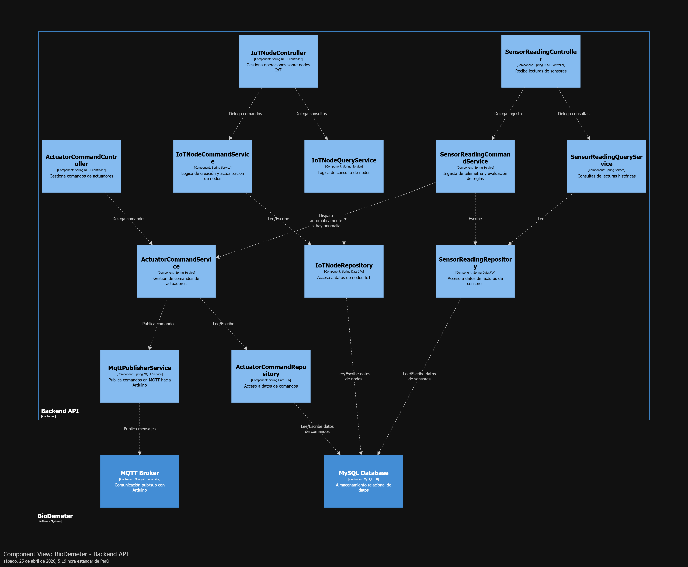
</p>


#### 5.4.6. Bounded Context Software Architecture Code Level Diagrams

##### 5.4.6.1. Bounded Context Domain Layer Class Diagrams

Este diagrama UML muestra la capa de dominio de IoT Management con tres agregados principales (IoTNode, SensorReading y ActuatorCommand), modelados como entidades independientes del negocio, junto con los value objects/enumeraciones (NodeStatus, ActuatorType, ActuatorAction, CommandStatus) que aseguran consistencia de datos; además, presenta los servicios de comando y consulta que orquestan la lógica, destacando que SensorReadingCommandService activa ActuatorCommandService cuando detecta anomalías en la telemetría.

<p __align__="center">
  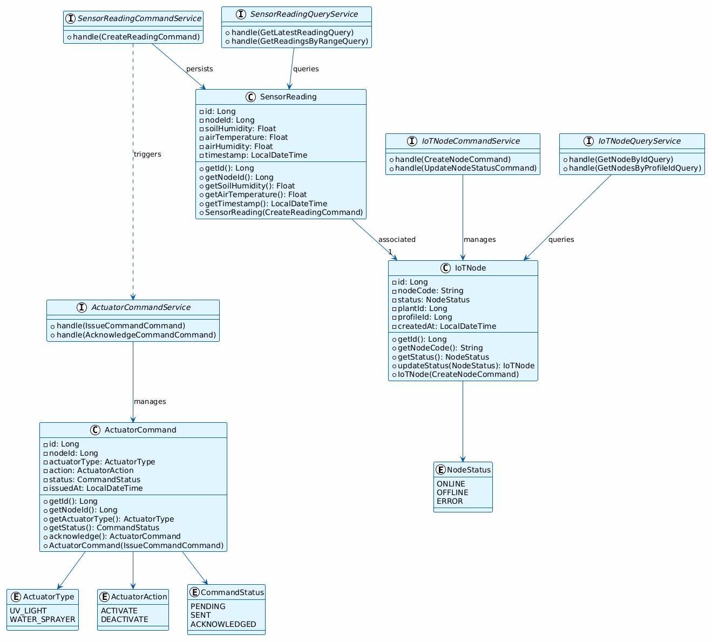
</p>


##### 5.4.6.2. Bounded Context Database Design Diagram

El diseño de base de datos del bounded context IoT Management se compone de tres tablas principales: iot_nodes, que registra cada nodo Arduino con su nodeCode único, estado, referencias de planta/perfil y fecha de creación; sensor_readings, que almacena la telemetría (humedad de suelo, temperatura y humedad de aire, timestamp) vinculada al nodo por nodeId y optimizada para consultas temporales con índices por nodo y fecha; y actuator_commands, que guarda el historial de comandos enviados a actuadores (tipo, acción, estado y fecha) también relacionado por nodeId e indexado para localizar rápidamente comandos pendientes; en conjunto, las relaciones garantizan consistencia e integridad referencial al depender ambas tablas transaccionales de iot_nodes.

<p __align__="center">
  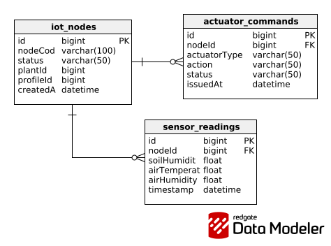
</p>

### 5.5. Bounded Context: CareScheduling

#### 5.5.1. Domain Layer

En esta capa se define el núcleo de la programación de cuidados de plantas, encapsulando las reglas de negocio para la gestión de tareas de mantenimiento como riego, fertilización y otras acciones programadas.

**Aggregate: `Task`**

El agregado Task es la raíz que gestiona las tareas de cuidado de plantas en el sistema, asegurando que las acciones programadas sean consistentes y válidas.

| Atributos | Tipo de dato | Visibilidad | Descripción |
|---|---|---|---|
| id | Long | Private | Identificador único de la tarea. |
| date | LocalDate | Private | Fecha programada para la ejecución de la tarea. |
| action | String | Private | Acción a realizar (ej. "WATER", "FERTILIZE"). |
| completed | Boolean | Private | Indica si la tarea ha sido completada. |
| plantId | PlantId | Private | ID de la planta asociada a la tarea. |
| profileId | ProfileId | Private | ID del perfil propietario de la tarea. |

| Métodos | Tipo de retorno | Visibilidad | Descripción |
|---|---|---|---|
| getId() | Long | Public | Devuelve el ID de la tarea. |
| getDate() | LocalDate | Public | Devuelve la fecha programada. |
| getAction() | String | Public | Devuelve la acción a realizar. |
| getCompleted() | Boolean | Public | Devuelve si la tarea está completada. |
| getPlantId() | PlantId | Public | Devuelve el ID de la planta asociada. |
| getProfileId() | ProfileId | Public | Devuelve el ID del perfil propietario. |
| updateInformation(String, LocalDate, PlantId, ProfileId, Boolean) | Task | Public | Actualiza la información de la tarea. |
| Task(CreateTaskCommand) | Constructor | Public | Crea una nueva tarea a partir de un comando. |

**Value Objects**

| Value Object | Descripción |
|---|---|
| PlantId | Registro que representa el identificador de una planta. Valida que no sea nulo o menor o igual a cero. |
| ProfileId | Registro que representa el identificador de un perfil. Valida que no sea nulo o menor o igual a cero. |

**Excepciones de Dominio**

| Excepción | Descripción |
|---|---|
| TaskCreationException | Se lanza cuando ocurre un error durante la creación de una tarea. |
| TaskDeletionException | Se lanza cuando ocurre un error durante la eliminación de una tarea. |

**Clase: `TaskQueryService`**

| Título | TaskQueryService |
|---|---|
| Descripción | Interfaz de servicio de consultas para operaciones de lectura de tareas. |

**Métodos**

| Método | Descripción |
|---|---|
| handle(GetAllTasksQuery) | Recupera la lista completa de tareas registradas en el sistema. |
| handle(GetTaskByIdQuery) | Obtiene una tarea por su identificador único. |

**Clase: `TaskCommandService`**

| Título | TaskCommandService |
|---|---|
| Descripción | Interfaz de servicio de comandos para la gestión de tareas. |

**Métodos**

| Método | Descripción |
|---|---|
| handle(CreateTaskCommand) | Crea una nueva tarea a partir del comando y retorna su ID. |
| handle(DeleteTaskCommand) | Elimina una tarea del sistema. |

#### 5.5.2. Interface Layer

La capa de interfaz del contexto CareScheduling expone controladores REST para la gestión de tareas de cuidado. Utiliza assemblers especializados para transformar las solicitudes HTTP en comandos y consultas, asegurando que el dominio no se vea afectado por cambios en la API externa.

**Controlador: `TaskCommandController`**

Maneja las operaciones de escritura sobre tareas, permitiendo la creación y eliminación de las mismas.

**Métodos**

| Método | Ruta | Descripción |
|---|---|---|
| createTask | POST /api/v1/tasks | Crea una nueva tarea y devuelve sus datos. |
| deleteTask | DELETE /api/v1/tasks/{taskId} | Elimina una tarea del sistema. |

**Controlador: `TaskQueryController`**

Gestiona las operaciones de consulta y lectura de tareas en la plataforma.

**Métodos**

| Método | Ruta | Descripción |
|---|---|---|
| getAllTasks | GET /api/v1/tasks | Lista todas las tareas del sistema. |

**Recursos (DTOs)**

| Recurso | Descripción |
|---|---|
| CreateTaskResource | Contiene los datos para crear una tarea: action, date, plantId, profileId, completed. |
| TaskResource | Representa la respuesta de una tarea: id, action, date, plantId, profileId, completed. |

**Assemblers (Transformadores)**

| Assembler | Descripción |
|---|---|
| CreateTaskCommandFromResourceAssembler | Convierte un CreateTaskResource en un CreateTaskCommand. |
| TaskResourceFromEntityAssembler | Convierte la entidad Task en un TaskResource. |

#### 5.5.3. Application Layer

Los servicios internos implementan la lógica de orquestación para la gestión de tareas. Se encargan de ejecutar comandos y coordinar la persistencia.

**Clase: `TaskCommandServiceImpl`**

| Título | TaskCommandServiceImpl |
|---|---|
| Descripción | Implementación del servicio de comandos para gestionar la creación y eliminación de tareas. |

**Dependencias**

| Dependencia | Descripción |
|---|---|
| TaskRepository | Repositorio para la persistencia de tareas. |

**Clase: `TaskQueryServiceImpl`**

| Título | TaskQueryServiceImpl |
|---|---|
| Descripción | Implementación del servicio de consultas para operaciones de lectura de tareas. |

**Dependencias**

| Dependencia | Descripción |
|---|---|
| TaskRepository | Repositorio para el acceso a la base de datos de tareas. |

#### 5.5.4. Infrastructure Layer

Esta capa implementa los mecanismos de persistencia mediante JPA y Spring Data JPA.

**Clase: `TaskRepository`**

| Título | TaskRepository |
|---|---|
| Descripción | Interfaz de persistencia para operaciones CRUD de tareas. |

**Métodos**

| Método | Descripción |
|---|---|
| findById(Long) | Recupera una tarea por su ID. |
| findAll() | Recupera todas las tareas. |
| save(Task) | Persiste o actualiza la información de la tarea. |
| deleteById(Long) | Elimina una tarea por su ID. |

#### 5.5.5. Bounded Context Software Architecture Component Level Diagrams

Este diagrama representa cómo el Bounded Context de CareScheduling gestiona las tareas de cuidado de plantas.
El TaskCommandController es el punto de entrada principal para el flujo de creación y eliminación de tareas, mientras que el TaskQueryController maneja las consultas de lectura. Ambos controladores delegan respectivamente en TaskCommandService y TaskQueryService.
La persistencia se realiza en una base de datos relacional MySQL a través de TaskRepository.
<p __align__="center">
  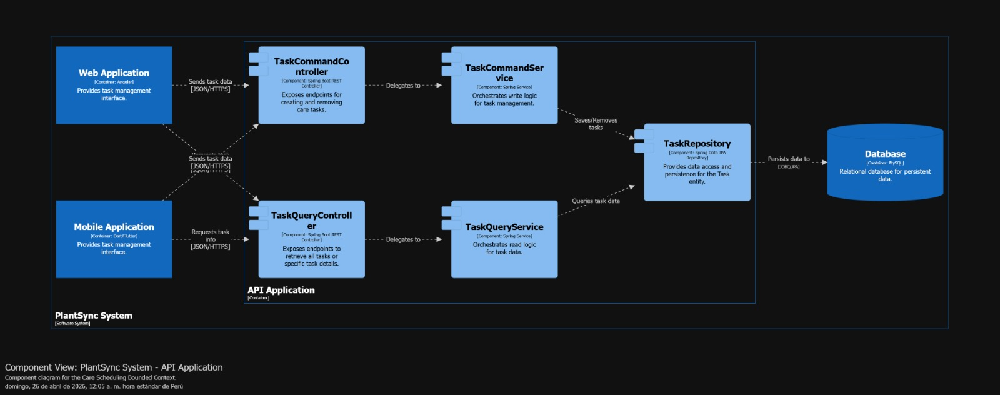
</p>
<p __align__="center">
  Elaboración propia
</p>

#### 5.5.6. Bounded Context Software Architecture Code Level Diagrams

En esta sección, se explica los diagramas que presentan un mayor detalle sobre la implementación de componentes en el bounded context de CareScheduling.

##### 5.5.6.1. Bounded Context Domain Layer Class Diagrams

<br>
<p __align__="center">
  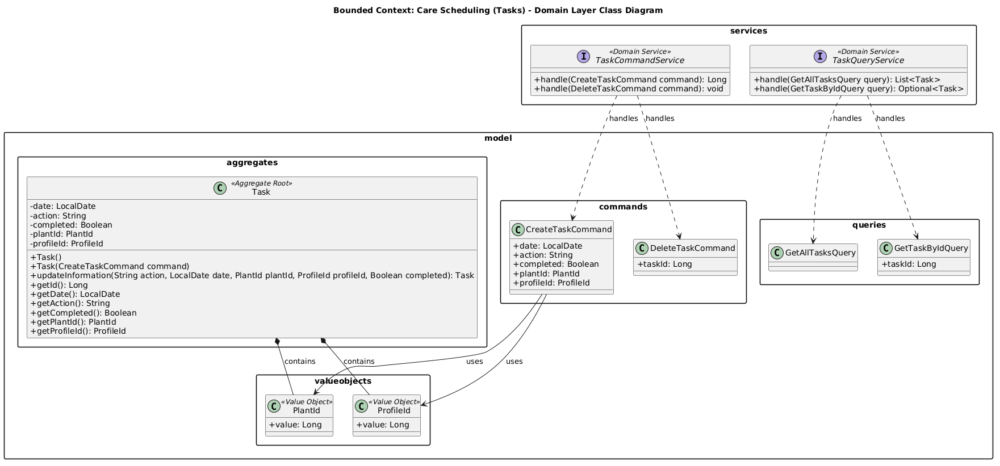
</p>
<p __align__="center">
    Bounded Context Class Diagram - Elaboración propia
</p>

##### 5.5.6.2. Bounded Context Database Design Diagram

<p align="center">
  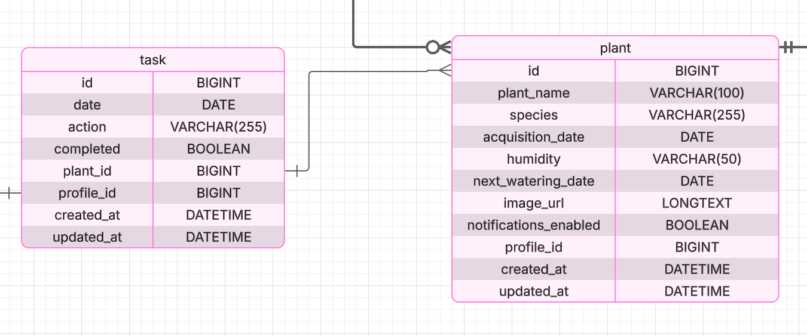
</p>

<p align="center">
  Elaboración propia
</p>

<div style="page-break-before: always;"></div>

### 5.6. Bounded Context: Inteligencia Botánica y Análisis Externo

#### 5.6.1. Domain Layer

En esta capa se define el núcleo de la generación de recomendaciones personalizadas de cuidado por especie, encapsulando las reglas de negocio para analizar telemetría de sensores, consultar datos botánicos externos y producir consejos accionables para el usuario.

**Aggregate: `Recommendation`**

El agregado Recommendation es la raíz que gestiona las recomendaciones de cuidado generadas para una planta específica, asegurando que la evaluación de condiciones y los consejos producidos sean consistentes y válidos.

| Atributos | Tipo de dato | Visibilidad | Descripción |
|---|---|---|---|
| id | RecommendationId | Private | Identificador único de la recomendación. |
| plantId | String | Private | Identificador de la planta evaluada. |
| userId | String | Private | Identificador del usuario propietario. |
| telemetrySnapshot | TelemetrySnapshot | Private | Captura inmutable de telemetría relevante. |
| externalSpeciesData | ExternalSpeciesData | Private | Datos externos de especie consultados. |
| plantCondition | PlantCondition | Private | Estado evaluado de la planta. |
| advices | List\<CareAdvice\> | Private | Lista de consejos priorizados generados. |
| generatedAt | LocalDateTime | Private | Fecha y hora de generación. |
| domainEvents | List\<DomainEvent\> | Private | Eventos de dominio pendientes de publicación. |

| Métodos | Tipo de retorno | Visibilidad | Descripción |
|---|---|---|---|
| getId() | RecommendationId | Public | Devuelve el ID de la recomendación. |
| getPlantId() | String | Public | Devuelve el ID de la planta asociada. |
| getUserId() | String | Public | Devuelve el ID del usuario propietario. |
| getPlantCondition() | PlantCondition | Public | Devuelve la condición evaluada de la planta. |
| getAdvicesOrderedByPriority() | List\<CareAdvice\> | Public | Devuelve consejos ordenados por prioridad. |
| pullDomainEvents() | List\<DomainEvent\> | Public | Extrae eventos de dominio para publicación. |
| evaluate(RecommendationService) | void | Public | Ejecuta evaluación con servicio de dominio. |
| Recommendation(RecommendationId, String, String, TelemetrySnapshot, ExternalSpeciesData) | Constructor | Public | Crea una nueva recomendación. |

**Entity: `CareAdvice`**

Entidad que representa un consejo específico generado como parte de una recomendación, incluyendo prioridad, tipo y mensaje de acción.

| Atributos | Tipo de dato | Visibilidad | Descripción |
|---|---|---|---|
| id | UUID | Private | Identificador único del consejo. |
| type | CareAdviceType | Private | Tipo de consejo generado. |
| priority | int | Private | Nivel de prioridad del consejo. |
| message | String | Private | Mensaje descriptivo para el usuario. |
| actionRequired | String | Private | Acción recomendada a ejecutar. |

| Métodos | Tipo de retorno | Visibilidad | Descripción |
|---|---|---|---|
| getId() | UUID | Public | Devuelve el ID del consejo. |
| getType() | CareAdviceType | Public | Devuelve el tipo de consejo. |
| getPriority() | int | Public | Devuelve la prioridad del consejo. |
| getMessage() | String | Public | Devuelve el mensaje descriptivo. |
| isHighPriority() | boolean | Public | Indica si el consejo es de alta prioridad. |
| CareAdvice(CareAdviceType, int, String, String) | Constructor | Public | Crea un nuevo consejo de cuidado. |

**Value Objects**

| Value Object | Descripción |
|---|---|
| RecommendationId | Registro que representa el identificador único de una recomendación. Encapsula un UUID. |
| TelemetrySnapshot | Captura inmutable de telemetría relevante: humedad del suelo, temperatura ambiental, nivel de luz, timestamp y origen. Proporciona métodos de validación contra umbrales. |
| ExternalSpeciesData | Información externa por especie: rangos óptimos de humedad, temperatura, iluminación mínima, frecuencia de riego sugerida y fuente de datos. |
| PlantCondition | Enumeración que representa el estado evaluado de la planta: OPTIMAL, STRESS_HUMIDITY, STRESS_TEMPERATURE, STRESS_LIGHT, CRITICAL. |
| CareAdviceType | Enumeración del tipo de consejo: WATERING, LIGHT_SUPPLEMENT, TEMPERATURE_ADJUSTMENT, FERTILIZER, GENERAL. |

**Domain Events**

| Event | Descripción |
|---|---|
| RecommendationGenerated | Evento de dominio emitido cuando se genera exitosamente una nueva recomendación para una planta. Contiene ID de recomendación, plantId, userId, condición detectada y cantidad de consejos. |

**Domain Services**

| Service | Descripción |
|---|---|
| RecommendationService | Servicio de dominio que compara telemetría contra datos externos de especie, determina PlantCondition y construye la lista priorizada de CareAdvice. |

**Clase: `RecommendationQueryService`**

| Título | RecommendationQueryService |
|---|---|
| Descripción | Interfaz de servicio de consultas para operaciones de lectura de recomendaciones generadas. |

**Métodos**

| Método | Descripción |
|---|---|
| handle(GetLatestRecommendationQuery) | Recupera la recomendación más reciente de una planta. |
| handle(GetRecommendationHistoryQuery) | Recupera el historial paginado de recomendaciones de una planta. |

**Clase: `RecommendationCommandService`**

| Título | RecommendationCommandService |
|---|---|
| Descripción | Interfaz de servicio de comandos para la generación de recomendaciones. |

**Métodos**

| Método | Descripción |
|---|---|
| handle(GenerateRecommendationCommand) | Orquesta la generación completa de una recomendación: consulta telemetría, especie, datos externos, evalúa, persiste y publica evento. |

#### 4.4.6.2. Interface Layer

La capa de interfaz del contexto Inteligencia Botánica y Análisis Externo expone controladores REST para consulta de recomendaciones y consumidores de eventos para procesamiento asíncrono de telemetría. Utiliza assemblers especializados para transformar las solicitudes y respuestas, asegurando que el dominio no se vea afectado por cambios en la API externa.

**Controlador: `RecommendationController`**

Gestiona las operaciones de consulta de recomendaciones generadas para plantas específicas.

**Métodos**

| Método | Ruta | Descripción |
|---|---|---|
| getLatestRecommendation | GET /api/v1/recommendations/{plantId}/latest | Devuelve la última recomendación generada para una planta. |
| getRecommendationHistory | GET /api/v1/recommendations/{plantId}/history | Devuelve el historial paginado de recomendaciones de una planta. |

**Consumidor de Eventos: `TelemetryEventConsumer`**

Escucha eventos de nueva telemetría publicados por el bounded context IoT Management y desencadena la generación automática de recomendaciones.

**Métodos**

| Método | Descripción |
|---|---|
| onTelemetrySaved(TelemetrySavedEvent) | Consume el evento de telemetría guardada y activa el comando GenerateRecommendation. |

**Recursos (DTOs)**

| Recurso | Descripción |
|---|---|
| RecommendationResource | Representa la respuesta de una recomendación: plantCondition, lista de advices ordenados por prioridad, timestamp de generación y fuente de datos. |

**Assemblers (Transformadores)**

| Assembler | Descripción |
|---|---|
| RecommendationAssembler | Convierte el aggregate Recommendation en un RecommendationResource para exposición vía API REST. |

#### 5.6.3. Application Layer

Los servicios internos implementan la lógica de orquestación para la generación y consulta de recomendaciones. Se encargan de coordinar la interacción entre telemetría, perfiles de planta, datos externos y persistencia.

**Clase: `GenerateRecommendationCommandHandler`**

| Título | GenerateRecommendationCommandHandler |
|---|---|
| Descripción | Implementación del handler de comando que orquesta la generación completa de una recomendación. |

**Dependencias**

| Dependencia | Descripción |
|---|---|
| IRecommendationRepository | Repositorio para persistencia de recomendaciones. |
| ISpeciesDataRepository | Repositorio para consulta de datos externos de especie. |
| RecommendationService | Servicio de dominio para evaluación de condiciones. |
| RecommendationEventPublisher | Publicador de eventos de dominio. |
| PlantProfilesClient | Cliente HTTP para consulta de especie desde PlantProfiles BC. |

**Clase: `GetLatestRecommendationQueryHandler`**

| Título | GetLatestRecommendationQueryHandler |
|---|---|
| Descripción | Implementación del handler de consulta para recuperar la última recomendación de una planta. |

**Dependencias**

| Dependencia | Descripción |
|---|---|
| IRecommendationRepository | Repositorio para acceso a datos de recomendaciones. |

**Clase: `GetRecommendationHistoryQueryHandler`**

| Título | GetRecommendationHistoryQueryHandler |
|---|---|
| Descripción | Implementación del handler de consulta para recuperar historial paginado de recomendaciones. |

**Dependencias**

| Dependencia | Descripción |
|---|---|
| IRecommendationRepository | Repositorio para acceso paginado al historial. |

#### 5.6.4. Infrastructure Layer

Esta capa implementa los mecanismos de persistencia, integración con servicios externos y publicación de eventos.

**Clase: `RecommendationRepositoryImpl`**

| Título | RecommendationRepositoryImpl |
|---|---|
| Descripción | Implementación JPA del repositorio de recomendaciones para persistencia en base de datos relacional. |

**Métodos**

| Método | Descripción |
|---|---|
| save(Recommendation) | Persiste o actualiza una recomendación. |
| findById(RecommendationId) | Recupera una recomendación por su ID. |
| findLatestByPlantId(String) | Recupera la recomendación más reciente de una planta. |
| findByPlantIdPaginated(String, int, int) | Recupera historial paginado de recomendaciones. |

**Clase: `SpeciesDataRepositoryImpl`**

| Título | SpeciesDataRepositoryImpl |
|---|---|
| Descripción | Implementación del repositorio que consume API externa de datos botánicos por especie (ej. Perenual API). |

**Métodos**

| Método | Descripción |
|---|---|
| findBySpeciesName(String) | Consulta datos externos de especie y retorna ExternalSpeciesData. |

**Clase: `TelemetryEventConsumerImpl`**

| Título | TelemetryEventConsumerImpl |
|---|---|
| Descripción | Implementación del consumidor de eventos que escucha TelemetrySaved desde el message broker y delega al command handler. |

**Clase: `RecommendationEventPublisher`**

| Título | RecommendationEventPublisher |
|---|---|
| Descripción | Adaptador que publica el evento RecommendationGenerated al message broker (RabbitMQ/Kafka) para notificaciones. |

**Infraestructura de Soporte**

| Component | Descripción |
|---|---|
| SpeciesDataCache | Caché basada en Redis con TTL configurable para reducir llamadas a API externa. Almacena ExternalSpeciesData indexado por speciesName. |

#### 5.6.5. Bounded Context Software Architecture Component Level Diagrams

Este diagrama representa cómo el Bounded Context de Inteligencia Botánica y Análisis Externo gestiona la generación de recomendaciones personalizadas de cuidado por especie.

El RecommendationController es el punto de entrada principal para las consultas de recomendaciones, delegando en los query handlers correspondientes. El TelemetryEventConsumer escucha eventos de nueva telemetría desde IoT Management y activa el GenerateRecommendationCommandHandler, quien orquesta la consulta de especie desde PlantProfiles, la obtención de datos externos desde SpeciesDataRepository, la evaluación con RecommendationService y la persistencia del resultado. La persistencia se realiza en una base de datos relacional MySQL a través de RecommendationRepositoryImpl.

<p align="center">
  
</p>
<p align="center">
  Elaboración propia
</p>

#### 5.6.6. Bounded Context Software Architecture Code Level Diagrams

En esta sección, se explican los diagramas que presentan un mayor detalle sobre la implementación de componentes en el bounded context de Inteligencia Botánica y Análisis Externo.

##### 5.6.6.1. Bounded Context Domain Layer Class Diagrams

<br>
<p align="center">
  
</p>
<p align="center">
    Bounded Context Class Diagram - Elaboración propia
</p>

##### 5.6.6.2. Bounded Context Database Design Diagram

<p align="center">
  
</p>

<p align="center">
  Elaboración propia
</p>

<div style="page-break-before: always;"></div>

### 5.7. Bounded Context: \<PlantGuidance\>

#### 5.7.1. Domain Layer

En esta capa se define el núcleo de la seguridad y gestión de identidades, encapsulando las reglas de negocio para la autenticación y autorización de usuarios.

En esta capa se gestiona la inteligencia del sistema. Integrando la ia del chatbot con los datos dinámicos de los sensores y de los perfiles de las plantas para ofrecer recomendaciones.

**Aggregate: `Consultation`**

Representa una sesión de consulta temporal donde un usuario interactúa con la IA para obtener asesoría basada en los datos específicos de una de sus plantas.

| Atributos      | Tipo de dato     | Visibilidad | Descripción                                     |
|----------------|-----------------|------------|------------------------------------------------|
| consultationId    | Long            | Private    | Identificador único de la consulta.            |
| plantId      | Long           | Private    | ID de la planta sobre la cual se realiza la consulta.    |
| userMessage       | String          | Private    | Pregunta o inquietud enviada por el usuario.                      |
| aiResponse    | String         | Private    | Respuesta generada por el modelo de IA          |
| plantSnapshot    | PlantSnapshot         | Private    | Objeto de valor con los datos de la planta en el momento de la consulta.          |
| createdAt    | Timestamp         | Private    | Fecha y hora de la interacción.          |

| Métodos                         | Tipo de retorno | Visibilidad | Descripción                                      |
|---------------------------------|----------------|------------|------------------------------------------------|
| getConsultationId()                 | Long           | Public     | Devuelve el ID de la consulta.                   |
| getPlantId()                 | Long          | Public     | Devuelve el ID de la planta asociada.    |
| getAiResponse()                      | String         | Public     | Devuelve la respuesta generada por la IA.              |
| updateResponse(response)                |void       | Public     | Asigna la respuesta final generada por el servicio de IA.        |
| getCreatedAt()                     | Timestamp  | Public     | Devuelve la fecha de la consulta.       |

**Value Objects**

| Value Object   | Descripción                                                                 |
|----------------|-----------------------------------------------------------------------------|
| ChatRole  | Define el rol del emisor del mensaje: `USER`, `ASSISTANT` y `SYSTEM`.      |
| PlantSnapshot | Contiene los datos técnicos de la planta al momento de la duda: nombre, descripción, temperatura y humedad.|

**Clase: `ChatbotQueryService`**

| Título       | ChatbotQueryService |
|--------------|----------------------|
| Descripción  | Interfaz de servicio de consultas para recuperar el historial de interacciones de una planta específica. |

**Métodos**

| Método                             | Descripción                                               |
|-----------------------------------|-----------------------------------------------------------|
| handle(GetConsultationsByPlantIdQuery)        | Obtiene todas las consultas realizadas para una planta específica.   |
| handle(GetConsultationByIdQuery) | Obtiene los detalles de una consulta específica.     |

**Clase: `ChatbotCommandService`**

| Título       | ChatbotCommandService |
|--------------|------------------------|
| Descripción  | Interfaz de servicio de comandos para procesar la lógica de generación de asesoría mediante IA. |

**Métodos**

| Método                           | Descripción                                                        |
|---------------------------------|--------------------------------------------------------------------|
| handle(ProcessPlantConsultationCommand)     | Orquesta la obtención de datos de la planta, genera el prompt para la IA y registra la respuesta.            |
| handle(ClearPlantConsultationsCommand)     | Elimina el historial de consultas de una planta. |


#### 5.7.2. Interface Layer

La capa de interfaz del contexto PlantGuidance expone los endpoints necesarios para que la aplicación móvil o web envíe las preguntas del usuario. Utiliza transformadores para convertir las solicitudes en comandos que incluyen el contexto de la planta seleccionada.

**Controlador: `ChatbotController`**

Controlador REST que maneja el flujo de comunicación entre el usuario y el agente de IA botánico.

**Metodos**

| Método           | Ruta                              | Descripción                                               |
|-----------------|----------------------------------|-----------------------------------------------------------|
| consultAi   | POST /api/v1/chatbot/consult        | Recibe la pregunta del usuario y el ID de la planta para generar asesoría. |
| getPlantHistory | GET /api/v1/chatbot/history/{plantId} | Recupera la conversación actual para una planta. |
| deleteHistory | DELETE /api/v1/chatbot/history/{plantId} | Borra la conversación al salir de la vista del chatbot. |

**Dependencias**

| Dependencia                         | Descripción                                                                 |
|------------------------------------|-----------------------------------------------------------------------------|
| ChatbotCommandService                 | Servicio para procesar la generación de respuestas con IA.               |
| ChatbotQueryService               | Servicio para recuperar datos de consultas previas. |
| ConsultationResourceFromEntityAssembler | Convierte la entidad Consultation a un recurso JSON.           |
| ProcessConsultationCommandFromResourceAssembler | Mapea el request del usuario a un comando de dominio.      |

#### 5.7.3. Application Layer

LEl servicio ChatbotCommandServiceImpl actúa como el orquestador principal. No solo llama a la IA, sino que primero utiliza un ProfilesContextFacade (ACL) para obtener la temperatura y humedad actual del Bounded Context de Plant Profiles antes de enviar la solicitud al agente de IA

**Clase: `ChatbotCommandServiceImpl`**

| Título       | ChatbotCommandServiceImpl |
|--------------|--------------------------|
| Descripción  | Implementación de la lógica de negocio para la generación de consejos botánicos inteligentes. |

**Dependencias**

| Dependencia            | Descripción                                   |
|-------------------------|-----------------------------------------------|
| ConsultationRepository       | Repositorio para persistencia (audit log) de las consultas.  |
| AiServiceAgent     | Adaptador de infraestructura para la API  |
| ProfilesContextFacade     | Fachada para obtener datos de la planta desde otro Bounded Context.  |

**Clase: `ChatbotQueryServiceImpl`**

| Título       | ChatbotQueryServiceImpl |
|--------------|----------------------------|
| Descripción  | Implementación del servicio de lectura para el historial de chat del usuario. |

**Dependencias**

| Dependencia            | Descripción                                   |
|-------------------------|-----------------------------------------------|
| ConsultationRepository      | Acceso a la persistencia de consultas. |

#### 5.7.4. Infrastructure Layer

Esta capa maneja la integración técnica con la API de la IA y la base de datos de auditoría. El AiServiceAdapter transforma el contexto del dominio en un prompt optimizado para el modelo de lenguaje.

**Clase: `ConsultationRepository`**

| Título       | ConsultationRepository |
|-------------|------------------|
| Descripción | Interfaz de persistencia para las entidades de consulta de IA. |

**Metodos**

| Método             | Descripción                                           |
|-------------------|-------------------------------------------------------|
| save(Consultation) | Persiste el log de la consulta y la respuesta generada. |
| findByPlantId(Long)   | Recupera las consultas asociadas a una planta.                        |
| deleteAllByPlantId(Long)    | Elimina el historial de consultas.                        |

**Dependencias**

| Dependencia            | Propósito                                   |
|-------------------------|-----------------------------------------------|
| ConsultationEntity      | Representación JPA de la consulta en la base de datos. |
| AiClient      | Cliente externo para la comunicación con los servidores de la IA |

#### 5.7.5. Bounded Context Software Architecture Component Level Diagrams

Este diagrama de componentes representa cómo el sistema consume datos de plantas para alimentar la IA. 

El `ChatbotController` recibe la consulta del usuario. El `ChatbotCommandService` orquesta el flujo: solicita los datos de temperatura y humedad al `ProfilesContextFacade`, combina esta información con la pregunta del usuario y la envía al `AiServiceAdapter`. Finalmente, la respuesta se entrega al usuario y se registra en el repositorio mediante JPA.

<p align="center">
  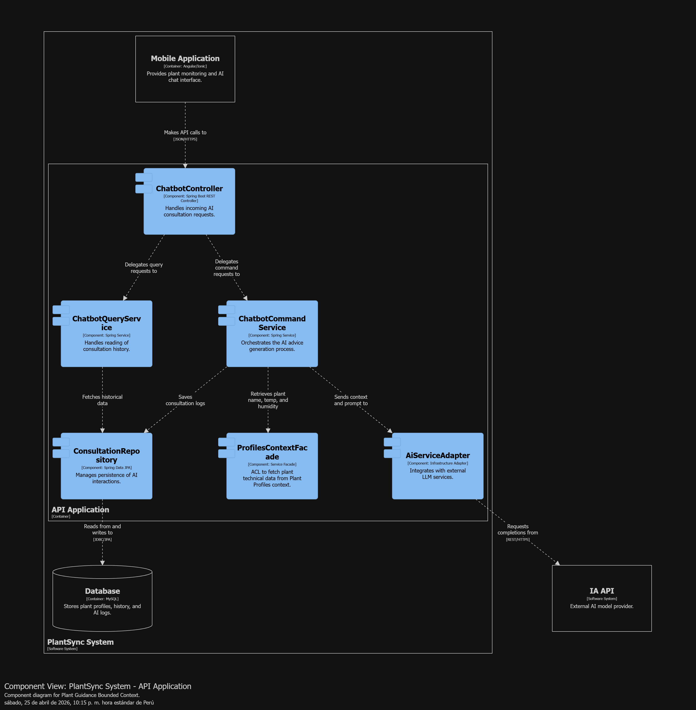
</p>

<p align="center">
  Elaboración propia
</p>

#### 5.7.6. Bounded Context Software Architecture Code Level Diagrams

En esta sección, se explica los diagramas que presentan un mayor detalle sobre la implementación de componentes en el bounded context de IAM.

##### 5.7.6.1. Bounded Context Domain Layer Class Diagrams

<br>

<p align="center">
  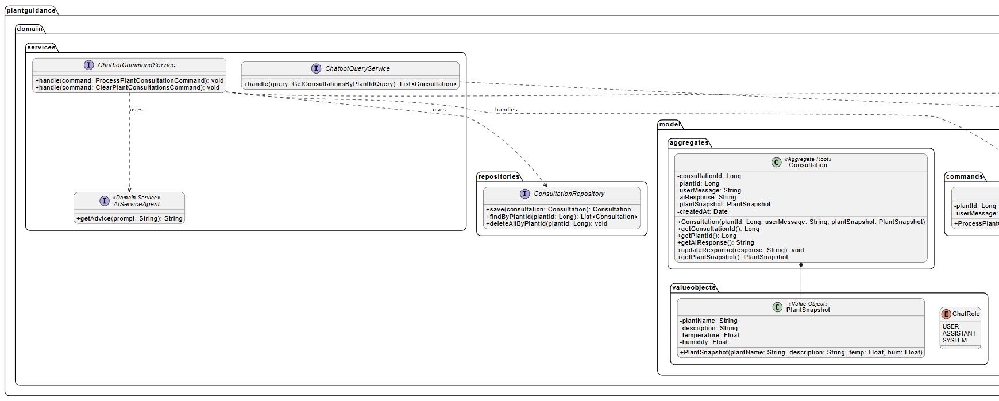
</p>
<p align="center">
  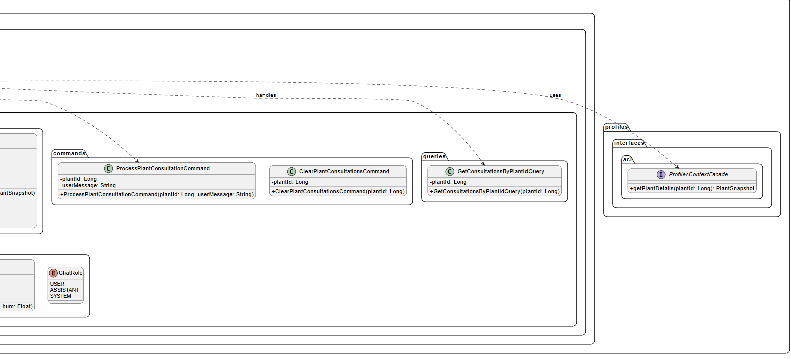
</p>

<p align="center">
    Bounded Context Class Diagram - Elaboración propia
</p>

##### 5.7.6.2. Bounded Context Database Design Diagram

<p align="center">
  
</p>

<p align="center">
  Elaboración propia
</p>

<div style="page-break-before: always;"></div>


# Capítulo VI: Solution UI/UX Design

## 6.1. Style Guidelines

Las guías de estilo de la solución definen los criterios visuales, comunicacionales e interactivos que orientan el diseño de la experiencia digital de **BioDemeter** y de su producto **PlantSync**. Su finalidad es asegurar consistencia entre la identidad de marca, la interfaz de usuario y las funcionalidades ofrecidas en la landing page, la aplicación web, la aplicación móvil y los componentes vinculados al ecosistema IoT.

<h3>6.1.1. General Style Guidelines</h3>

<h4>Branding</h4>

**Brand Overview**

**BioDemeter** es una startup orientada al desarrollo de soluciones tecnológicas para el cuidado de plantas en el hogar, combinando monitoreo, automatización y asistencia digital con un enfoque de sostenibilidad y bienestar ambiental. Su primer producto es **PlantSync**, una solución digital disponible en entorno web y móvil que permite registrar plantas, monitorear su estado, gestionar tareas de cuidado, consultar información útil y acceder a recomendaciones personalizadas basadas en datos y contexto de uso.

**Brand Name**

El nombre **PlantSync** proviene de la idea de sincronizar el cuidado vegetal con la tecnología y con la rutina diaria del usuario. Esta denominación representa una plataforma que integra organización, monitoreo y acompañamiento digital para hacer más simple, accesible y constante el cuidado de las plantas en casa.

**Colores**

La propuesta cromática se basa principalmente en tonalidades de verde, debido a su fuerte asociación con naturaleza, crecimiento, equilibrio y bienestar. Este color principal se complementa con verdes oscuros para encabezados y elementos de contraste, verdes claros para resaltar áreas positivas, y tonos neutros como beige, blanco y gris para fondos y superficies limpias que favorezcan la lectura y reduzcan la fatiga visual.

Asimismo, se incorporan colores funcionales para representar estados dentro del sistema, como rojo para alertas o problemas, amarillo para advertencias y verde para condiciones normales, especialmente en pantallas relacionadas con monitoreo, tareas y seguimiento del estado de las plantas.

<p align="center">
  
</p>

<h4>Tipografía</h4>

La tipografía seleccionada para la solución está orientada a garantizar jerarquía visual, legibilidad y consistencia en dispositivos digitales. Para ello, se utilizarán las familias tipográficas **Poppins** y **Nunito**.

**Poppins** será empleada principalmente en títulos, encabezados y botones de acción debido a su apariencia moderna, limpia y estructurada. **Nunito**, por su parte, será utilizada en textos descriptivos, mensajes auxiliares y cuerpos de contenido, ya que ofrece una lectura clara y amigable tanto en pantallas web como móviles.

<p align="center">
  
</p>

<h4>Lenguaje aplicado</h4>

El lenguaje utilizado en la solución será claro, cercano y fácil de comprender para usuarios con distintos niveles de experiencia en jardinería y tecnología. El tono de comunicación será amigable y motivador, evitando tecnicismos innecesarios y priorizando mensajes breves, optimistas y orientados a la acción.

Este estilo comunicacional busca acompañar al usuario durante toda su experiencia, reforzando hábitos positivos de cuidado y promoviendo una interacción intuitiva con mensajes consistentes, comprensibles y alineados con el contexto vegetal de la plataforma.


<h3>6.1.2. Web, Mobile and IoT Style Guidelines</h3>

La solución ha sido diseñada bajo un enfoque visual minimalista, ordenado y adaptable, con el objetivo de facilitar la interacción del usuario en diferentes contextos de uso. Este enfoque abarca la landing page, la aplicación web, la aplicación móvil y los componentes visuales asociados a la integración con dispositivos IoT, manteniendo coherencia estética y funcional en todo el ecosistema digital.

<h4>Estilo visual de la landing page</h4>

La landing page presenta una estructura clara y persuasiva, orientada a comunicar rápidamente la propuesta de valor del producto y facilitar la conversión. Su diseño prioriza una lectura fluida, bloques visuales bien definidos y secciones que resaltan beneficios, funcionamiento, planes y datos institucionales de la startup.

La composición se apoya en jerarquías visuales simples, contrastes bien controlados y botones de llamado a la acción visibles, favoreciendo una experiencia confiable y comprensible desde el primer contacto con la marca.

<h4>Estilo visual de la aplicación web y móvil</h4>

La aplicación web y móvil comparte una misma línea gráfica para garantizar continuidad de uso entre plataformas. La interfaz prioriza claridad visual, uso moderado de color, tarjetas informativas, iconografía reconocible y componentes reutilizables que permitan al usuario identificar fácilmente acciones, estados y módulos principales.

En la versión web, se aprovechan áreas más amplias para paneles, dashboards y vistas comparativas, mientras que en la versión móvil la información se reorganiza para priorizar accesos rápidos, navegación táctil y lectura vertical, manteniendo la misma identidad visual y semántica.

<h4>Estilo visual de componentes IoT</h4>

Los componentes relacionados con monitoreo e integración IoT deben transmitir precisión, confiabilidad y respuesta en tiempo real. Para ello, las métricas ambientales, estados de conexión y controles de actuadores se representarán mediante indicadores claros, tarjetas de datos, etiquetas de estado y colores funcionales que faciliten la interpretación rápida del usuario.

El diseño de estos módulos debe mantener consistencia con la interfaz principal, evitando que la sección IoT parezca un sistema independiente. De esta manera, la visualización de humedad, temperatura, iluminación o acciones remotas se integra de forma natural al flujo general de cuidado de plantas.

<h4>Botones</h4>

Los botones constituyen elementos centrales de interacción dentro de la solución. Se utilizarán para ejecutar acciones como registrarse, iniciar sesión, agregar plantas, guardar cambios, programar tareas, activar funciones específicas y navegar entre módulos.

Se establecerá una jerarquía visual entre botones primarios, secundarios y de advertencia, utilizando color, contraste y tamaño para diferenciar su relevancia dentro de cada contexto. Los botones principales emplearán el color verde predominante de la marca, mientras que los de confirmación o alerta utilizarán variantes funcionales según el tipo de acción.

<h4>Imágenes</h4>

Las imágenes estarán presentes tanto en la landing page como en la aplicación. En la landing, servirán para representar el uso del sistema, comunicar cercanía y reforzar visualmente la propuesta de valor. En la aplicación, podrán emplearse en perfiles de plantas, registros visuales de crecimiento e identificación mediante fotografías.

Además, en los componentes asociados al monitoreo inteligente será conveniente incluir recursos gráficos o iconos que ayuden a representar sensores, conectividad y variables ambientales sin complejizar la interfaz.

<h4>Pantallas emergentes</h4>

Las pantallas emergentes se utilizarán para confirmar acciones importantes, notificar resultados, advertir sobre errores o presentar mensajes contextuales relevantes para el usuario. Estas ventanas deberán ser visualmente llamativas pero consistentes con la paleta de color general, utilizando una jerarquía clara entre mensaje, acción principal y acción secundaria.

Su diseño debe favorecer decisiones seguras, especialmente en acciones sensibles como eliminación de registros, cambios importantes en la configuración o activación de funciones remotas.

<h4>Encabezado</h4>

En la landing page, el encabezado incluirá el logotipo, accesos a secciones principales y botones para ingresar o registrarse en la plataforma. Su diseño será fijo o persistentemente visible para facilitar el acceso rápido a los contenidos más relevantes.

En la aplicación web y móvil, el encabezado podrá complementarse con elementos de contexto como el nombre del módulo actual, indicadores de perfil, accesos rápidos o notificaciones, manteniendo siempre simplicidad visual y claridad funcional.

<h4>Pie de página</h4>

El pie de página contendrá enlaces institucionales, medios de contacto, redes sociales, políticas y accesos complementarios a otras secciones del sitio. En la landing page, este componente servirá también como refuerzo de confianza y continuidad informativa, permitiendo al usuario acceder fácilmente a recursos de soporte y comunicación.


## 6.2. Information Architecture

La arquitectura de información de la solución establece la manera en que el contenido y las funcionalidades se estructuran, organizan, etiquetan y presentan dentro del ecosistema digital de BioDemeter y PlantSync. Su propósito es garantizar una experiencia fluida, comprensible y consistente en la landing page, la aplicación web, la aplicación móvil y los módulos asociados al monitoreo inteligente.

<h3>6.2.1. Organization Systems</h3>

La organización del contenido responde a un modelo combinado que integra estructuras jerárquicas, secuenciales y matriciales, permitiendo ordenar adecuadamente la información según la naturaleza de cada vista y según las tareas que el usuario necesita realizar dentro del sistema.

<h4>Organización jerárquica</h4>

La organización jerárquica se aplica principalmente en la landing page, el panel principal de la aplicación y las vistas de detalle. En estas pantallas, los elementos más importantes se ubican en zonas de mayor visibilidad y con mayor peso visual, como acciones principales, información resumida del estado de las plantas, métricas destacadas o accesos directos a funcionalidades clave.

Este enfoque permite que el usuario identifique rápidamente qué información requiere atención prioritaria y qué acciones puede ejecutar primero, reduciendo la carga cognitiva y facilitando la toma de decisiones.

<h4>Organización secuencial</h4>

La organización secuencial se utiliza en procesos que requieren una progresión ordenada, como el registro de usuarios, la incorporación de una nueva planta, la configuración de tareas o la vinculación de dispositivos. En estos casos, la interfaz guía al usuario paso a paso, mostrando únicamente la información necesaria en cada momento para favorecer la comprensión del flujo.

Este tipo de organización es especialmente útil en interacciones iniciales o en configuraciones técnicas, ya que reduce errores y mejora la percepción de control durante el proceso.

<h4>Organización matricial</h4>

La organización matricial se aplica en módulos donde el usuario necesita explorar información de manera flexible, comparar elementos o revisar múltiples registros. Esto ocurre, por ejemplo, en el inventario de plantas, en el historial de acciones, en el listado de tareas o en la visualización de métricas ambientales.

En estos casos, el contenido puede presentarse mediante tarjetas, listas o cuadrículas que permitan navegar libremente entre elementos, ordenar resultados y detectar patrones o diferencias entre registros.

<h4>Esquemas de categorización</h4>

La solución emplea distintos esquemas de categorización según el tipo de información presentada:

- **Por tópicos**, para organizar guías, recomendaciones y contenidos de ayuda según temas como riego, luz, temperatura, plagas o mantenimiento.
- **Alfabético**, para ordenar listados de plantas o búsquedas por nombre.
- **Cronológico**, para historiales de cuidado, tareas registradas, eventos recientes y datos de monitoreo.
- **Por estado**, para clasificar condiciones normales, alertas, advertencias o situaciones pendientes de atención.

<h3>6.2.2. Labeling Systems</h3>

El sistema de etiquetado ha sido definido para ser claro, directo y consistente en todos los puntos de interacción. El objetivo es que el usuario comprenda con rapidez el significado de cada sección, botón, estado o módulo, sin necesidad de interpretaciones complejas ni conocimientos técnicos previos.

<h4>Menú principal de la landing page</h4>

- Inicio
- ¿Cómo funciona?
- Planes
- ¿Quiénes somos?
- Acceder

<h4>Menú de navegación de la solución</h4>

- Mis plantas
- Tareas
- Chatbot
- Perfil
- Cerrar sesión

<h4>Tipos de etiquetas en la interfaz</h4>

<p align="center">
  
</p>

| Tipo de etiqueta | Ejemplo                  | Aparición                                        |
|------------------|--------------------------|--------------------------------------------------|
| Encabezado       | “Mis plantas”           | Parte superior de la pantalla principal          |
| Panel            | “Historial de cuidados” | Dentro de módulos informativos o tarjetas        |
| Botón            | “Agregar planta”        | Acción principal en formularios o vistas de gestión |
| Navegación       |  “Tareas”, “Chatbot” | Menú principal, barra lateral o navegación inferior |
| Estado           | “Último riego hace 3 días” | Dentro de tarjetas o secciones de seguimiento |

Las etiquetas se mantendrán uniformes entre web, móvil y componentes vinculados al monitoreo inteligente, lo que permite conservar continuidad semántica y facilitar el aprendizaje del sistema.

<h3>6.2.3. SEO Tags and Meta Tags</h3>

Las metaetiquetas permiten describir estructuralmente el contenido de la solución y mejorar su visibilidad en motores de búsqueda. Aunque no son visibles para el usuario final, cumplen un papel importante en la indexación de la landing page y en el posicionamiento digital de la marca BioDemeter y del producto PlantSync.

<h4>Landing Page</h4>

**Título**
```html
<title>BioDemeter | Tecnología inteligente para el cuidado de plantas</title>
```

**Codificación de caracteres**
```html
<meta charset="utf-8" />
```

**Meta Description**
```html
<meta
  name="description"
  content="BioDemeter es una startup que desarrolla soluciones digitales para el monitoreo, registro y cuidado inteligente de plantas mediante su app PlantSync en web y móvil."
/>
```

**Keywords**
```html
<meta
  name="keywords"
  content="BioDemeter, PlantSync, cuidado de plantas, monitoreo de plantas, app para plantas, jardinería digital, recomendaciones para plantas, web y móvil"
/>
```

**Author y Derechos de Autor**
```html
<meta name="author" content="Equipo BioDemeter" />
<meta name="copyright" content="Copyright BioDemeter team" />
```

<h4>Web and Mobile Application</h4>

**Título**
```html
<title>PlantSync | Gestiona y cuida tus plantas desde web y móvil</title>
```

**Codificación de caracteres**
```html
<meta charset="utf-8" />
```

**Meta Description**
```html
<meta
  name="description"
  content="PlantSync permite registrar plantas, consultar guías, gestionar tareas, recibir recordatorios y obtener recomendaciones personalizadas desde una experiencia web y móvil."
/>
```

**Keywords**
```html
<meta
  name="keywords"
  content="PlantSync, BioDemeter, historial de riego, guías para plantas, monitoreo manual, recomendaciones por clima, app móvil de plantas, plataforma web de plantas"
/>
```

**Author y Derechos de Autor**
```html
<meta name="author" content="Equipo BioDemeter" />
<meta name="copyright" content="Copyright BioDemeter team" />
```

### 6.2.4. Searching Systems

Dado que la solución manejará una cantidad considerable de información, incluyendo guías, registros de plantas, historiales, tareas y datos de monitoreo, resulta fundamental implementar un sistema de búsqueda y filtrado eficiente. Este sistema debe permitir al usuario encontrar rápidamente el contenido que necesita, reduciendo el esfuerzo cognitivo y mejorando la fluidez de navegación.

Las principales opciones de búsqueda incluirán:

- Búsqueda de guías y contenidos informativos.
- Búsqueda de plantas registradas.
- Búsqueda de tareas y actividades programadas.
- Búsqueda de registros asociados a cada planta.
- Búsqueda de información contextual relacionada con recomendaciones y monitoreo.

Asimismo, se incorporarán filtros que permitan refinar los resultados según distintos criterios:

- Tipo de planta.
- Tipo de tarea.
- Estado de la planta.
- Tipo de guía.
- Periodo de tiempo.
- Estado de conectividad o condición monitoreada, cuando corresponda.

Este sistema de búsqueda y filtrado resulta especialmente útil para usuarios con múltiples plantas registradas o con un uso más frecuente del monitoreo y del historial de cuidados, ya que permite identificar patrones, revisar eventos y acceder con rapidez a información relevante.

<h3>6.2.5. Navigation Systems</h3>

La navegación de la solución ha sido diseñada con un enfoque intuitivo, flexible y adaptable a diferentes dispositivos. Su objetivo es ofrecer una experiencia ordenada, evitando la saturación visual y facilitando el acceso a contenidos, acciones y módulos relevantes dentro del ecosistema digital.

<h4>Landing Page</h4>

La landing page utiliza un diseño de tipo **one-page scroll**, que permite recorrer el contenido mediante desplazamiento vertical continuo. Este modelo facilita una lectura lineal de la propuesta de valor, los beneficios, los planes, la información institucional y los llamados a la acción, todo dentro de una experiencia de navegación simple y predecible.

Para reforzar la orientación, se incorpora un encabezado fijo con enlaces directos a las secciones principales, permitiendo al usuario desplazarse rápidamente sin necesidad de recorrer manualmente toda la página.

<h4>Web Application</h4>

La aplicación web adopta una navegación híbrida que combina accesos directos entre módulos con flujos guiados para tareas específicas. El usuario puede desplazarse libremente entre secciones como plantas, tareas, historial, sensores, Chatbot, perfil y configuración, mientras que ciertos procesos más estructurados mantienen una secuencia paso a paso.

Este modelo permite equilibrar libertad de exploración con orden funcional, favoreciendo una experiencia de uso flexible, eficiente y orientada a objetivos.

<h4>Mobile Application</h4>

La aplicación móvil mantiene la lógica de navegación de la versión web, pero adaptada a pantallas más pequeñas y a patrones táctiles de uso. La distribución prioriza acciones rápidas, lectura vertical, accesibilidad con una sola mano y accesos compactos a los módulos principales, asegurando continuidad funcional sin perder claridad visual.

De este modo, la experiencia entre plataformas se mantiene coherente, permitiendo al usuario interactuar con la solución desde distintos dispositivos sin necesidad de reaprender la estructura general del sistema.
## 6.3. Landing Page UI Design

Enlace del Figma para visualización de el Landing Page UI Design: [Enlace del figma](https://www.figma.com/design/5cSEKvg4XXUzsXTpOPJySb/PlantSync?node-id=0-1&t=y4kxXaWBUrJgtPEo-1)

### 6.3.1. Landing Page Wireframe

En esta sección se presenta una versión básica de nuestra landing page para navegador de escritorio. En ella se incluyen los elementos clave para generar una buena primera impresión en el usuario: una breve introducción sobre el proyecto, una explicación simplificada de su funcionamiento, el uso de herramientas IoT en el monitoreo de la planta, el uso de IA botánica para resolver dudas, la visualización de los distintos planes disponibles, el FAQ y, finalmente, una pequeña presentación de nuestra startup y nuestro grupo de trabajo.


<a href="https://ibb.co/xSL39dWw"></a>

<a href="https://ibb.co/HpY5K1kP"></a>

<a href="https://ibb.co/gb6myw0r"></a>

### 5.3.2. Landing Page Mock-up

A partir de nuestro wireframe, que representa una versión básica de la landing page, se desarrolló la versión final. Esta mantiene los mismos apartados definidos previamente, incorporando además los colores seleccionados y un lenguaje pensado para ser claro y amigable para el usuario.

<a href="https://ibb.co/WpHHM6HX"></a>

<a href="https://ibb.co/Zz7XBj7V"></a>

<a href="https://ibb.co/rW2g8cL"></a>

<a href="https://ibb.co/TMK9RXrF"></a>

<a href="https://ibb.co/20FdTVRP"></a>

## 6.4. Applications UX/UI Design

#### 6.4.1. Web Applications Wireframes<br><br>

Los wireframes desarrollados para la aplicación web de BioPafi reflejan una planificación enfocada en el usuario, incorporando principios de diseño como la claridad visual, la jerarquía de la información, la consistencia y la inclusividad. Cada pantalla presenta una estructura ordenada y limpia, con encabezados visibles, elementos organizados según su nivel de importancia y una navegación lateral constante que facilita la orientación.

Se prioriza el uso de etiquetas claras y botones con alto contraste para mejorar la accesibilidad. Asimismo, el diseño contempla usuarios con distintos niveles de experiencia, ofreciendo formularios guiados para principiantes y paneles informativos más detallados para usuarios avanzados. Por otro lado, se evidencia una adecuada arquitectura de la información mediante la organización en módulos como Plantas, Guías, Tareas, ChatBot y Configuración, lo que permite encontrar fácilmente cada funcionalidad. En conjunto, cada vista demuestra un equilibrio entre lo funcional y lo estético, respondiendo a las necesidades del público objetivo.

[Enlace del figma](https://www.figma.com/design/5cSEKvg4XXUzsXTpOPJySb/PlantSync?node-id=42-2&t=y4kxXaWBUrJgtPEo-1)

- Mis Planta:

Pantalla principal del usuario donde se muestra el listado de todas sus plantas registradas. Desde esta vista, puede consultar el estado general de cada planta, acceder a su información detallada, editar sus datos o agregar una nueva.

<a href="https://ibb.co/svgK5zrV"></a>


- Tareas:

Sección con formato de calendario que presenta los recordatorios programados para cada planta, como riegos, fertilización y otras tareas. Facilita la organización de la rutina de cuidado del usuario.

<a href="https://ibb.co/v47YTWP0"></a>

- Chatbot:

Pantalla principal del asistente virtual (RootBot), desde la cual el usuario puede iniciar una conversación para resolver dudas rápidas relacionadas con el cuidado de plantas.

<a href="https://ibb.co/v6prJzqz"></a>

- Configuración personal

Panel en el que el usuario puede actualizar su información personal, configurar las notificaciones y administrar su tipo de suscripción (básico, PRO o premium).

<a href="https://ibb.co/KchvWvv1"></a>

- Añadir Planta:

Interfaz de registro asistido para añadir una nueva planta. Contempla campos como nombre asignado, especie, fecha de adquisición y la opción de habilitar notificaciones.

<a href="https://ibb.co/ch4r4X1G"></a>

- Ver Guía:

Pantalla que presenta el contenido completo de una guía específica, con indicaciones paso a paso, recursos visuales ilustrativos y consejos prácticos para el usuario.

<a href="https://ibb.co/qYpdJ3nQ"></a>

- Chateando con ChatBot:

Vista de la conversación en curso con el bot, donde el usuario puede realizar consultas sobre el cuidado o la adquisición de plantas y recibir respuestas adaptadas al contexto.

<a href="https://ibb.co/4RHdr3RN"></a>

- Ver Planta:

Pantalla que muestra la información completa de una planta específica, incluyendo su imagen, especie, historial de cuidados y recomendaciones según el clima.

<a href="https://ibb.co/qYpdJ3nQ"></a>

- Ver historial de planta:

Historial organizado de las acciones realizadas sobre una planta, como riego, fertilización o cambios de estado, complementado con gráficas sencillas que muestran la humedad y su evolución.

<a href="https://ibb.co/0VpKDycs"></a>

- Mis dispositivos IoT:  
Vista general que agrupa a las plantas que cuentan con dispositivos IoT conectados para su control, mostrando los resultados actualizados de la humedad del suelo, la temperatura y la humedad del aire. Puede hacerse clic en cada uno, para poder abrir el control personalizado por cada planta.

<a href="https://ibb.co/yJQxBy4"></a>

- Sensores y métricas de planta:  
Pantalla de seguimiento que presenta las mediciones obtenidas por los sensores por la planta seleccionada, como humedad del suelo, temperatura y humedad ambiental, permitiendo interpretar de forma clara el estado actual de la planta. Además, se cuenta con un análisis general de los resultados obtenidos durante un periodo de tiempo (dashboard para análitica)

<a href="https://ibb.co/LD0QBVtK"></a>

- Actuadores de planta:  
Interfaz destinada al control de actuadores como bomba para riego y las luces, donde el usuario puede activar o desactivar cada componente y revisar su estado para automatizar acciones de cuidado.

<a href="https://ibb.co/zV1FjB6J"></a>

#### 6.4.2. Mobile Applications Wireframes

- Login:  
Pantalla de inicio de sesión que permite al usuario ingresar con correo (usuario) y contraseña; incluye logo, campos para credenciales, botón "Ingresar" y enlace para registrarse.

<a href="https://ibb.co/99SpTT6x"></a>

- Registro:  
Pantalla de creación de cuenta con campos para nombre, apellido, email y contraseña, junto a un botón "Registrarse" para completar el alta.

<a href="https://ibb.co/4ZK2fzHL"></a>

- Navegación principal:  
Interfaz con barra de navegación inferior que muestra las pestañas principales (Plantas, IoT, Tareas, Perfil) y un área de contenido central que cambia según la pestaña activa.

<a href="https://ibb.co/qMTGy3bs"></a>

- Mis Plantas (Dashboard):  
Vista en cuadrícula de tarjetas de plantas que muestran imagen, nombre y especie; incluye un botón flotante para añadir una nueva planta.

<a href="https://ibb.co/d4j5Ykp9"></a>

- Detalle de Planta:  
Pantalla de ficha individual con imagen, especie y un historial de cuidados (p. ej. regada, abonada) presentado como lista de acciones recientes.

<a href="https://ibb.co/GQ8Fvzxf"></a>

- Añadir Planta:  
Formulario sencillo para registrar una nueva planta con campos como nombre y especie y un botón "Guardar Planta" para confirmar el registro.

<a href="https://ibb.co/WWq6wJvf"></a>

- Panel IoT:  
Panel de telemetría con lecturas en vivo (por ejemplo humedad y temperatura) y controles manuales para actuadores (como bomba o lámpara) con toggles.

<a href="https://ibb.co/N6rVQ974"></a>

- Tareas / Cuidados:  
Lista de tareas de cuidado con casillas de verificación, título de la tarea y fecha programada, que permite marcar tareas como completadas.

<a href="https://ibb.co/b57tJRNH"></a>

- Perfil:  
Resumen del usuario con avatar, nombre y plan de suscripción, más accesos a opciones como configuración de notificaciones y gestión de suscripción.

<a href="https://ibb.co/fYPfJm9g"></a>

- Editar Perfil:  
Formulario para actualizar datos del usuario (nombre, plan de suscripción) y un botón para guardar los cambios.

<a href="https://ibb.co/PG98rmD9"></a>

<br><br>


<h4>Web Applications Wireflow Diagrams</h4>

<br><br>

[Enlace del Lucid parte 1](https://lucid.app/lucidchart/84007aa3-229d-41c7-95be-36ba79ede3d5/edit?viewport_loc=-4889%2C-386%2C12110%2C5687%2C0_0&invitationId=inv_454cb49d-3128-4c42-8ea7-98ae9f14da50)
[Enlace del Lucid parte 2](https://lucid.app/lucidchart/705f0f0f-e376-4335-b188-bb234cde86a2/edit?viewport_loc=-7424%2C-5702%2C25532%2C11991%2C0_0&invitationId=inv_bc7d108f-b673-49da-9fd9-06710a5600a1)

<br><br>

- **Wireflow 1: Registrar una nueva planta**

**User Goal:** Como usuario principiante, quiero registrar mi nueva planta para empezar a cuidarla con ayuda de la aplicación.

**User Persona:** Personas con poca y mucha experiencia en el cuidado de plantas

**Flujo:** Este flujo comienza cuando el usuario ingresa a la sección "Mis Plantas" y hace clic en el botón “Agregar Planta”. Se abre un formulario donde debe completar campos como nombre personalizado, especie, fecha de adquisición, subir una foto opcional, y seleccionar si desea recibir recordatorios. Además, puede indicar su nivel de experiencia y activar el monitoreo manual asistido. Una vez completado, pulsa “Añadir” y es redirigido al dashboard con la planta registrada y visible. Este flujo está pensado especialmente para usuarios principiantes que requieren orientación paso a paso.

<p align="center">
  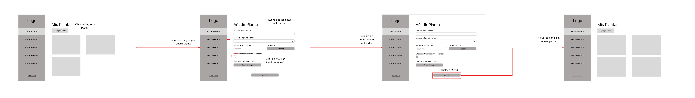
</p>

<br><br>

- **Wireflow 2: Consultar guía de cuidado**

**User Goal:** Como usuario experto, quiero consultar una guía específica para verificar recomendaciones de cuidado avanzado.

**User Persona:** Personas con poca y mucha experiencia en el cuidado de plantas

**Flujo:** El flujo inicia desde la sección “Guías”, donde el usuario visualiza un catálogo de recomendaciones. Filtra por categoría o especie y selecciona una guía específica. Al hacer clic en “Ver guía”, accede a una vista con información detallada, pasos visuales, imágenes y consejos según el tipo de planta. Desde ahí, el usuario puede regresar al catálogo o asociar la guía a una planta registrada. Este flujo está enfocado tanto en principiantes como en expertos que buscan información puntual.

<p align="center">
  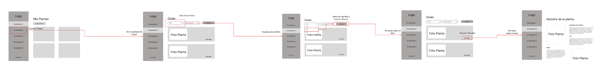
</p>

<br><br>

- **Wireflow 3: Ver historial de cuidado**

**User Goal:** Como usuario frecuente, quiero revisar el historial de mi planta para entender cómo ha evolucionado su estado.

**User Persona:** Personas con poca y mucha experiencia en el cuidado de plantas

**Flujo:** Desde “Mis Plantas”, el usuario selecciona una planta específica y accede a su vista detallada. Allí, hace clic en “Ver Historial”, lo que lo dirige a una pantalla donde puede visualizar los registros de cuidado (riego, fertilización, observaciones) ordenados cronológicamente. También accede a un gráfico de humedad que le permite analizar el estado de la planta a lo largo del tiempo. Este flujo está pensado para usuarios que buscan tomar decisiones basadas en datos.

<p align="center">
  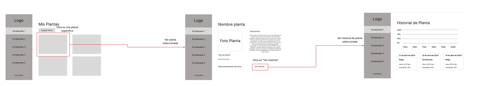
</p>

<br><br>

- **Wireflow 4: Consultar recomendaciones por clima**

**User Goal:** Como usuario con poco tiempo, quiero saber si hoy debo regar o proteger mis plantas, según el clima actual.

**User Persona:** Personas con poca y mucha experiencia en el cuidado de plantas

**Flujo:** En el apartado de "Mis Plantas", cuando el usuario desea consultar recomendaciones basadas en el clima, debe hacer clic sobre una de sus plantas previamente registradas. Luego, en la parte inferior izquierda de la pantalla, se mostrará la temperatura actual junto con sugerencias específicas según las condiciones climáticas del día.

<p align="center">
  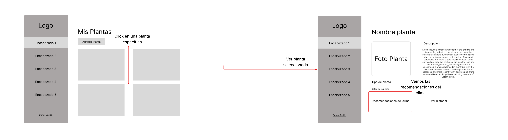
</p>

<br><br>

- **Wireflow 5: Configurar mis preferencias y cuenta**

**User Goal:** Como usuario PRO, quiero actualizar mis datos y gestionar mi suscripción.

**User Persona:** Personas con poca y mucha experiencia en el cuidado de plantas

**Flujo:** Desde el ícono de perfil o el menú lateral, el usuario accede a “Configuración personal”. Aquí puede modificar sus datos (nombre, email), activar o desactivar notificaciones, y gestionar su plan de suscripción. Si decide cambiar de plan, selecciona uno nuevo y confirma. Al guardar los cambios, recibe una notificación y es redirigido a su perfil actualizado. Este flujo aplica tanto a usuarios nuevos como recurrentes.

<p align="center">
  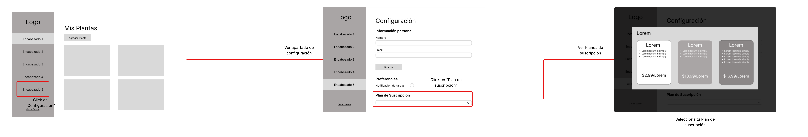
</p>

<br><br>

- **Wireflow 6: Chatear con el bot**


**User Goal:** Como usuario de PlantSync, quiero hacer preguntas rápidas sobre el cuidado o adquisición de mis plantas para obtener respuestas inmediatas sin tener que navegar por todo el sitio.

**User Persona:** Personas con poca y mucha experiencia en el cuidado de plantas


**Flujo:** Este flujo comienza cuando el usuario accede a la opción “Chatbot” desde el menú lateral o directamente desde una tarjeta destacada en el dashboard. Al ingresar, se presenta una interfaz de mensajería con un campo de texto inferior y mensajes de bienvenida del bot. El usuario escribe su consulta, por ejemplo: “¿Cada cuánto debo regar una lavanda?” o “¿Dónde puedo conseguir plantas para interior?”. El bot procesa la pregunta y responde con un mensaje textual y, si corresponde, con enlaces a guías, recomendaciones o catálogos. El usuario puede continuar haciendo más preguntas o cerrar el chat. En caso de ser un usuario PRO o Premium, también podrá acceder a respuestas más detalladas o enlaces externos. Este flujo está pensado para ofrecer una experiencia conversacional ágil que complemente la navegación tradicional, ideal para usuarios que prefieren resolver dudas en tiempo real.

<p align="center">
  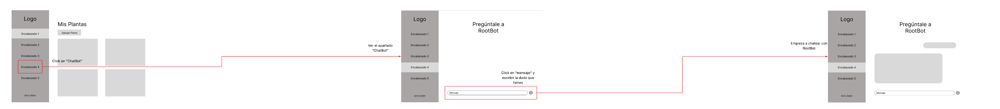
</p>

<br><br>

<h4>Movil Applications Wireflow Diagrams</h4>

<br><br>
[Enlace del Miro](https://miro.com/app/board/uXjVHVl1p8U=/?share_link_id=982143810898)
<br><br>

- **Wireflow 1: Conectar o desconectar dispositivo IoT**

**User Goal:** Como usuario de la plataforma, quiero vincular o desvincular mi hardware de monitoreo para habilitar el control automatizado y la lectura de sensores de mi planta.

**User Persona:** Usuarios con interés en la automatización y control de hardware para el cuidado de plantas.

**Flujo:** Este flujo inicia en el panel de la planta seleccionada, donde el usuario accede a la sección de configuración de hardware. Al hacer clic en "Conectar Dispositivo", el sistema vincula el equipo y la interfaz transiciona para mostrar el tablero de telemetría. Esto habilita el acceso en tiempo real a las lecturas de los sensores (humedad, temperatura) y a los controles de los actuadores (sistemas de riego). Si el usuario selecciona "Desconectar", el flujo muestra una confirmación y posteriormente inactiva estos controles manuales y automáticos en la interfaz.

<p align="center">
  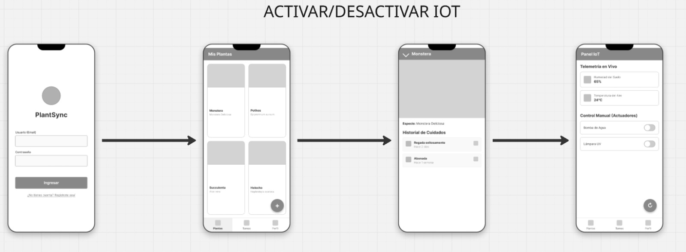
</p>

<br><br>

- **Wireflow 2: Ver los cuidados específicos que requiere cada planta**

**User Goal:** Como usuario, quiero consultar los requerimientos técnicos y recomendaciones específicas de mi planta guardada para brindarle el mantenimiento adecuado.

**User Persona:** Personas con poca y mucha experiencia en el cuidado de plantas.

**Flujo:** El recorrido comienza en el catálogo principal "Mis Plantas". El usuario hace clic sobre la tarjeta de una especie particular y es redirigido a la vista de detalle. El sistema extrae de la base de datos y despliega en pantalla la información estructurada sobre la planta, mostrando indicadores visuales y de texto sobre la frecuencia ideal de riego, exposición solar necesaria, tipo de sustrato y humedad recomendada.

<p align="center">
  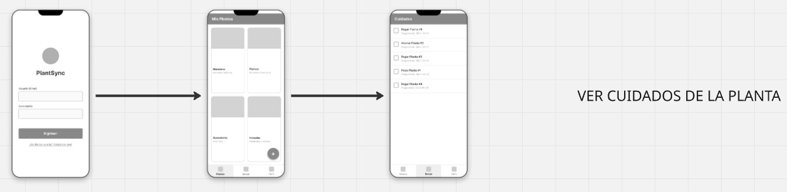
</p>

<br><br>

- **Wireflow 3: Ver mi perfil y editar mi información personal**

**User Goal:** Como usuario, quiero acceder a la configuración de mi cuenta para actualizar mis datos personales y credenciales dentro de la plataforma.

**User Persona:** Todo tipo de usuario registrado en la aplicación.

**Flujo:** La secuencia parte desde el menú principal o barra de navegación lateral, donde el usuario selecciona la opción "Mi Perfil". La interfaz muestra primero los datos en modo de solo lectura. Al pulsar el botón "Editar", se habilita un formulario que permite modificar el nombre, correo electrónico y preferencias. El recorrido finaliza cuando el usuario presiona "Guardar Cambios", momento en el que el sistema valida la información, muestra una alerta de éxito y retorna a la vista actualizada del perfil.

<p align="center">
  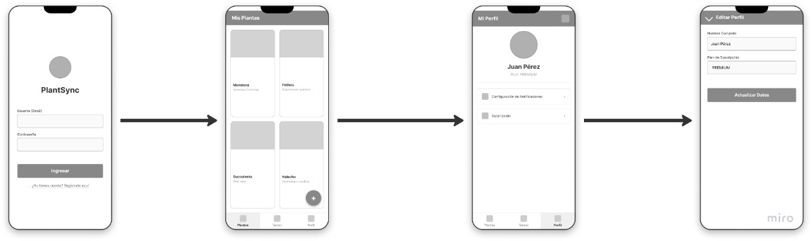
</p>

<br><br>

- **Wireflow 4: Registrarse en la plataforma**

**User Goal:** Como nuevo usuario, quiero crear una cuenta en BioPafi para acceder a las herramientas de monitoreo y gestión del cuidado de plantas.

**User Persona:** Personas interesadas en comenzar a utilizar la plataforma por primera vez.

**Flujo:** El proceso abarca desde la landing page o pantalla de inicio de sesión. El usuario selecciona "Registrarse" y es dirigido a un formulario en blanco. Aquí ingresa sus credenciales básicas (nombre, correo electrónico, contraseña y confirmación de contraseña). Tras completar los campos y pulsar "Crear Cuenta", el sistema ejecuta las validaciones de seguridad. Una vez aprobado, el flujo redirige automáticamente al usuario a su nuevo Dashboard principal, completando el onboarding.

<p align="center">
  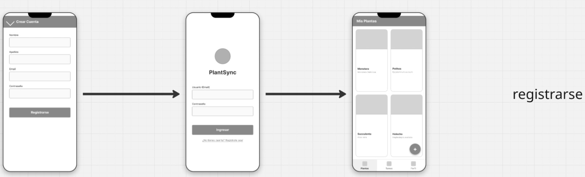
</p>

<br><br>

- **Wireflow 5: Registrar una nueva planta**

**User Goal:** Como usuario principiante, quiero registrar mi nueva planta para empezar a cuidarla con ayuda de la aplicación.

**User Persona:** Personas con poca y mucha experiencia en el cuidado de plantas.

**Flujo:** Este flujo comienza cuando el usuario ingresa a la sección "Mis Plantas" y hace clic en el botón “Agregar Planta”. Se abre un formulario donde debe completar campos como nombre personalizado, especie, fecha de adquisición, subir una foto opcional, y seleccionar si desea recibir recordatorios. Además, puede indicar su nivel de experiencia y activar el monitoreo manual asistido. Una vez completado, pulsa “Añadir” y es redirigido al dashboard con la planta registrada y visible. Este flujo está pensado especialmente para usuarios principiantes que requieren orientación paso a paso.

<p align="center">
  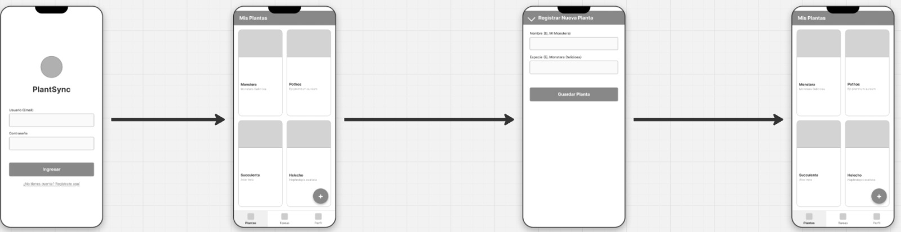
</p>

<br><br>

- **Wireflow 6: Ver los datos y acceso al historial de cuidados**

**User Goal:** Como usuario, quiero revisar la bitácora de eventos y datos pasados de mi planta para realizar un seguimiento continuo de su salud y mantenimiento.

**User Persona:** Usuarios metódicos o aquellos que utilizan hardware IoT para auditoría de cuidados.

**Flujo:** Partiendo de la vista detallada de una planta, el usuario hace clic en la pestaña "Historial". El flujo ilustra cómo la interfaz cambia para desplegar una línea de tiempo cronológica. En esta pantalla, el usuario puede visualizar y filtrar eventos pasados, tales como registros de riego activados por los actuadores, alertas automáticas emitidas por los sensores ambientales y notas o cuidados manuales que el usuario haya registrado previamente.

<p align="center">
  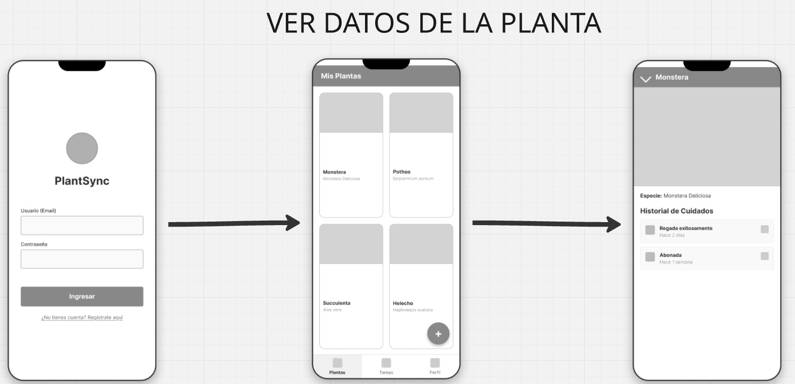
</p>

<br><br>


### 5.4.2. Applications Mock-ups

Los siguientes prototipos visuales se han desarrollado a partir de los wireframes documentados anteriormente, reflejando con precisión las interfaces y funcionalidades que los usuarios experimentarán al interactuar con la plataforma. Ambas versiones (web y móvil) se encuentran consolidadas en un único proyecto de Figma para facilitar la coherencia visual y la gestión unificada del diseño.

[Enlace del Figma](https://www.figma.com/design/5cSEKvg4XXUzsXTpOPJySb/PlantSync?node-id=44-4&t=txBRNOk6AKu7kNCJ-1)

<br><br>

<h4> Web Platform <h4>

- Mis Plantas

Vista principal del usuario con el listado de todas sus plantas registradas. Desde aquí puede visualizar el estado general de cada planta, acceder a sus detalles, editarla o añadir una nueva.

<p align="center">
  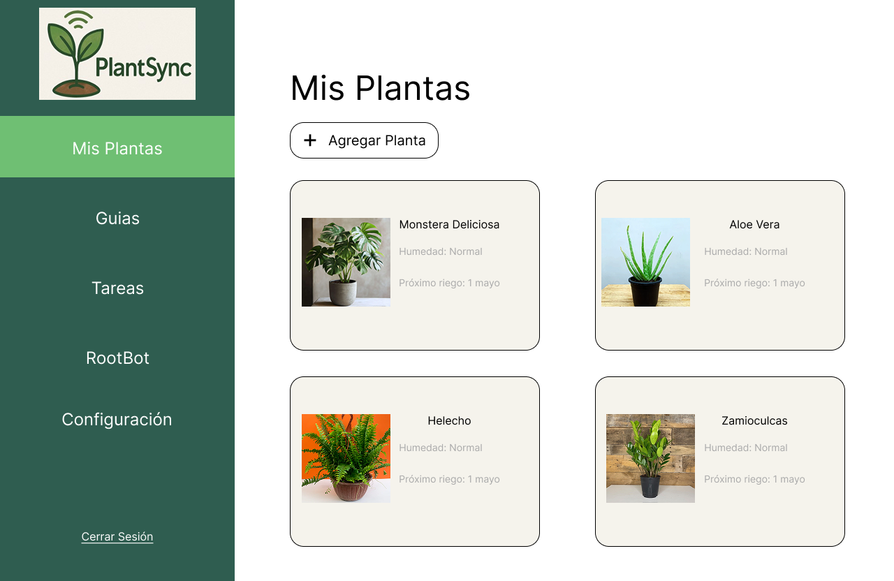
</p>

- Guías:

Catálogo de recomendaciones organizadas por tema (riego, luz, fertilizante, plagas). Permite a los usuarios consultar guías según sus necesidades o tipo de planta.

<p align="center">
  
</p>

- Tareas:

Sección tipo calendario que muestra los recordatorios programados para cada planta, incluyendo riegos, fertilización u otras tareas. Ayuda al usuario a organizar su rutina de cuidado permitiendole informar que planta ya cuidó o no.

<p align="center">
  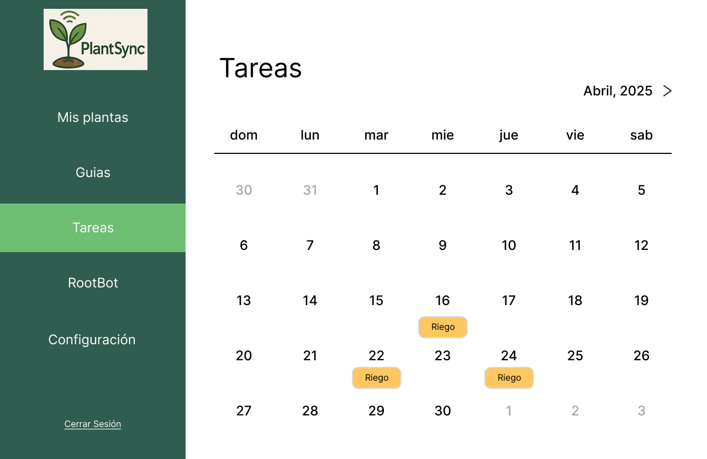
</p>

<p align="center">
  
</p>

- Chatbot:

Vista principal del asistente virtual (RootBot), que permite al usuario iniciar una conversación para resolver dudas rápidas sobre el cuidado de plantas.

<p align="center">
  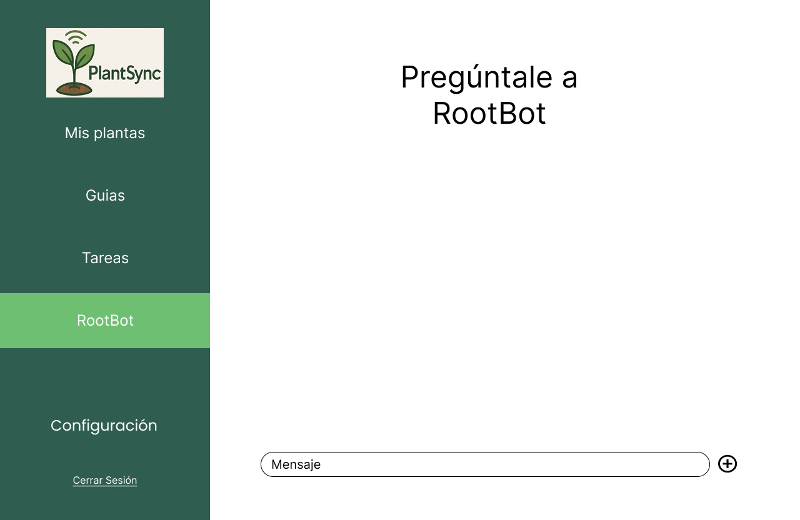
</p>

- Configuración personal

Panel donde el usuario puede actualizar su información personal, configurar notificaciones y gestionar su tipo de suscripción (básico, PRO o premium).

<p align="center">
  
</p>

<p align="center">
  
</p>

- Añadir Planta:

Formulario guiado para registrar una nueva planta. Incluye campos como nombre personalizado, especie, fecha de adquisición y opción para activar notificaciones.

<p align="center">
  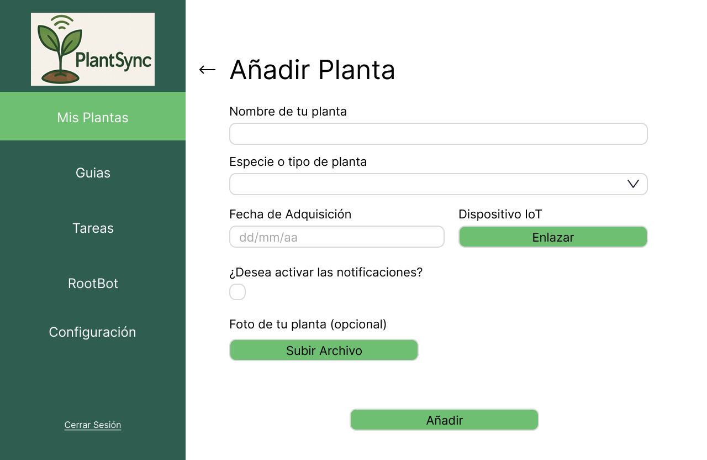
</p>

- Ver Guía:

Pantalla con el contenido detallado de una guía específica, incluyendo instrucciones paso a paso, imágenes ilustrativas y recomendaciones prácticas.

<p align="center">
  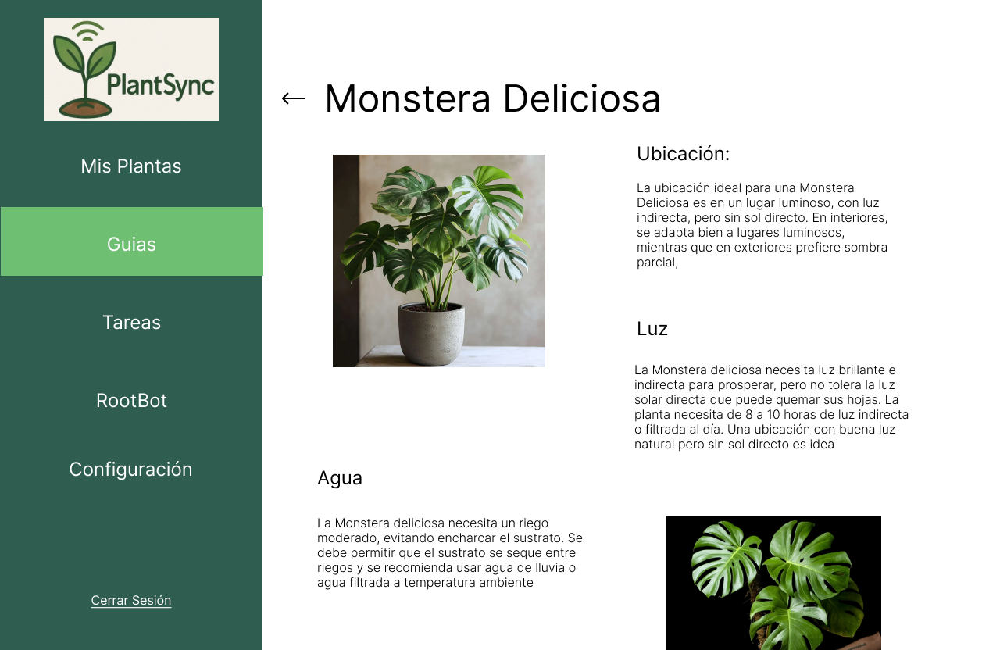
</p>

- Chateando con ChatBot:

Vista activa de la conversación con el bot. El usuario realiza preguntas relacionadas al cuidado o adquisición de plantas y recibe respuestas contextualizadas.

<p align="center">
  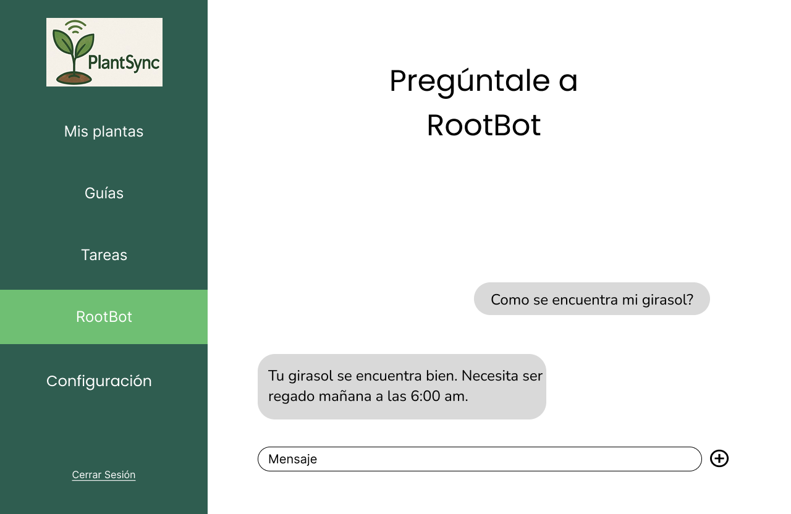
</p>
+ Ver Planta:

Pantalla detallada con toda la información de una planta específica, incluyendo foto, especie, historial de cuidado y recomendaciones por clima.

<p align="center">
  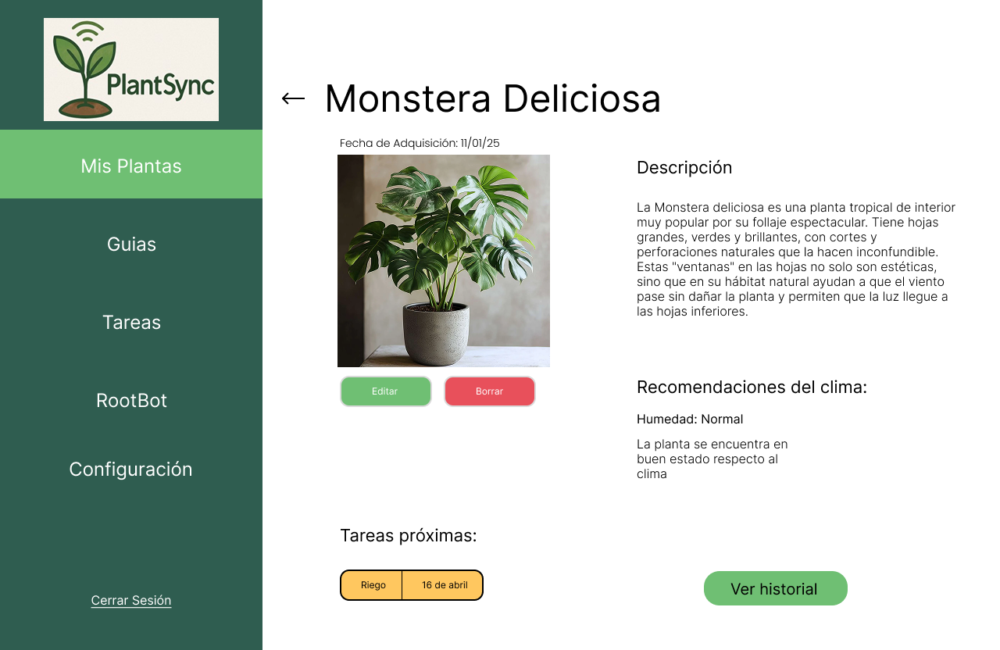
</p>

- Ver historial de planta:

Registro cronológico de las acciones realizadas sobre una planta (riego, fertilización, cambios de estado), acompañado de gráficas simples de humedad y evolución.

<p align="center">
  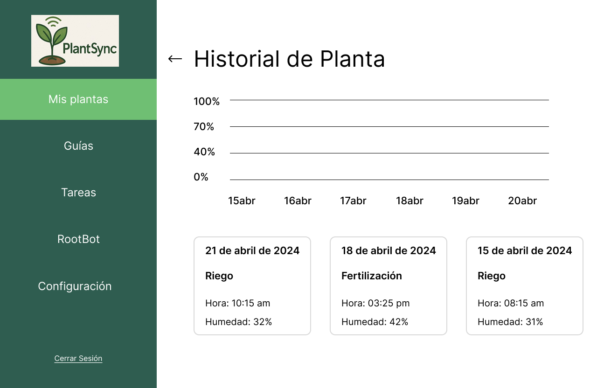
</p>

<br><br>

<h4> Mobile Application <h4>

A continuación, se presentan los mock-ups diseñados para la aplicación móvil de PlantSync, detallando las interfaces clave con las que interactuará el usuario.


- **Iniciar Sesión:**
Interfaz para que los usuarios ya registrados ingresen a su cuenta utilizando su correo electrónico y contraseña.

<p align="center">
  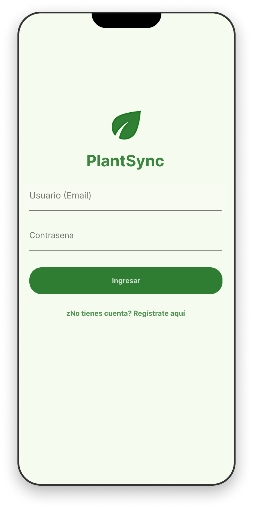
</p>

- **Registro de Usuario:**
Formulario de creación de cuenta donde los nuevos usuarios pueden registrarse ingresando sus datos personales básicos y credenciales.

<p align="center">
  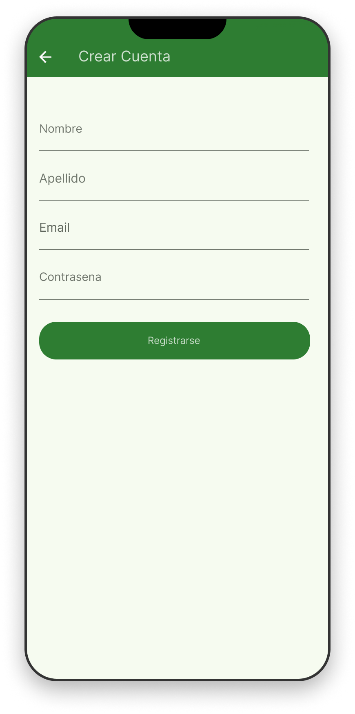
</p>

- **Mis Plantas (Inicio):**
Pantalla principal (Dashboard) donde el usuario visualiza su colección de plantas registradas, su estado actual y accesos rápidos a las acciones de cuidado.

<p align="center">
  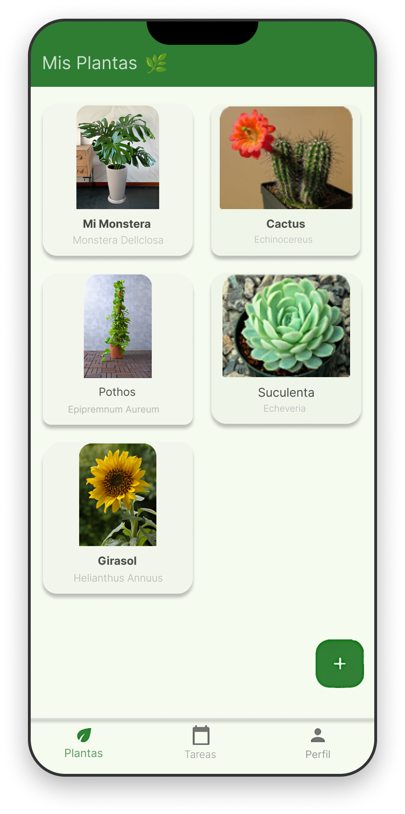
</p>

- **Detalles y Cuidados de la Planta:**
Vista específica de una planta (ej. Monstera Deliciosa) que muestra indicadores vitales detallados como temperatura, humedad, luz requerida y consejos específicos de cuidado.

<p align="center">
  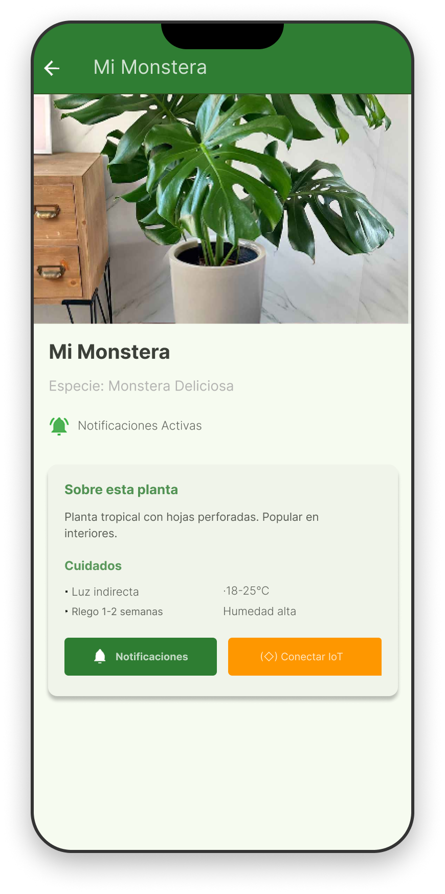
</p>


- **Calendario de Tareas y Recordatorios:**
Vista en formato de agenda donde el usuario puede realizar el seguimiento diario de las actividades pendientes (riego, abono, limpieza) programadas para sus plantas y marcarlas como completadas.

<p align="center">
  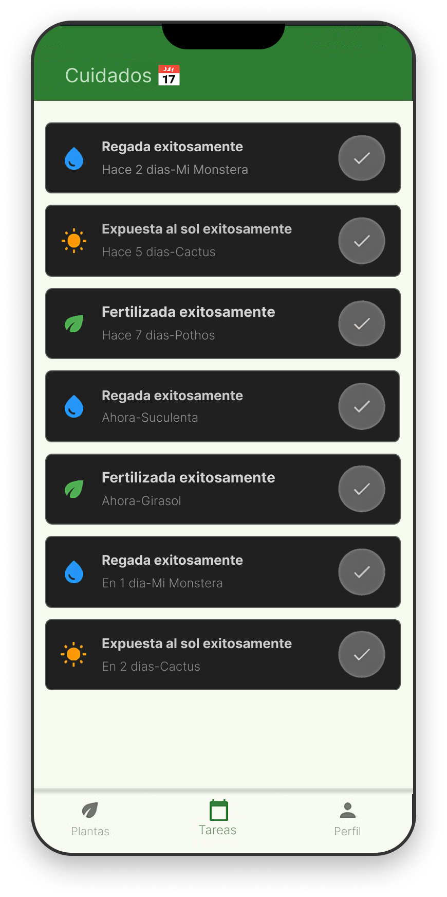
</p>

- **Búsqueda y Agregar Planta:**
Sección que permite al usuario buscar nuevas plantas en la base de datos mediante una barra de búsqueda para añadirlas a su colección personal.

<p align="center">
  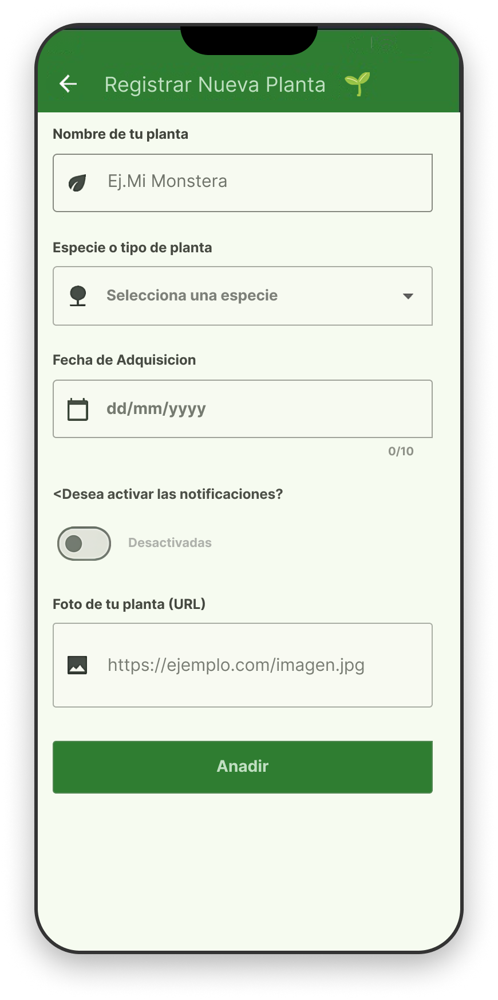
</p>


- **Perfil y Ajustes:**
Pantalla de gestión de la cuenta de usuario donde se pueden modificar datos personales, preferencias de notificaciones, seguridad y soporte de la aplicación.

<p align="center">
  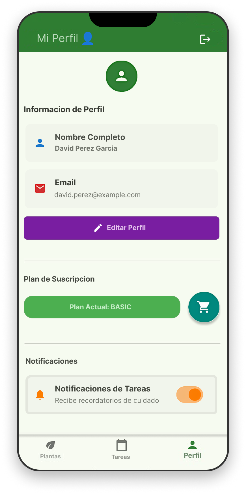
</p>


<br><br>

### 6.4.3. Applications User Flow Diagrams

<h4>Web Platform</h4>

[Enlace para acceder al Overflow](https://overflow.io/s/YN9XV7BV)

- **User Flow Diagram 1: Registrar una nueva planta**

**User Goal:** Como usuario principiante, quiero registrar mi nueva planta para empezar a cuidarla con ayuda de la aplicación.

**User Persona:** Personas con poca y mucha experiencia en el cuidado de plantas

**Flujo:** Este flujo comienza cuando el usuario ingresa a la sección "Mis Plantas" y hace clic en el botón “Agregar Planta”. Se abre un formulario donde debe completar campos como nombre personalizado, especie, fecha de adquisición, subir una foto opcional, y seleccionar si desea recibir recordatorios. Además, puede indicar su nivel de experiencia y activar el monitoreo manual asistido. Una vez completado, pulsa “Añadir” y es redirigido al dashboard con la planta registrada y visible. Este flujo está pensado especialmente para usuarios principiantes que requieren orientación paso a paso.

<p align="center">
  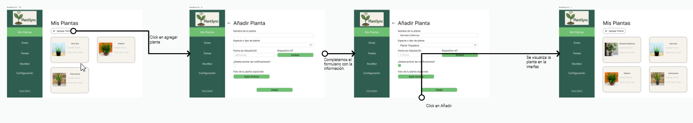
</p>

<br><br>

- **User Flow Diagram 2: Consultar guía de cuidado**

**User Goal:** Como usuario experto, quiero consultar una guía específica para verificar recomendaciones de cuidado avanzado.

**User Persona:** Personas con poca y mucha experiencia en el cuidado de plantas

**Flujo:** El flujo inicia desde la sección “Guías”, donde el usuario visualiza un catálogo de recomendaciones. Filtra por categoría o especie y selecciona una guía específica. Al hacer clic en “Ver guía”, accede a una vista con información detallada, pasos visuales, imágenes y consejos según el tipo de planta. Desde ahí, el usuario puede regresar al catálogo o asociar la guía a una planta registrada. Este flujo está enfocado tanto en principiantes como en expertos que buscan información puntual.

<p align="center">
  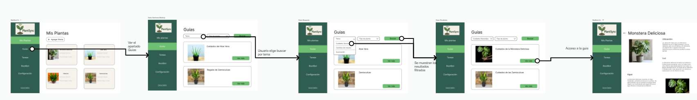
</p>

<br><br>

- **User Flow Diagram 3: Ver historial de cuidado**

**User Goal:** Como usuario frecuente, quiero revisar el historial de mi planta para entender cómo ha evolucionado su estado.

**User Persona:** Personas con poca y mucha experiencia en el cuidado de plantas

**Flujo:** Desde “Mis Plantas”, el usuario selecciona una planta específica y accede a su vista detallada. Allí, hace clic en “Ver Historial”, lo que lo dirige a una pantalla donde puede visualizar los registros de cuidado (riego, fertilización, observaciones) ordenados cronológicamente. También accede a un gráfico de humedad que le permite analizar el estado de la planta a lo largo del tiempo. Este flujo está pensado para usuarios que buscan tomar decisiones basadas en datos.

<p align="center">
  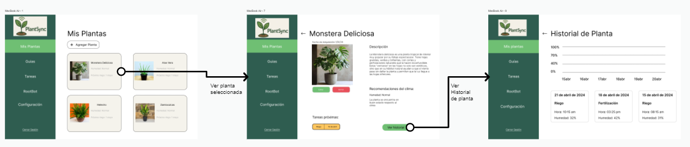
</p>

<br><br>

- **User Flow Diagram 4: Consultar recomendaciones por clima**

**User Goal:** Como usuario con poco tiempo, quiero saber si hoy debo regar o proteger mis plantas, según el clima actual.

**User Persona:** Personas con poca y mucha experiencia en el cuidado de plantas

**Flujo:** En el apartado de "Mis Plantas", cuando el usuario desea consultar recomendaciones basadas en el clima, debe hacer clic sobre una de sus plantas previamente registradas. Luego, en la parte inferior izquierda de la pantalla, se mostrará la temperatura actual junto con sugerencias específicas según las condiciones climáticas del día.

<p align="center">
  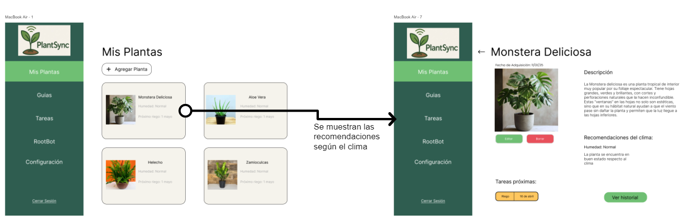
</p>

<br><br>

- **User Flow Diagram 5: Configurar mis preferencias y cuenta**

**User Goal:** Como usuario PRO, quiero actualizar mis datos y gestionar mi suscripción.

**User Persona:** Personas con poca y mucha experiencia en el cuidado de plantas

**Flujo:** Desde el ícono de perfil o el menú lateral, el usuario accede a “Configuración personal”. Aquí puede modificar sus datos (nombre, email), activar o desactivar notificaciones, y gestionar su plan de suscripción. Si decide cambiar de plan, selecciona uno nuevo y confirma. Al guardar los cambios, recibe una notificación y es redirigido a su perfil actualizado. Este flujo aplica tanto a usuarios nuevos como recurrentes.

<p align="center">
  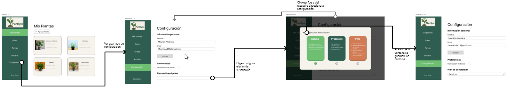
</p>

<br><br>

- **User Flow Diagram 6: Chatear con el bot**

**User Goal:** Como usuario de PlantSync, quiero hacer preguntas rápidas sobre el cuidado o adquisición de mis plantas para obtener respuestas inmediatas sin tener que navegar por todo el sitio.

**User Persona:** Personas con poca y mucha experiencia en el cuidado de plantas

**Flujo:** Este flujo comienza cuando el usuario accede a la opción “Chatbot” desde el menú lateral o directamente desde una tarjeta destacada en el dashboard. Al ingresar, se presenta una interfaz de mensajería con un campo de texto inferior y mensajes de bienvenida del bot. El usuario escribe su consulta, por ejemplo: “¿Cada cuánto debo regar una lavanda?” o “¿Dónde puedo conseguir plantas para interior?”. El bot procesa la pregunta y responde con un mensaje textual y, si corresponde, con enlaces a guías, recomendaciones o catálogos. El usuario puede continuar haciendo más preguntas o cerrar el chat. En caso de ser un usuario PRO o Premium, también podrá acceder a respuestas más detalladas o enlaces externos. Este flujo está pensado para ofrecer una experiencia conversacional ágil que complemente la navegación tradicional, ideal para usuarios que prefieren resolver dudas en tiempo real.

<p align="center">
  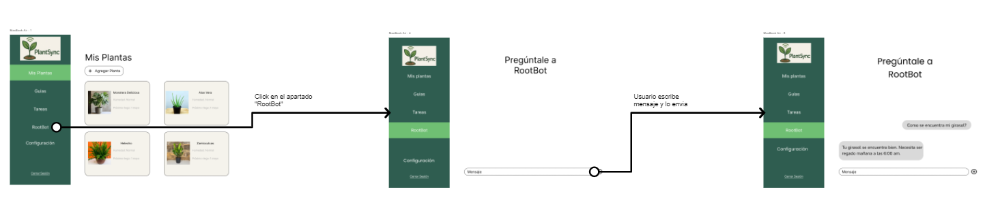
</p>


<br><br>

<h4>Mobile Application</h4>

[Enlace para acceder al Miro](https://miro.com/welcomeonboard/SjZhVmJpdE1MS09ocG83UnRZaUZCTFB5SHVDY2R3K0pjNjBHNUwzdGZFRUluZDFYV3hMcnRZODBNYkp5YVNMcTFPenNBdEk2M0lqMnZMYkpQTnVENlM2b2hLVHdjMUxrN0VLN3lVWFpacjNON2dMdGNYbFJ2MC8vMkRWejd5M0pzVXVvMm53MW9OWFg5bkJoVXZxdFhRPT0hdjE=?share_link_id=787034318997)

---

- **User Flow Diagram 1: Registrar una Nueva Planta**

**User Goal:** Como usuario principiante, quiero registrar mi nueva planta para empezar a cuidarla con ayuda de la aplicación.

**User Persona:** Personas con poca y mucha experiencia en el cuidado de plantas

**Flujo:** Este flujo comienza cuando el usuario toca el botón flotante "+" en la esquina inferior derecha de la sección "Mis Plantas". Se abre un formulario secuencial optimizado para mobile donde ingresa el nombre personalizado de la planta, selecciona la especie de un dropdown, ingresa la fecha de adquisición en formato dd/mm/yyyy, activa o desactiva notificaciones con un toggle, y completa un campo URL para la foto de la planta. El usuario revisa los datos con un deslizamiento vertical y toca el botón verde "Añadir" para confirmar. Inmediatamente es redirigido a la pantalla "Mis Plantas" donde la nueva planta aparece en el grid de tarjetas con su imagen y nombre. Este flujo está optimizado para entrada rápida de datos en pantalla táctil.

<p align="center">
  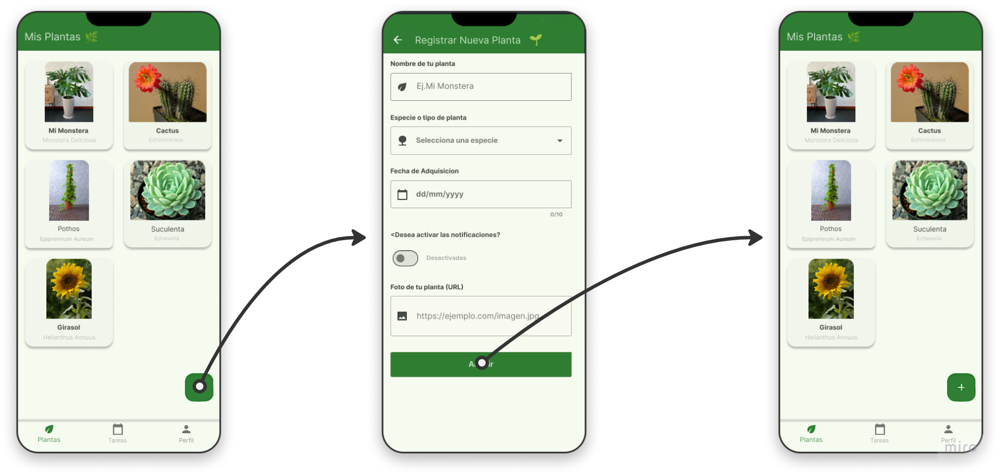
</p>

---

- **User Flow Diagram 2: Ver Detalle de Planta**

**User Goal:** Como usuario, quiero ver la información completa de mi planta incluyendo especie, cuidados y opciones de notificaciones.

**User Persona:** Personas con poca y mucha experiencia en el cuidado de plantas

**Flujo:** Desde la pantalla "Mis Plantas", el usuario toca una tarjeta de planta específica. Se abre la vista detallada de esa planta mostrando una imagen grande en la parte superior, el nombre de la planta (ej: "Mi Monstera"), la especie científica (ej: "Monstera Deliciosa"), y un ícono de notificaciones activas. Debajo aparece la sección "Sobre esta planta" con descripción general y características. En la sección "Cuidados" se muestran requisitos específicos como luz indirecta, riego cada 1-2 semanas, temperatura de 18-25°C, y humedad alta. Al final hay dos botones: "Notificaciones" (verde) para configurar alertas y "Conectar IoT" (naranja) para vincular un sensor. El usuario puede deslizar hacia atrás para regresar al listado de plantas. Este flujo proporciona información contextual rápida sobre cada planta.

<p align="center">
  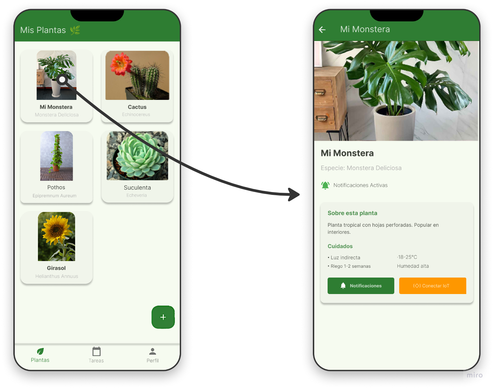
</p>

---

- **User Flow Diagram 3: Consultar Tareas y Notificaciones**

**User Goal:** Como usuario, quiero ver todas mis tareas pendientes de cuidado organizadas por prioridad.

**User Persona:** Personas con poca y mucha experiencia en el cuidado de plantas

**Flujo:** El usuario toca la pestaña "Tareas" en el menú inferior de la app. Se abre una lista vertical de tarjetas de tareas pendientes, cada una mostrando un icono descriptivo (gota para riego, sol para luz, hoja para fertilización), el tipo de tarea, la planta afectada, cuándo debe realizarse, y un checkbox a la derecha. Las tarjetas tienen fondo oscuro (gris oscuro) con texto claro. En la parte superior derecha aparece un ícono con el número "17" indicando el total de tareas pendientes. El usuario puede deslizar el listado verticalmente para ver todas las tareas, o tocar una tarjeta para ver detalles y confirmar la tarea. Este flujo centraliza todas las acciones de cuidado que el usuario debe realizar en sus plantas.

<p align="center">
  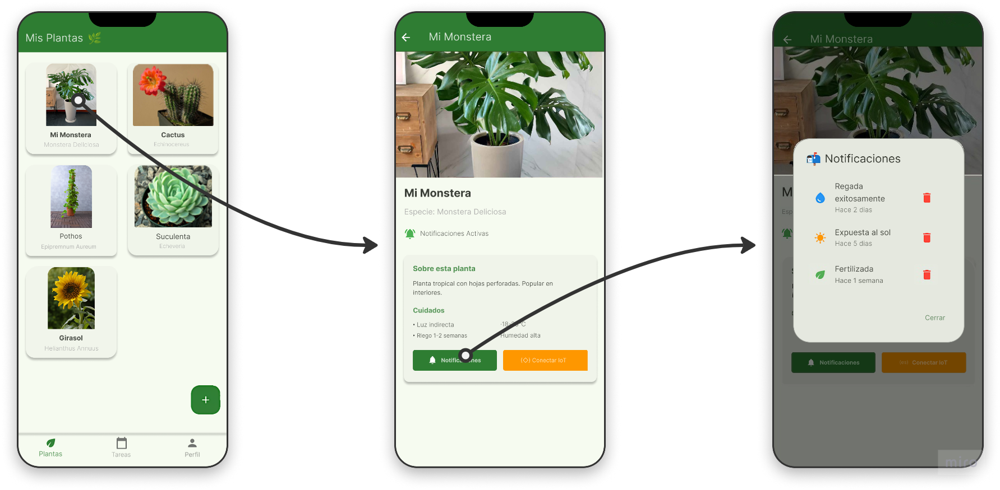
</p>

---

- **User Flow Diagram 4: Conectar Dispositivo IoT**

**User Goal:** Como usuario avanzado, quiero conectar un sensor IoT a mi planta para monitoreo automático.

**User Persona:** Personas con experiencia en el cuidado de plantas y tecnología

**Flujo:** Desde la vista detallada de una planta, el usuario toca el botón naranja "Conectar IoT". Se abre un modal que pregunta "¿Deseas conectar este dispositivo?" mostrando el tipo de dispositivo disponible: "Arduino Sensor Node". El usuario toca el toggle azul para confirmar la conexión. Una vez activado, el botón cambia de estado (toggle en posición ON) indicando que el dispositivo está siendo vinculado. El sistema comunica la conexión exitosa y el usuario cierra el modal regresando a la vista de detalle de la planta. Este flujo habilita funcionalidades avanzadas de monitoreo con IoT para usuarios tecnológicos.

<p align="center">
  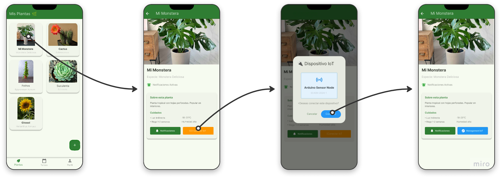
</p>

---

- **User Flow Diagram 5: Ver Panel IoT y Telemetría en Vivo**

**User Goal:** Como usuario con sensor IoT, quiero ver datos en tiempo real de humedad, temperatura y luz de mi planta.

**User Persona:** Personas con experiencia en tecnología e interesadas en datos precisos

**Flujo:** Después de conectar un dispositivo IoT, el usuario toca el botón "Manejo IoT" (azul) en la vista de la planta. Se abre la pantalla "Panel IoT" con el título "Telemetría en Vivo" mostrando un listado de medidas en tiempo real: Humedad del Suelo (65.5%), Temperatura del Aire (24.3°C), Intensidad de Luz (450 lux), Radiación UVB (3.50 mW/cm²). Debajo aparece una sección "Nutrientes NPK" con valores de Nitrógeno (N), Fósforo (P) y Potasio (K). Al final hay una sección "Control Manual (Actuadores)" con toggles para activar/desactivar Bomba de Agua y Lámpara UV. El usuario puede deslizar verticalmente para ver todos los datos, o deslizar hacia atrás para regresar a la vista anterior. Este flujo proporciona monitoreo detallado para usuarios avanzados.

<p align="center">
  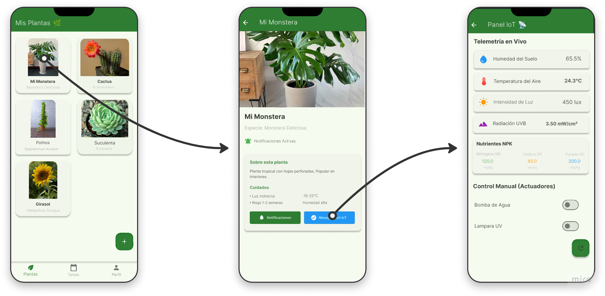
</p>

---

- **User Flow Diagram 6: Gestionar Tareas de Cuidado**

**User Goal:** Como usuario responsable, quiero visualizar y gestionar todas mis tareas de cuidado pendientes de forma centralizada.

**User Persona:** Personas con poca y mucha experiencia en el cuidado de plantas

**Flujo:** El usuario accede a la pestaña "Tareas" donde visualiza un listado completo de tarjetas de tareas agrupadas cronológicamente. Cada tarjeta muestra un icono de tarea (gota azul para riego, sol naranja para luz, hoja verde para fertilización), una descripción clara (ej: "Regada exitosamente - Hace 2 días-Mi Monstera"), el tiempo transcurrido desde que se generó la tarea, y un checkbox circular a la derecha sin marcar. Las tarjetas tienen fondo gris oscuro con texto blanco. El encabezado muestra "Cuidados" con un ícono de número "17" indicando la cantidad total de tareas. El usuario puede deslizar hacia abajo para ver más tareas, o tocar una tarjeta para abrirla y realizar la acción. Este flujo proporciona una vista unificada de todas las responsabilidades de cuidado.

<p align="center">
  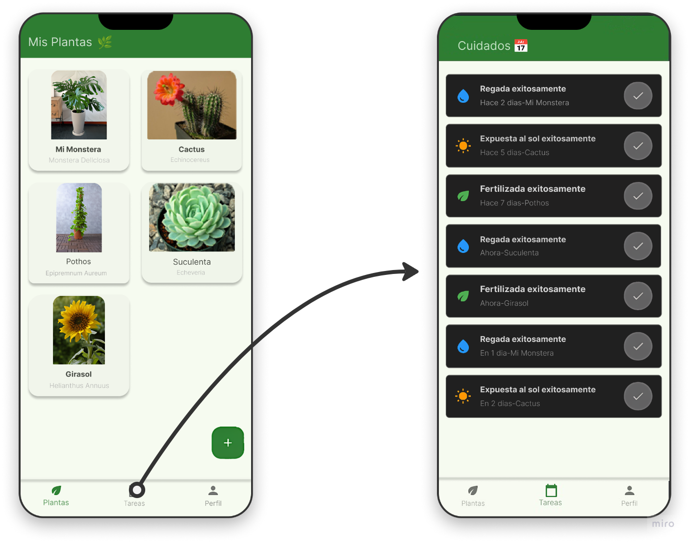
</p>

---

- **User Flow Diagram 7: Completar y Confirmar Tareas**

**User Goal:** Como usuario, quiero marcar mis tareas como completadas para registrar que realicé el cuidado.

**User Persona:** Personas con poca y mucha experiencia en el cuidado de plantas

**Flujo:** Desde el listado de tareas, el usuario toca una tarjeta de tarea (ej: "Regada exitosamente"). Se abre un modal de confirmación preguntando "¿Completaste exitosamente regada en Mi Monstera?" con dos opciones: "Cancelar" y "Aceptar" (con toggle azul activado). El usuario toca "Aceptar" para confirmar que completó la acción. El sistema registra la tarea como completada, el modal se cierra, y el checkbox en la tarjeta se marca (pasa de vacío a marcado). Opcionalmente, la tarjeta puede cambiar a un estado visual diferente (atenuado o con check verde) indicando finalización. El usuario es automáticamente devuelto al listado de tareas donde puede confirmar otras acciones pendientes. Este flujo asegura un registro preciso de acciones completadas.

<p align="center">
  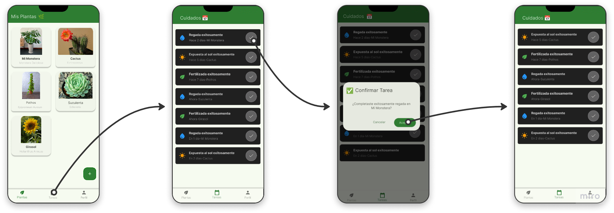
</p>

---

- **User Flow Diagram 8: Editar Perfil y Preferencias**

**User Goal:** Como usuario PRO, quiero actualizar mis datos personales y gestionar mi suscripción.

**User Persona:** Personas con poca y mucha experiencia en el cuidado de plantas

**Flujo:** El usuario toca el ícono de perfil (usuario) en la pestaña "Perfil" del menú inferior. Se abre la pantalla "Mi Perfil" mostrando un avatar circular en la parte superior, una sección "Información de Perfil" con Nombre Completo (ej: "David Perez Garcia") y Email (ej: "david.perez@example.com"), un botón morado "Editar Perfil" y una sección "Plan de Suscripción" mostrando el plan actual (ej: "Plan Actual: BASIC") con un icono de carrito. Al tocar "Editar Perfil", se abre una pantalla con campos editables para Nombres, Apellidos y Correo. El usuario modifica los datos, toca el botón "Guardar Cambios" (verde) y regresa a la pantalla de perfil con los datos actualizados. Este flujo permite personalización y gestión de cuenta en mobile.

<p align="center">
  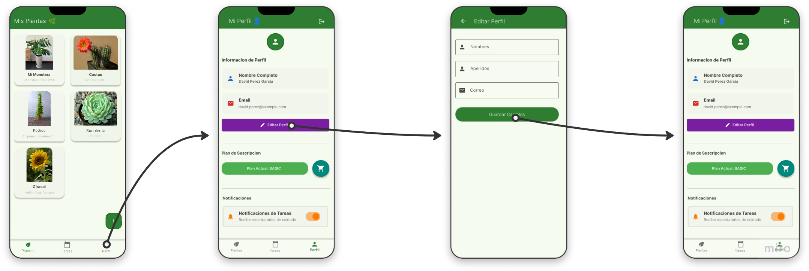
</p>

---

<br><br>

## 6.5. Applications Prototyping

Esta sección presenta el prototipo de la aplicación web orientada al cuidado de plantas mediante el uso de tecnología IoT, permitiendo al usuario monitorear y gestionar sus dispositivos desde un entorno más amplio y detallado. Las decisiones de interacción se basan en una arquitectura de información estructurada con un menú lateral persistente que facilita el acceso a módulos como plantas, guías, tareas, chatbot y configuración, así como al control IoT básico (el control total se tiene en la aplicación móvil). La navegación sigue un enfoque jerárquico y consistente con los User Flow Diagrams, permitiendo al usuario desplazarse entre vistas como el registro de plantas, visualización de detalles, historial de datos y control de dispositivos IoT. Asimismo, se integran interacciones como formularios, modales de confirmación y paneles de información que optimizan la gestión de acciones. Los flujos principales contemplan la consulta de información, la automatización de cuidados, la exploración de guías y la asistencia mediante el chatbot, garantizando una experiencia fluida, organizada y alineada con las necesidades del usuario en un entorno de escritorio. Todo esto está conectado con la landing page, a través del botón "Call to Action" que se tiene en el landing.

link del prototipo de la aplicación web: [prototipo web](https://www.figma.com/proto/5cSEKvg4XXUzsXTpOPJySb/PlantSync?node-id=185-4&p=f&t=YaSL2qy6CTbiqSX6-1&scaling=scale-down&content-scaling=fixed&page-id=44%3A4&starting-point-node-id=185%3A4&show-proto-sidebar=1)

<a href="https://ibb.co/G3Gp6k6G"></a>


Esta sección presenta el prototipo de la aplicación móvil orientada al cuidado de plantas mediante el uso de tecnología IoT, integrando sensores y actuadores para optimizar su mantenimiento. Las decisiones de interacción se basan en una arquitectura de información clara, donde la navegación principal se organiza mediante una barra inferior que permite acceder rápidamente a las vistas de plantas, tareas y perfil. A partir de la pantalla principal, el usuario puede visualizar sus plantas registradas y acceder al detalle de cada una, donde se muestran datos relevantes y opciones para monitoreo y control. Los flujos de interacción contemplan acciones como agregar nuevas plantas, vincular dispositivos IoT, revisar condiciones ambientales y ejecutar tareas automatizadas o manuales. La navegación sigue un enfoque intuitivo y jerárquico, alineado con los User Flow Diagrams, permitiendo transiciones fluidas entre pantallas y asegurando que el usuario pueda gestionar el cuidado de sus plantas de manera eficiente y centralizada.

link del prototipo de la aplicación móvil: [prototipo móvil](https://www.figma.com/proto/5cSEKvg4XXUzsXTpOPJySb/PlantSync?node-id=2088-401&p=f&t=abAPWSt2DZDGdUK0-1&scaling=scale-down&content-scaling=fixed&page-id=44%3A4&starting-point-node-id=2088%3A401&show-proto-sidebar=1)

<a href="https://ibb.co/ddVhZnw"></a>


## 6.6. IoT Device Design

Esta sección detalla la propuesta de diseño físico y el modelado de los circuitos electrónicos de los dispositivos IoT que conforman la solución de monitoreo botánico. El ecosistema físico actúa como el puente principal (Edge) entre el entorno biológico de la planta y la plataforma digital.

### 6.6.1. Criterios de Diseño Físico e Introducción

El diseño físico del dispositivo IoT se rige bajo los principios de diseño no intrusivo, resistencia ambiental y modularidad. Al tratarse de un hardware que convivirá en entornos húmedos (macetas, jardines de interior), los principales criterios de decisión para el diseño de la carcasa (enclosure) y la disposición de componentes son:

1. **Aislamiento y Protección (IP Rating):** El microcontrolador, los módulos de relé y los componentes electrónicos deben estar protegidos frente a humedad, polvo y posibles salpicaduras. Esto permite reducir riesgos de cortocircuito y garantizar una mayor durabilidad del dispositivo físico.
2. **Disposición Estratégica de Sensores:** En el prototipo Wokwi se emplean sensores ambientales como DHT22, LDR y sensor de gas, los cuales permiten representar variables clave del entorno de la planta, como temperatura, humedad, iluminación y calidad del aire. Para una futura implementación física, estos sensores deberán ubicarse en zonas expuestas al ambiente, evitando obstrucciones que alteren las lecturas.
3. **Mantenibilidad:** El diseño modular debe permitir al usuario final reemplazar fácilmente componentes específicos, como sensores, actuadores o módulos de visualización, sin necesidad de desarmar completamente el núcleo del dispositivo.
4. **Escalabilidad hacia hardware físico real:** El prototipo simulado permite validar la lógica de monitoreo y actuación. En futuras iteraciones, esta base podrá complementarse con sensores físicos especializados, como humedad de suelo o sensores de luz de mayor precisión, manteniendo la arquitectura funcional validada en Wokwi.

### 6.6.2. Relación con la Arquitectura de Información y Guía de Estilos
El diseño físico refleja estrictamente las decisiones tomadas en la Arquitectura de Información (IA) y la Guía de Estilos para IoT Device Physical Interfaces.

+ **Feedback Visual (Physical UI):** La arquitectura de información de la aplicación móvil clasifica las alertas y acciones según variables como humedad, temperatura, iluminación y estado de actuadores. En el prototipo Wokwi, esta retroalimentación se representa mediante dos pantallas LCD 16x2: una dedicada a mostrar métricas ambientales y otra orientada a mostrar el estado de los actuadores.
+ **Interacción Física Complementaria:** Además de la interacción desde la plataforma digital, el prototipo incorpora botones físicos que permiten modificar manualmente el comportamiento de los actuadores. Esta decisión representa una extensión física de los controles digitales propuestos en la aplicación móvil.
+ **Estética Biofílica:** Para una implementación física final, la carcasa del dispositivo deberá adoptar tonos tierra, acabados mate y una estructura compacta que permita integrarse visualmente con el entorno de la maceta, minimizando el impacto visual tecnológico y manteniendo coherencia con la interfaz limpia y natural de las aplicaciones web y móvil.

### 6.6.3. Diseño de Circuito (Hardware Architecture)

El prototipo funcional desarrollado en Wokwi está centralizado en un **ESP32 DevKit V1**, el cual actúa como unidad de procesamiento en el Edge. Esta placa permite integrar conectividad WiFi, lectura de sensores, control de actuadores y comunicación básica con el backend mediante peticiones HTTP.

1. **Unidad de Control Central:**
   + **ESP32 DevKit V1:** Placa base encargada de la lectura cíclica de sensores, ejecución de reglas lógicas locales, control de actuadores, conexión WiFi y comunicación inicial con el backend de PlantSync.

2. **Integración de Sensores (Inputs):**
   + **Sensor DHT22:** Conectado al pin D4. Permite medir temperatura y humedad ambiental, variables utilizadas para evaluar el estado general del entorno de la planta.
   + **Sensor LDR / Fotoresistor:** Conectado al pin D32. Permite estimar el nivel de iluminación del ambiente en un rango porcentual, funcionando como base para el control de la luz artificial simulada.
   + **Sensor de Gas Analógico:** Conectado al pin D34. Permite representar una medición aproximada de calidad del aire o concentración de gases en el entorno. Esta variable se utiliza para activar alertas cuando supera un umbral definido.

3. **Integración de Actuadores (Outputs):**
   + **Relé con LED indicador:** Conectado al pin D5. El relé controla un LED rojo que representa la activación de una lámpara o fuente de iluminación artificial. En una implementación física, este componente puede ser reemplazado por una lámpara real controlada mediante relé.
   + **Servo motor:** Conectado al pin D18. Representa el mecanismo de apertura o cierre de una válvula de riego. En el prototipo Wokwi se emplea como simulación del actuador de riego, sin utilizar una bomba de agua real.
   + **Buzzer:** Conectado al pin D19. Funciona como alarma sonora ante condiciones ambientales críticas, como baja temperatura o mala calidad del aire.

4. **Componentes de Visualización e Interacción:**
   + **LCD 16x2 de sensores:** Conectado mediante I2C con dirección 0x27. Muestra temperatura, humedad, luz y calidad del aire.
   + **LCD 16x2 de actuadores:** Conectado mediante I2C con dirección 0x28. Muestra el estado del buzzer, servo y luz.
   + **Botones físicos:** Conectados a los pines D25, D26 y D27. Permiten cambiar manualmente el estado o modo de funcionamiento del buzzer, servo y luz.

5. **Conectividad:**
   + El prototipo se conecta a la red WiFi virtual de Wokwi y realiza una autenticación HTTP contra el backend de PlantSync. Esta comunicación permite validar la integración inicial entre el dispositivo IoT y la plataforma digital. En esta versión, las métricas se visualizan localmente mediante LCD y monitor serial; el envío persistente de telemetría al backend queda como mejora para futuras iteraciones.

### 6.6.4. Flujos de Interacción del Prototipo

A nivel físico y sistémico, el dispositivo ejecuta flujos de interacción automatizados y manuales basados en eventos generados por sensores, botones y reglas locales.

+ **Flujo 1: Inicialización y conexión del dispositivo**

  **1.** El ESP32 inicia el sistema y establece comunicación serial.

  **2.** El dispositivo se conecta a la red WiFi virtual de Wokwi.

  **3.** Se realiza una petición HTTP de autenticación hacia el backend de PlantSync.

  **4.** Si la autenticación es exitosa, el dispositivo obtiene un token de acceso y consulta el perfil asociado al usuario.

  **5.** Finalmente, se inicializa el sistema local de monitoreo y se activan las pantallas LCD.

+ **Flujo 2: Monitoreo ambiental local**

  **1.** El sensor DHT22 captura la temperatura y humedad ambiental.

  **2.** El sensor LDR mide el nivel de iluminación del entorno.

  **3.** El sensor de gas registra una lectura analógica relacionada con la calidad del aire.

  **4.** El ESP32 procesa los valores obtenidos y los transforma en métricas comprensibles para el usuario.

  **5.** Las métricas se muestran en la pantalla LCD de sensores y también se imprimen en el monitor serial para fines de depuración.

+ **Flujo 3: Control automático del riego simulado**

  **1.** El sistema evalúa la humedad ambiental obtenida por el sensor DHT22.

  **2.** Si el modo del servo se encuentra en automático y la humedad cae por debajo del umbral configurado, el servo se mueve hacia su posición de activación.

  **3.** Esta acción representa la apertura de una válvula o mecanismo de riego.

  **4.** Cuando la humedad vuelve a un rango adecuado, el servo retorna a su posición inicial.

  **5.** El usuario también puede modificar manualmente el modo del servo mediante el botón físico correspondiente.

+ **Flujo 4: Regulación de luz simulada**

  **1.** El sensor LDR mide el nivel de iluminación del entorno.

  **2.** El ESP32 compara la lectura obtenida con el umbral definido en la lógica local.

  **3.** Según el modo configurado, el relé activa o desactiva el LED que representa la lámpara de apoyo lumínico.

  **4.** El usuario puede modificar manualmente el modo de funcionamiento de la luz mediante el botón físico correspondiente.

  **5.** El estado de la luz se muestra en la pantalla LCD de actuadores.

+ **Flujo 5: Alerta por temperatura o calidad de aire**

  **1.** El sistema evalúa la temperatura ambiental y el porcentaje de gas detectado.

  **2.** Si la temperatura es demasiado baja o la calidad del aire supera el umbral establecido, el buzzer se activa.

  **3.** Cuando las condiciones vuelven a un estado aceptable, el buzzer se apaga automáticamente.

  **4.** El usuario puede habilitar o deshabilitar el buzzer mediante el botón físico asignado.

+ **Flujo 6: Control manual mediante botones**

  **1.** El primer botón permite alternar el estado del buzzer.

  **2.** El segundo botón cambia el modo del servo entre encendido, apagado y automático.

  **3.** El tercer botón cambia el modo de la luz entre encendido, apagado y automático.

  **4.** Cada cambio actualiza inmediatamente el comportamiento del sistema y se refleja en las pantallas LCD.


# Conclusiones
A lo largo del desarrollo del documento, se evidenció que el proyecto plantea una solución con un propósito claro y con potencial de impacto real en el cuidado de plantas y la sostenibilidad ambiental. La propuesta no se limita a una herramienta de seguimiento básico, sino que integra diferentes dimensiones del problema, como la gestión de información de las plantas, la interpretación de condiciones ambientales y la generación de apoyo inteligente para la toma de decisiones. Este enfoque permite visualizar un sistema con valor académico y práctico, orientado a mejorar la experiencia del usuario y optimizar el cuidado de las especies.

Asimismo, la estructura propuesta del sistema refleja una comprensión sólida del dominio del problema. La separación de responsabilidades en distintos contextos de negocio y la definición de componentes específicos permiten organizar la solución de manera lógica, modular y adaptable. Esta arquitectura no solo facilita la comprensión del sistema, sino que también muestra una visión de diseño orientada a la escalabilidad, la mantenibilidad y la evolución futura del producto. En ese sentido, el trabajo evidencia una base metodológica sólida para continuar con el desarrollo del sistema.

Por otro lado, la incorporación de tecnologías emergentes, particularmente la inteligencia artificial y el análisis de datos, representa una ventaja diferenciadora dentro de la propuesta. La capacidad de interpretar información contextual, generar recomendaciones personalizadas y apoyar la toma de decisiones en tiempo real refuerza la relevancia del proyecto dentro del ámbito de la innovación tecnológica aplicada al cuidado de plantas. Este enfoque demuestra que la solución tiene un potencial más amplio que un simple monitoreo, al posicionarse como una herramienta inteligente, orientada a la automatización y al apoyo de la sostenibilidad.

